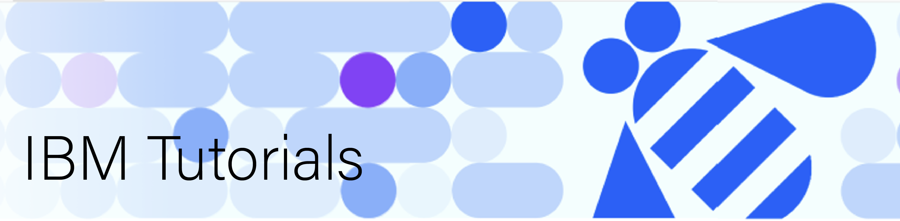

Welcome to the centralized repository for all technical explainers, tutorials, and demos developed by inbound ibm.com technical writing team. This repository focuses on cutting-edge technologies in the fields of:

<h3> AI | Machine Learning | Natural Language Processing | LLMs | Prompt Engineering | Data Governance </h3>

<!-- EDIT SCOPE: Team can add the related fiels in this list -->

These tutorials provide educational materials, technical insights, and working demos to help both developers and non-developers understand the AI ecosystem. Whether you are just starting out or looking to deepen your understanding, you will find valuable content here.

<h2>Technologies</h2>

This repository contains tutorials and demos covering the following key technologies:

<ul>
  <li>Artificial Intelligence (AI): Introduction to AI concepts, algorithms, and applications.</li>
  <li>Machine Learning (ML): Supervised and unsupervised learning, model building, optimization and validation.</li>
  <li>Natural Language Processing (NLP): Text analysis, sentiment detection, and language models.</li>
  <li>Data Governance: Ensuring data integrity and security</li>
</ul>

<!-- EDIT SCOPE: Team can add the related fiels in this list -->

We also use the following technologies, programming language, tools and frameworks in our tutorials:

<ul>
  <li>Python for scripting and model development.</li>
  <li>TensorFlow / PyTorch for deep learning models.</li>
  <li>Hugging Face for NLP-related demos.</li>
  <li>IBM granite models for AI/ML/DL/NLP applications.</li>
</ul>

<!-- EDIT SCOPE: Team can add the related fiels in this list -->

<!-- ><h2>Repository Structure</h2>

Coming Soon!

<h2>License</h2>

The license details of this repository will be updated soon.

<h2>Contact the team</h2>

For any questions or discussions, feel free to reach out to us.
 -->

