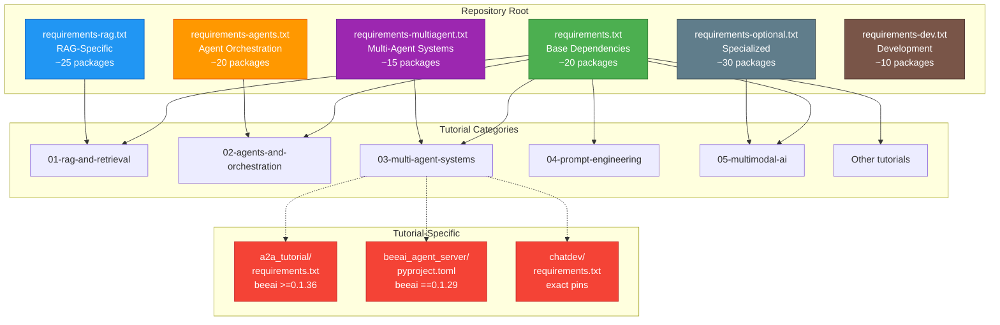
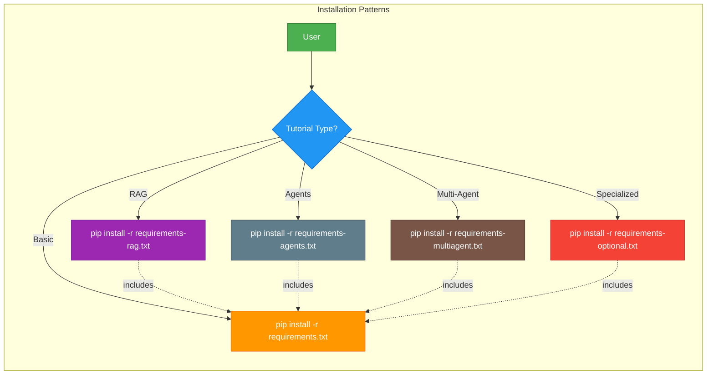
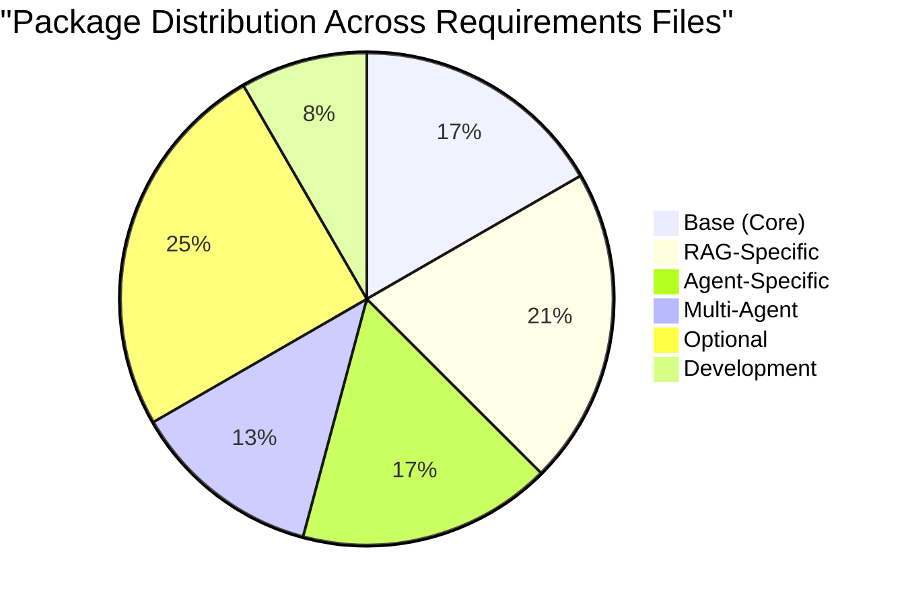
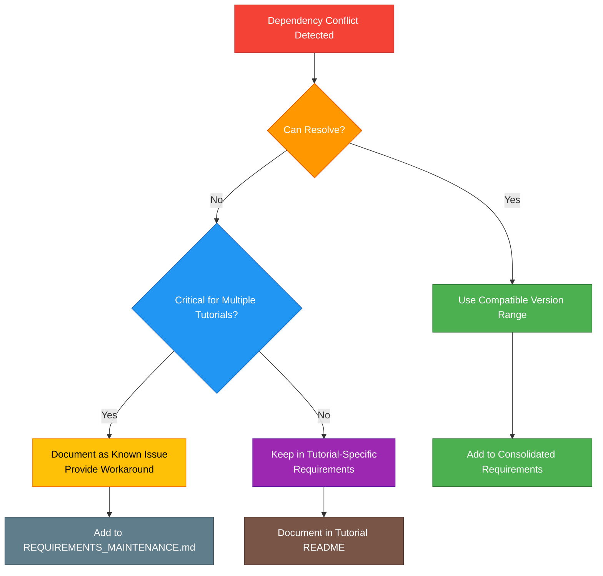
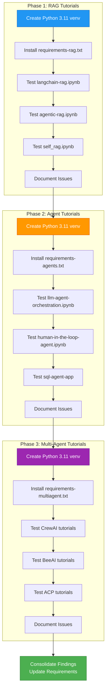
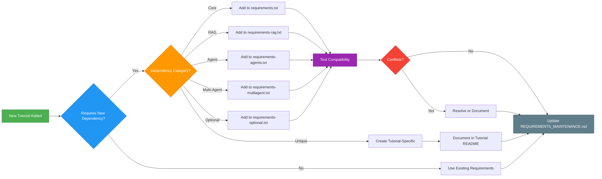

# Phase 5: Requirements Architecture Diagram

## Multi-Tiered Requirements Structure

## Dependency Flow

## Package Distribution

## Version Conflict Resolution Strategy

## Testing Workflow

## Maintenance Workflow

## File Size Estimates

| File | Packages | Est. Size | Install Time |
|------|----------|-----------|--------------|
| requirements.txt | ~20 | 150 MB | 2-3 min |
| requirements-rag.txt | ~45 (incl. base) | 800 MB | 5-7 min |
| requirements-agents.txt | ~40 (incl. base) | 600 MB | 4-6 min |
| requirements-multiagent.txt | ~35 (incl. base) | 500 MB | 4-5 min |
| requirements-optional.txt | ~50 (incl. base) | 2 GB | 10-15 min |
| **Full Installation** | ~120 unique | 3-4 GB | 15-20 min |

## Python Version Compatibility Matrix

| Package Category | Python 3.10 | Python 3.11 | Python 3.12 | Python 3.13 |
|-----------------|-------------|-------------|-------------|-------------|
| Base | ✅ | ✅ | ✅ | ✅ |
| RAG | ✅ | ✅ | ✅ | ⚠️ |
| Agents | ✅ | ✅ | ✅ | ⚠️ |
| Multi-Agent | ✅ | ✅ | ⚠️ | ❌ |
| Optional | ✅ | ✅ | ⚠️ | ❌ |

Legend:
- ✅ Fully supported
- ⚠️ Mostly supported (some packages may have issues)
- ❌ Not supported

## Key Benefits of Multi-Tiered Approach

1. **Modularity**: Install only what you need
2. **Faster Installation**: Smaller, focused dependency sets
3. **Easier Maintenance**: Clear categorization of dependencies
4. **Better Documentation**: Each file documents its purpose
5. **Conflict Isolation**: Tutorial-specific conflicts don't affect others
6. **Testing Efficiency**: Test by category rather than all-at-once
7. **User Experience**: Clear installation paths for different use cases

## Implementation Checklist

- [x] Complete dependency audit
- [x] Identify version conflicts
- [x] Design multi-tiered architecture
- [ ] Create requirements.txt (base)
- [ ] Create requirements-rag.txt
- [ ] Create requirements-agents.txt
- [ ] Create requirements-multiagent.txt
- [ ] Create requirements-optional.txt
- [ ] Create requirements-dev.txt
- [ ] Test RAG tutorials
- [ ] Test Agent tutorials
- [ ] Test Multi-Agent tutorials
- [ ] Create REQUIREMENTS_MAINTENANCE.md
- [ ] Update README.md
- [ ] Document tutorial-specific requirements

## Next Action

**Switch to Code mode** to begin creating the requirements files, starting with:
1. requirements.txt (base dependencies)
2. requirements-rag.txt (RAG-specific)
3. requirements-agents.txt (Agent-specific)

Then test with priority tutorials (RAG and Agents) before proceeding with remaining files.