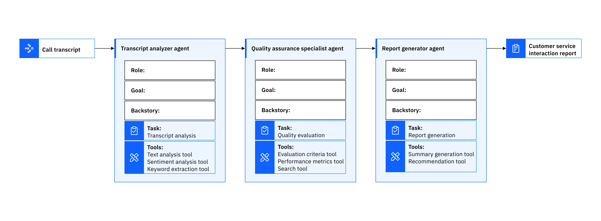

# Multi-Agent Collaboration for Customer Call Analysis using Watsonx.ai and CrewAI

In this tutorial, we will demonstrate how a team of multiple artificial
intelligence [(AI) agents](https://www.ibm.com/think/topics/ai-agents) can
collaborate to complete complex tasks and optimize workflows. We built a python
application to explain the orchestration of specialized agents working within a
multiagent architecture. By the end, you will have seen and run an example of
multiagent collaboration within an [agentic AI](https://www.ibm.com/think/topics/agentic-ai)
application.

The application we’ll be working with is a Customer Service Analysis crew using
CrewAI as the multiagent framework and Watsonx.ai to deploy the large language
model ([LLM](https://www.ibm.com/think/topics/large-language-models)) that powers
it.

**AI agents** are LLM-based entities that can perform operations on behalf of a user or agentic AI system. Agentic architectures are structured around two different systems: single and multiagent.

**Single agent systems** are best for solving narrow problems because they
depend on one LLM agent to perform generative AI tasks. For example, a single
chatbot agent can be focused on specific tasks or conversations that it can
complete within the scope of its individual capabilities.

**Multiagent systems** ([MAS](https://www.ibm.com/think/topics/multiagent-system))
are frameworks that orchestrate the functionality and interactions between AI
agents. Rather than attempting to encompass all capabilities within a single
agent, multiagent architectures use different agents to work within the same
environment to achieve a shared goal. Key benefits of
multiagent systems include agent collaboration and adaptability to solve problems
beyond the capabilities of a single agent. The best approach depends on the
complexity of the machine learning tasks required to compile a solution or
achieve a certain result.

## Problem-solving with multiagent systems

crewAI is an opensource agentic framework that orchestrates LLM agent automation
by assembling customizable crews, or teams of role-playing agents. We applied a
simplified industry use case to explain how agents collaborate within a
multiagent architecture.

Imagine a real-world use case for a customer service call center.
Telecommunications software to analyze call center transcripts is used to
enhance customer experiences and evaluate call quality. In more robust software,
transcripts may even be analyzed in real-time along with large datasets including
call metadata. For the sake of explainability, our application’s dataset is
simple, a mock transcript between a customer service representative and customer.

```txt
# multiagent-collaboration-cs-call-center-analysis/data/transcript.txt

Customer Service Interaction Transcript

Cynthia:
Hi, I'm calling because I received a jar of peanut butter that was open and it's
completely spilled everywhere. This is really frustrating, and I need a replacement.

Gerald (Peanut Butter Inc.):
Ugh, that sucks. But, like, how did you not notice it was open before
you bought it?

Cynthia:
Excuse me? I didn't expect the jar to be open when I received it. It was sealed
when I bought it. Can you just help me out here?

Gerald:
Yeah, whatever. But we can't control how it gets to you. I mean, it's not like
we throw the jars around or anything. You're probably being dramatic.

Cynthia:
I'm not being dramatic. The peanut butter is literally all over the box and
it's a mess. I just want a replacement or a refund, that's all.

Gerald:
Look, I guess I could send you a replacement, but it's really not our fault, you
know? Maybe next time, check the jar before you open it?

Cynthia:
Are you seriously blaming me for your company's mistake? That's not how customer
service works!

Gerald:
Well, what do you want me to do? I don't exactly have magic powers to fix your
problem instantly. Chill out, we'll send you a new jar eventually.

Cynthia:
That's not good enough! I expect better from a company that I've been buying
from for years. Can you just do the right thing and make this right?

Gerald:
Fine, fine. I'll put in a request or whatever. But seriously, this kind of thing
happens. Don't make it sound like the end of the world.

Cynthia:
Unbelievable. I'll be posting a review if this isn't fixed immediately.

Gerald:
Cool, go ahead. I'm sure we'll survive your review.

Cynthia:
I'll be contacting your supervisor if this isn't resolved soon.

Gerald:
Yeah, okay. Do what you gotta do.
```

A team of collaborative agents will generate a comprehensive report based on text
analysis and customer call center evaluation metrics to help customer service
managers summarize the main events of the call, evaluate performance and provide
recommendations for improvement.

## The Customer Service Call Analysis Crew




The customer service call analysis crew consists of three agents with specialized
roles and predefined goals. The agent configuration includes a Transcript
Analyzer, a Quality Assurance Specialist, and a Report Generator. The agent’s
goals and characteristics are defined by three main attributes,
**role**, **goal**, and **backstory**.

```yaml
transcript_analyzer:
  role: >
    Transcript Analyzer
  goal: >
    Analyze the provided transcripts and extract key insights and themes.
  backstory: >
    As the Transcript Analyzer, you are responsible for reviewing customer
    service call transcripts, identifying important information, and summarizing
    findings into a report to pass on to the Quality Assurance Specialist. 
    You have access to advanced text analysis tools that help you process and
    interpret the data effectively.

quality_assurance_specialist:
  role: >
    Quality Assurance Specialist
  goal: >
    Evaluate the quality of the customer service based the Transcript Analyzer's
    report, call center evaluation metrics, and business standards. Flag any 
    transcripts with escalation risks as high priority.
  backstory: >
    As the Quality Assurance Specialist, you are tasked with assessing the
    quality of customer service interactions based on the Transcript Analyzer's
    report, call center evaluation metrics, and industry standards used in call
    centers. You review transcripts, evaluate agent performance, and provide
    feedback to improve overall service quality.

report_generator:
  role: >
    Report Generator
  goal: >
    Generate reports based on the insights and findings from the transcript
    analysis and quality assurance specialist.
  backstory: >
    As the Report Generator, you compile the key insights and findings from the
    transcript analysis and quality assurance specialist into a comprehensive
    report. You create an organized report that includes summaries and recommendations
    based on the data to help customer service managers understand the trends
    and patterns in customer interactions.
```

The Transcript Analyzer agent performs a thorough analysis on the transcript to
extract key insights, important information, and summarize findings into a report
that is passed along to the other agents to aid in their tasks. This agent uses
a suite of customized tools to perform natural language processing ([NLP](https://www.ibm.com/think/topics/natural-language-processing))
techniques like keyword extraction and sentiment analysis.

The Quality Assurance Specialist agent evaluates the quality of the call based
on the key insights from the Transcript Analyzer’s report and its own described
expertise implementing and evaluating call center evaluation metrics. This agent
can also search the internet to retrieve relevant metrics and processes to
evaluate the employee’s performance and provide feedback to improve overall
service quality.

The Report Generator agent generates a report based on the insights in the
transcript analysis report and the metrics and feedback provided by the quality
assurance evaluation. The agent specializes in organizing the data into a
comprehensive report. The goal of the report is to provide customer service
managers with a breakdown of the key insights from the call and recommendations
to improve customer service quality.

### Agent tools

Each agent has access to tools, _skills or functions that agents use to perform_
_different tasks_. crewAI offers existing tools, integration with LangChain tools,
and the option to build your own custom tools. The Customer Service Analysis
crew uses a combination, with each tool specified for the agent’s task and the
application’s goal. Each agent has certain permissions for what tooling they can
access in their configuration.

Custom tools are created by defining a clear description for what the tool will
be used for. For example, the Transcript Analyzer agent has several custom tools
for text analysis.

```python

# src/customer_service_analyzer/tools/custom_tool.py

class SentimentAnalysisTool(BaseTool):
    name: str = "Sentiment Analysis Tool"
    description: str = "Determines the sentiment of the interactions in the transcripts."

    def _run(self, transcript: str) -> str:
        # Simulating sentiment analysis
        sentiment = Helper.analyze_sentiment(transcript)
        return sentiment

```

The description of the tool is what the agent uses as logic to perform
sentiment analysis on the transcript.

Agents can also use existing tools and integrated APIs. The Quality Assurance
Specialist agent has access to a `search_tool` that uses the `SerperDevTool`to
[search the internet](https://docs.crewai.com/tools/serperdevtool) and return the
most relevant results to its inquiries. The agent can utilize its specialized
role as an experienced customer service evaluator, but also leverage the internet to search
for the necessary metrics to evaluate the call and use in its report.

## Task workflow

The tasks are the specific assignments completed by the agents with execution
details facilitated by three required tasks attributes: **description**,
**agent**, **expected output**. The agents perform their tasks in a logical
sequence using the detailed descriptions for each task as a guide.

```yaml
transcript_analysis:
  description: >
    Use the Text Analysis Tool to collect key information and insights to better
    understand customer service interactions and improve service quality. 
    Conduct a thorough analysis of the call {transcript}.
    Prepare a detailed report highlighting key insights, themes, and sentiment
    from the transcripts.
    Identify any escalation risks and flag them for the Quality Assurance Specialist.
    Use the sentiment analysis tool to determine the overall sentiment of the
    customer and the agent.
    Use the keyword extraction tool to identify key keywords and phrases in the transcript.
  expected_output: >
    A detailed analysis report of the {transcript} highlighting key insights,
    themes, and sentiment from the transcripts.
  agent: transcript_analyzer

quality_evaluation:
  description: >
    Review the transcript analysis report on {transcript} from the Transcript Analyzer.
    Utilize your expertise in customer service evaluation metrics and industry
    standards, and internet to evaluate the quality of the customer service interaction.
    Score the interaction based on the evaluation metrics and flag any high-risk
    escalations. Develop expert recommendations to optimize customer service
    quality. Ensure the report includes customer service metrics and feedback
    for improvement.
  expected_output: >
    A detailed quality evaluation report of the {transcript} highlighting the
    quality of the customer service interaction, scoring based on evaluation
    metrics, flagging any high-risk escalations, and recommendations for improvement.
  agent: quality_assurance_specialist

report_generation:
  description: >
    List the reports from the Transcript Analyzer and the Quality Assurance
    Specialist, then develop a detailed action plan for customer service managers
    to implement the changes.
    Use the data from these agents output to create an organized report including
    a summarization and actionable recommendations for call center managers.
    Ensure the report includes keywords and sentiment analysis from the Transcript
    Analyzer agent.
    Ensure the report includes the Quality Assurance Specialist agent's report,
    evaluation metrics and recommendations for improving customer service quality.
    Ensure the report is well written and easy to understand.
    Be smart and well explained.
    Ensure the report is comprehensive, organized, and easy to understand with
    labeled sections with relevant information.
  expected_output: >
    A comprehensive report that lists the reports from the Transcript Analyzer,
    then the Quality Assurance Specialist. 
    The report should include the key insights from {transcript} and the quality
    evaluation report from the Quality Assurance Specialist.
    The report should include organized sections for each agent's findings,
    summaries, and actionable recommendations for call center managers.
  agent: report_generator
  context:
    - transcript_analysis
    - quality_evaluation
```

The task workflow is executed in a sequential process starting with the
transcript analysis completed by the Transcript Analyzer. The results of one
task can establish context for a future task. During the next sequence, the
Quality Assurance Specialist leverages the transcript analysis report to inform
its quality evaluation, noting any keywords or phrases that indicate escalation.

The Report Generator agent uses the outputs of the Transcript Analyzer and the
Quality Assurance Specialist agents as context to generate a comprehensive report
about the call transcript. This is an example of multiagent collaboration and how
agents can complete complex tasks and generate more robust outputs with increased
context awareness while performing their specialized roles.

## Steps

### Step 1. Set up your environment

First, we need to set up our environment to run the application. You can find
these steps in the markdown file within the [crewAI project folder on GitHub](https://github.com/IBM/ibmdotcom-tutorials/tree/main/crew-ai-projects)
or by following along here.

- Ensure you have Python >=3.10 <=3.13 installed on your system. You can check
  your Python version using the `python3 –version` command.

- Clone the GitHub repository found [here](https://github.com/IBM/ibmdotcom-tutorials/tree/main).
  For detailed steps on how to clone a repository, refer to the [GitHub documentation](https://docs.github.com/en/repositories/creating-and-managing-repositories/cloning-a-repository).

The project structure should resemble the following:

```
src/customer_service_analyzer/

├── config/
│   ├── agents.yaml    # Agent configurations
│   └── tasks.yaml     # Task definitions
├── tools/
│   ├── custom_tool.py # Custom crewAI tool implementations
│   └── tool_helper.py # Custom tool helper functions
├── crew.py           # Crew orchestration
└── main.py          # Application entry point
```

### Step 2. Obtain watsonx API credentials

1. Log in to [watsonx.ai](https://dataplatform.cloud.ibm.com/registration/stepone?context=wx&apps=all)
   using your IBM Cloud account.

2. Create a [watsonx.ai project](https://www.ibm.com/docs/en/watsonx/saas?topic=projects-creating-project#create-a-project).
   Take note of your **project ID** in project > Manage > General > Project ID.
   You'll need this ID for this tutorial.

3. Create a [watsonx.ai Runtime](https://cloud.ibm.com/catalog/services/watsonxai-runtime)
   service instance (choose the Lite plan, which is a free instance).

4. Generate a watsonx [API Key](https://dataplatform.cloud.ibm.com/docs/content/wsj/analyze-data/ml-authentication.html).

5. Associate the watsonx.ai Runtime service to the project you created in [watsonx.ai](https://dataplatform.cloud.ibm.com/docs/content/wsj/getting-started/assoc-services.html?context=cpdaas).

### Step 3. Obtain Serper API credentials

Generate and take note of your free [Serper API](https://serper.dev/) key.
Serper is a Google Search API that we will be using in this project.

### Step 4. Install crewAI and set up your credentials

We need to install the crewAI framework for this tutorial and set up watsonx.ai
credentials that we generated in step 2.

If you use `uv` for package management, you can add crewAI as follows:

```python

uv tool install crewai

```

If using pip for package management, set up a virtual environment and then install crewAI in that environment.

```python

python3 -m venv venv
source ./venv/bin/activate

```

To install crewAI, run the following command in your terminal.

```python

pip install 'crewai[tools]'

```

In a separate .env file at the same directory level as the .env_sample file, set
your credentials as strings like so:

```

WATSONX_APIKEY=your_watson_api_key_here

WATSONX_PROJECT_ID=your_watsonx_project_id_here

WATSONX_URL=your_endpoint (e.g. "<https://us-south.ml.cloud.ibm.com>")

SERPER_API_KEY=your_serper_api_key_here

```

### Step 5. (Optional) Customize the crew

crewAI can be configured to use any open source LLM. LLMs can be connected through
Ollama and several other APIs such as IBM watsonx™ and OpenAI. Users can also leverage
pre-built tools available through the crewAI Toolkit as well as LangChain Tools.

### Step 6. Run the system

Ensure you are in the proper working directory of this project. You can change
directories by running the following command in your terminal.

```bash

cd crew-ai-projects/multiagent-collab-cs-call-center-analysis

```

To kickoff your crew of AI agents and begin task execution, run this command
from the root folder of your project.
**Note, the crew may run for several minutes before returning a result.**

```bash

crewai run

```

This command initializes the Call Center Analysis Crew, assembling the agents
and assigning them tasks as defined in your configuration. This example, unmodified,
will run a Llama model on watsonx.ai to create a report.md file with the output.
crewAI can return JSON, Pydantic models and raw strings as output. Here is an
example of the output produced by the crew.

## Example Output

This is an example of the final output after running the crew:

```markdown
**Detailed Analysis Report of the Customer Service Interaction Transcript**

**Transcript Analysis Report**

The customer, Cynthia, called to report a damaged product, a jar of peanut butter that was open and spilled everywhere. She requested a replacement, but the agent, Gerald, responded defensively and blamed her for not noticing the damage before purchasing. The conversation escalated, with Cynthia becoming frustrated and threatening to post a negative review and contact the supervisor.

**Key Insights and Themes**

- The customer was dissatisfied with the product and the agent's response.
- The agent was unhelpful, unprofessional, and failed to take responsibility for the company's mistake.
- The conversation was confrontational, with both parties becoming increasingly agitated.
- The customer felt disrespected and unvalued, while the agent seemed dismissive and uncaring.

**Sentiment Analysis**

- Customer Sentiment: Frustrated, Angry, Disappointed
- Agent Sentiment: Defensive, Dismissive, Uncaring

**Keyword Extraction**

- Damaged Product
- Unhelpful Agent
- Confrontational Conversation
- Customer Dissatisfaction
- Unprofessional Response

**Escalation Risks**

- Negative Review: The customer threatened to post a negative review if the issue was not resolved promptly.
- Supervisor Involvement: The customer may contact the supervisor to report the incident and request further action.

**Recommendations for Quality Assurance Specialist**

- Review the call recording to assess the agent's performance and provide feedback on areas for improvement, using customer service metrics.
- Investigate the root cause of the damaged product and implement measures to prevent similar incidents in the future.
- Provide training on customer service skills, including active listening, empathy, and conflict resolution, using customer service standards.
- Monitor the customer's feedback and respond promptly to any concerns or complaints to maintain a positive customer experience.
- Recognize the standards for various customer service metrics to measure key performance indicators that are related to the areas mentioned above.

**Summary of Quality Evaluation Report**

The customer, Cynthia, called to report a damaged product, a jar of peanut butter that was open and spilled everywhere. She requested a replacement, but the agent, Gerald, responded defensively and blamed her for not noticing the damage before purchasing. Evaluation metrics showed a low Customer Satisfaction Score (CSAT), high Customer Effort Score (CES), and negative Net Promoter Score (NPS).

**Recommendations for Call Center Managers**

- Review the call recording, investigate the root cause of the damaged product, and provide training on customer service skills. Recognize the standards for various customer service metrics to measure key performance indicators.
- Monitor the customer's feedback and respond promptly to any concerns or complaints to maintain a positive customer experience.
- Implement measures to prevent similar incidents in the future, such as improving product packaging and handling procedures.
- Provide feedback and coaching to agents on their performance, highlighting areas for improvement and recognizing good performance.
```

## Conclusion

As demonstrated in the sample output, the agents worked together to complete the
complex task of analyzing, evaluating, and generating a report about the example
transcript. The collaboration between agents enhanced the application’s efficiency
and accuracy by orchestrating each agent to specialize in a particular aspect of
the process. The report agent, for instance, generated an organized report that
includes the findings from the textual analysis and evaluation tasks. This reflects
a smooth coordination between agents in handling different parts of the workflow.

Multiagent frameworks can provide a more robust and improved overall performance
via agent collaboration. Not every multiagent architecture works the same way, for
instance some are specific for software development, while others like crewAI and
AutoGen offer more composable configurations.
