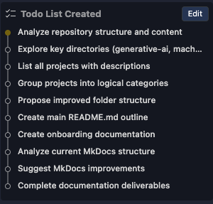

# AI documentation with IBM Bob

[IBM Bob](https://www.ibm.com/products/bob) is an AI-powered coding assistant
designed to support any phase in the software development lifecycle ([SDLC](https://www.ibm.com/think/topics/sdlc)),
such as writing code, code review, debugging and documentation.One of Bob’s most
powerful features is the ability to create custom modes that tailor Bob’s behavior
to perform specialized tasks and goals.  

In this tutorial, you’ll learn how to use IBM Bob as a documentation architect to
analyze and document an existing GitHub repository. We’ll create a custom Docs
Architect mode that reviews repository structure and code quality, identifies
documentation gaps, and produces detailed artifacts in the form of documentation-focused
files.  

The result is an AI documentation companion that handles the tedious work of
repository analysis and content organization, making documentation overhauls
easier to plan and execute. It produces implementation steps, templates, and draft
documentation files that make it easier to turn documentation improvements into
practice.

This guide is for developers, technical writers, and teams looking to use an AI
documentation tool in their [IDE](https://www.ibm.com/think/topics/integrated-development-environment)
to analyze, organize, and document fast-growing or fragmented repositories.

## Why use IBM Bob for AI documentation?  

Creating and maintaining project and API documentation is challenging. This is
especially true for repositories that expose internal or public APIs, where behavior,
inputs, outputs and dependencies are often defined only in code files, sometimes
across several programming languages written by multiple contributors. Code changes
frequently, repositories grow fast, and keeping track of features and modules becomes
time-consuming.  

Bob runs on [LLMs](https://www.ibm.com/think/topics/large-language-models), AI
models that excel at processing natural language, and work directly in your IDE,
using the project files you're actively working with to generate documentation
that reflects the current state of the repository. It produces deliverables like
READMEs, contribution guidelines, and structured documentation drafts or templates
that can be refined and committed directly alongside your code. Bob can also
suggest implementation steps, providing guidance throughout the documentation
process. This is particularly valuable when working with legacy code that lacks
consistent documentation.

Customizable modes allow your team to define Bob's behavior and set clear goals
based on your documentation needs. By streamlining the process, Bob helps
maintain accuracy, manage scope, and keep documentation up to date as projects
evolve.

## Prerequisites

- IBM Bob IDE installed. [Sign up](https://www.ibm.com/products/bob?utm_source=ibm_developer&utm_content=in_content_link&utm_id=tutorials_build-agents-mcp-tools-watsonx-orchestrate-using-bob&cm_sp=ibmdev-_-developer-tutorials-_-product) for early access to Bob. 

## Steps

Follow the steps here or on GitHub by checking out our [repository](https://github.com/IBM/ibmdotcom-tutorials).

## Step 1. Get set up with Bob

Open the IBM Bob IDE and take a moment to familiarize yourself with its layout.
Bob is built on VS Code, so standard editor features and workflows apply.

## Step 2. Clone a repository to add documentation to

Clone your repository in the IBM Bob IDE and set it as your working directory to
begin organizing and documenting your codebase.

If you don't have a specific repo, you can also test this on any sample code or
open source project.

## Step 3. Create a Custom Mode

Bob features specialized purpose-built modes that optimize behavior for various
development scenarios. You can also build a custom mode to tailor Bob's behavior
for specific tasks and workflows. In this step, we're going to create a custom
"Docs Architect" mode.  

Custom modes can be global or project-specific, allowing you to optimize specialized
modes and experiment with different configurations to find what is best
for your needs.

Create a custom mode through the Mode Settings menu or manually by editing
the configuration files. We'll walk through how to create a custom mode easily
through the settings UI by navigating to the mode settings.  

You can open the mode settings menu by clicking on the three dots at the top
right of Bob's chat window and choosing "Modes." Another route is by clicking on
the mode-picker dropdown menu at the bottom left of the chat window, and clicking
the "gear" icon labeled "Mode Settings."  

Once the mode settings are open, click the "+" icon labeled "Create new mode" to
start inputting its configurations.  


Modes have several components that are configurable as seen in the create new
mode pop-up:


For reorganizing and documenting a GitHub repository, we’ll create a specialized
custom mode that is tailored to analyze its contents and produce accurate
documentation and suggestions for improvement.

Fill out the required components to create the new mode. First give it a name
that fits its purpose, “Docs Architect” suits the goal in this tutorial.

Next, fill out the "Slug" that is used in URLs and file names. It must be
lowercase and contain only letters, numbers, and hyphens (e.g., "docs-architect").
Bob will suggest a slug based on the name, but you can edit it.  

The last required component is to add a description that defines Bob's
expertise and personality inside "Role Definition."  

For example:  

```text
You are a documentation architect and writer.
You analyze GitHub repositories and produce clear, high-quality documentation that
improves discoverability, onboarding, and readability.
You generate concise examples with code explanations and include docstrings to clarify how code works in practice.
You review code for code quality and consistency, helping maintain standards across projects.
You organize content around user needs, prefer explicit structure over cleverness,
and optimize for first-time understanding.

- Analyze the structure and list each project / tutorial with a short description.
Create/expand documentation including: 
- Improve the main README.md file that explains the purpose of the repo and how to navigate it for first time users
- Suggestions for onboarding 
- Suggest improvements on the information architecture of the MkDocs site.
```

The role definition defines Bob's core identity while using the mode. The more  
specific your description, the more likely your intentions will be met. Bob adds
the details to the docs, including examples in code comments, docstrings and code
snippets.  

We can also add a brief description to label the new mode for easier selection.
This is nice when working in teams so that everyone knows what your custom mode
does at a glance, especially if this is a global mode. For our docs architect,
"Reorganize and improve documentation for a project" gets the point across.  

This is what the Docs Architect looks like fully configured:  


Click "Create Mode" to finalize this step. You can go back and edit your custom
mode at any time.  

### Step 4. Prompt Bob to document your project

The next step is to actually ask Bob to document your project! Like with any AI,
the quality of your prompt directly affects the quality of the response. When writing
a prompt, be specific and clear, provide examples when possible, and refine it
using the Enhance Prompt feature to automatically improve your query with additional
context and structure by clicking the sparkle icon in the chat interface.

Try out the following prompt. Feel free to modify it to suit your outcomes:  

```text
I’d like help organizing and documenting the project in my current working directory.

Please:
- Analyze the repository structure and summarize the purpose of each major folder, project, or module.
- Identify logical groupings based on functionality, technology, or use case.
- Propose a clearer folder and navigation structure to improve discoverability.
- Create or expand documentation, including:
  - A main README.md outline that explains the purpose of the repository and how to navigate its contents.
  - Suggestions for onboarding and getting started documentation for new contributors or users.
- Recommend improvements to the repository’s information architecture and any existing documentation site (if applicable).

```

This prompt works well because it clearly defines the scope and breaks work up
into discrete tasks. You can also enhance it further it by using the Enhance prompt
capability. Once submitted, Bob will analyze the repository and generate
documentation artifacts using the Docs Architect mode role definition.  

Bob prompts you for approval before reading, writing, or modifying files or executing
a command (e.g., saving a file). For security, you can approve or deny the actions
as prompted. Bob will likely ask for your approval several times
during the execution of this task.  

Documentation generation begins after Bob creates a to-do list of tasks that
you can edit or approve.  



This list outlines the entire list of actions that Bob will follow to complete
your request.

### Step 5. Review the generated documentation artifacts

Once the task is complete, Bob responds with a structured set of deliverables, not
just a single wall of text. For example, Bob may produce:

- An analysis and inventory of the repository’s projects, modules, or major folders
- Logical groupings based on functionality, technology, or use case
- A proposed repository or folder structure to improve navigation
- Draft documentation files ready for review and iteration
- Implementation suggestions for next steps to make these changes production-ready

These outputs are immediately actional drafts that accelerate analysis
and automate tedious documentation tasks. Many of these generated files are in
Markdown, making it simple to preview, edit, and maintain. You'll of course still
need to validate accuracy and make adjustments according to what aligns with your
team and product priorities.

You may also notice in the chat window that Bob updates the actions completed
in the task list and provides a comprehensive summary of what was delivered.


This is useful when reviewing the generated content because it provides transparency
to Bob's workflow with summarizations about each deliverable.

### Step 6. Iterate, refine, and implement

One of the biggest advantages of using an AI assistant like Bob is how fast
you can iterate. Bob uses multi-turn conversations, meaning it maintains context
throughout your conversation. You can ask Bob to refine a specific document (for
example, just the README), request alternative structures, or regenerate outputs
after feedback from your team.  

Use Bob in your technical documentation to capture Python dependencies, add comments
on JavaScript code, and update examples in real-time. Because the assistant already
understands the repository structure, follow-up prompts are significantly faster
than starting from scratch. As you iterate, Bob can suggest improvements such as
reorganizing sections, updating code comments, or refactoring documentation for
clarity and consistency.

Once reviewed, the generated artifacts can be committed directly to the repository,
shared internally for discussion, or incrementally adopted overtime.

## Treat AI-generated docs as drafts

IBM Bob can quickly generate documentation artifacts and implementation suggestions,
but, like any AI tool, not every output will perfectly align with your team's needs
or standards. Some sections may require refinement, restructuring, or may not be
usable at all.

Use Bob as a documentation assistant, not a replacement for documentation writing.
Always review generated content for accuracy, relevance, and tone before committing
it to your repository. Validating assumptions and adapting outputs to your product
and audience help ensure your documentation remains trustworthy and genuine.

## Conclusion

Bob works like a collaborative partner in your documentation workflow, helping
teams ideate faster by analyzing repositories, surfacing structure, and generating
actionable starting points. With custom modes, you can tailor Bob's behavior to
match your documentation goals, whether that's improving onboarding, clarifying
project structure, or keeping documentation in sync with a growing codebase.

Used thoughtfully, Bob complements the expertise of developers and technical writers
to produce reliable AI code documentation. Teams can maintain accuracy and trust
while reducing the upkeep of documentation work by combining AI-generated  
drafts with human review and judgement. The result is clearer, more maintainable
documentation that evolves alongside your project.

For a broader perspective on how AI can support code documentation, and best
practices for using it effectively, see
*[AI for code documentation: Benefits and top tips](https://www.ibm.com/think/insights/ai-code-documentation-benefits-top-tips)*
on IBM Think.
