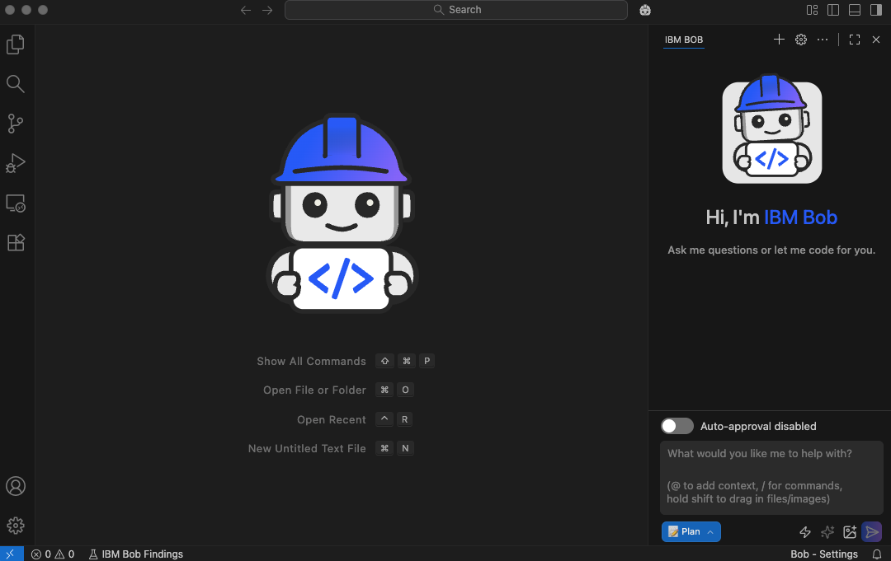
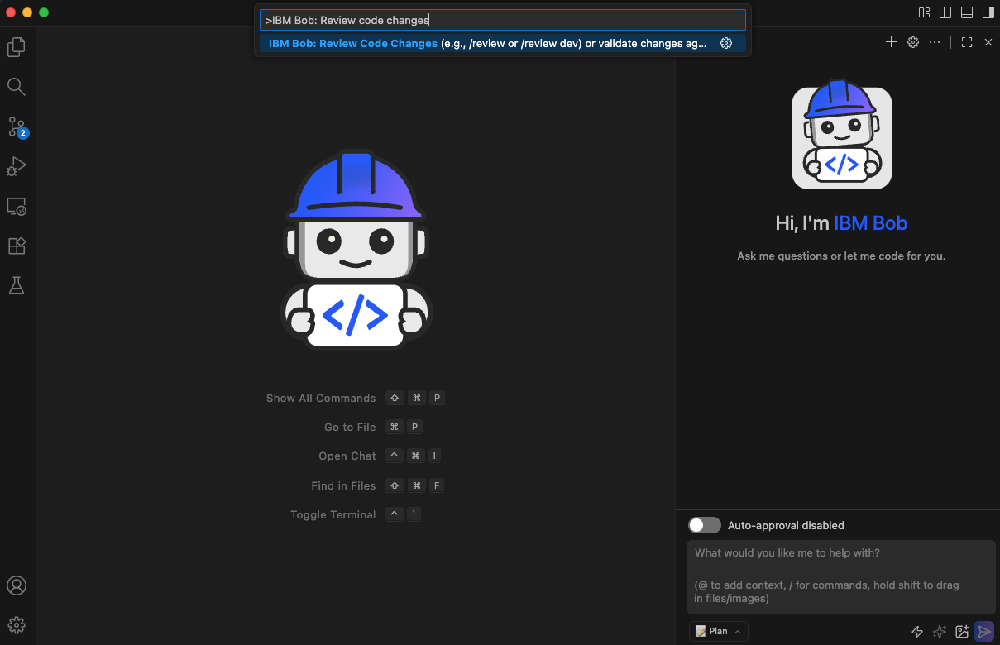
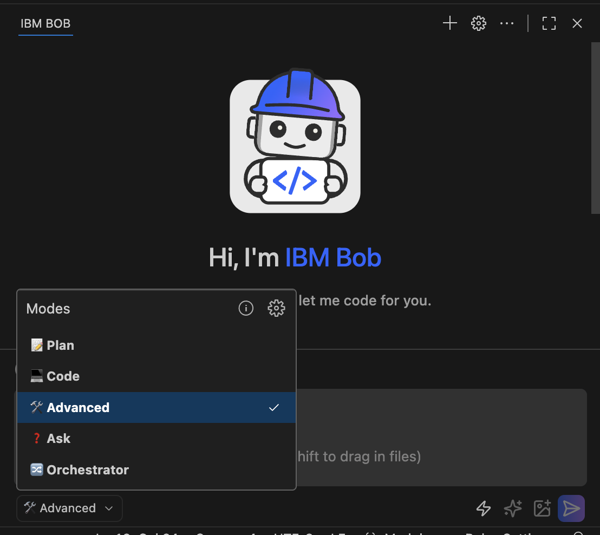
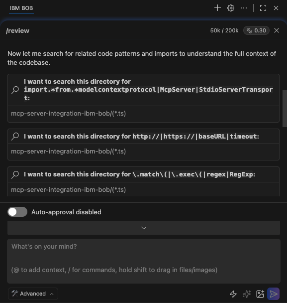
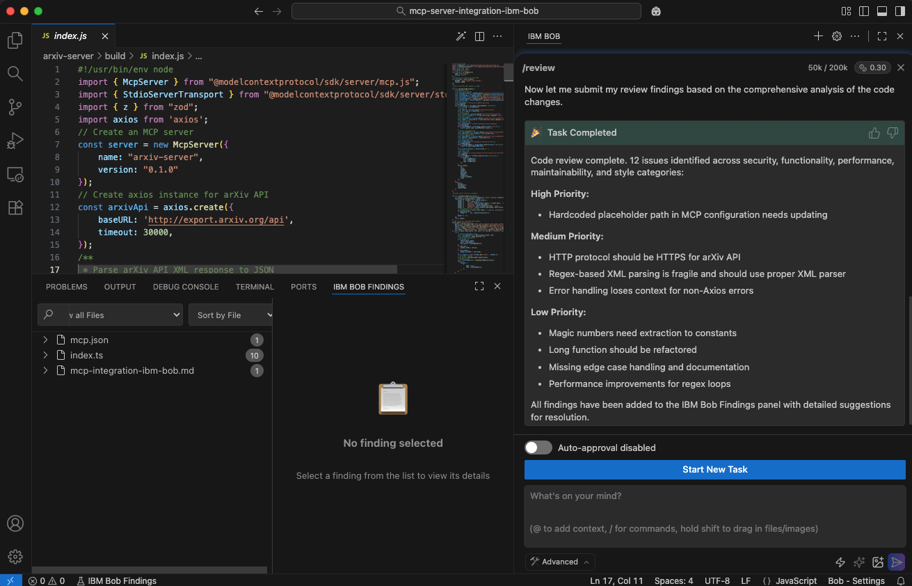
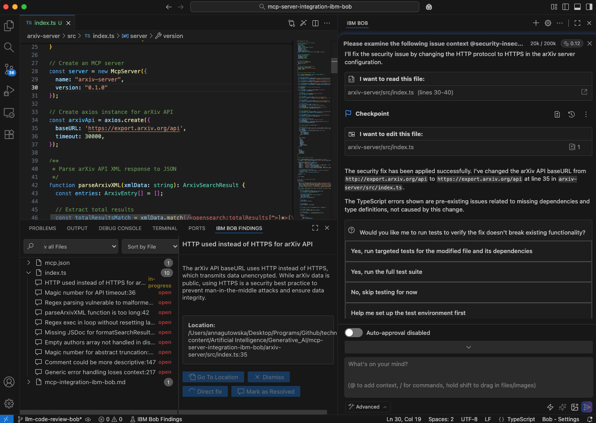
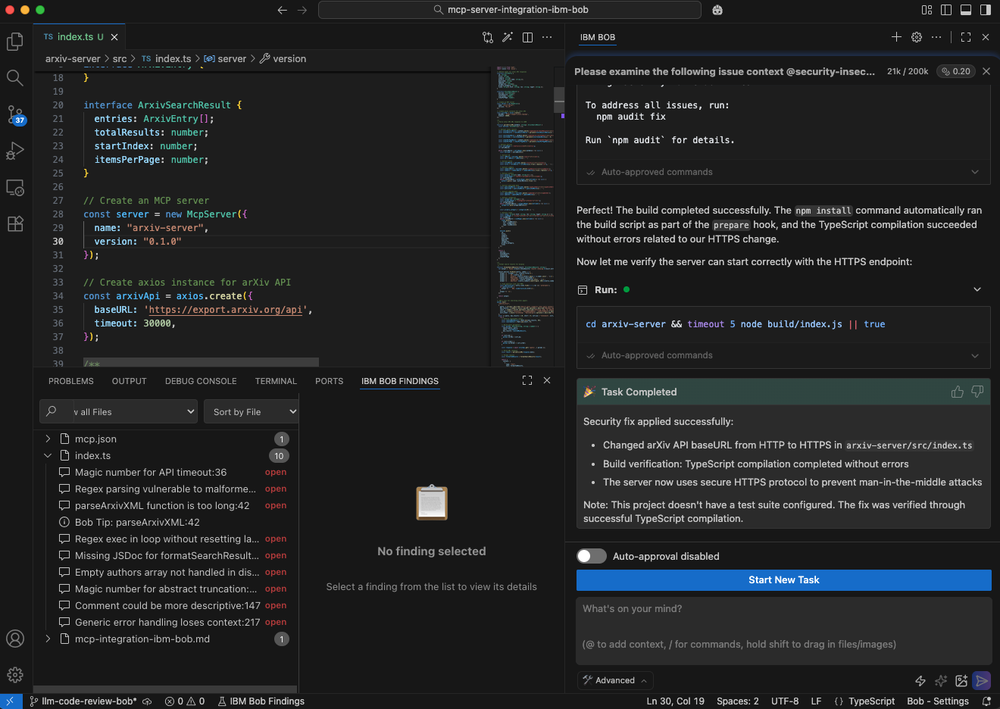

# LLM code review using IBM Bob 
**Authors:** Anna Gutowska, Fangfang Lee

Code review has long been a standard of ensuring software quality. Traditionally, it has relied almost entirely on human reviewers; teammates scanning pull requests for bugs, security vulnerabilities and logic flaws before code is merged into production. 

However, as software systems have grown in size and complexity, the manual review process can become unruly and hard to keep up. That’s exactly where [IBM Bob](https://www.ibm.com/products/bob) streamlines the development process. In this tutorial, you will use IBM Bob to perform LLM-powered [automated code review](https://www.ibm.com/think/insights/ai-code-review).

## LLM-powered code review in short
Modern software development teams often operate under tight release cycles, large codebases and constant streams of GitHub pull requests. This is where [large language models (LLMs)](https://www.ibm.com/think/topics/large-language-models) introduce a fundamentally new capability to the code review process. Unlike traditional rule-based tools, LLMs can reason about code semantically. They can improve readability of code, suggest refactors, propose unit tests and explain why certain approaches can lead to maintainability problems. 

Rather than replacing human reviewers, LLMs act as intelligent copilots, handling time-consuming aspects of review so engineers can focus on higher-level design decisions. Notable examples of such tools and IDEs include GitHub Copilot, Claude Code and [IBM Bob](https://www.ibm.com/products/bob).

Beyond identifying issues, LLMs can automate many parts of the review workflow itself: generating review comments, enforcing coding style standards across teams, drafting documentation updates, scanning for performance bottlenecks and mapping changes to existing APIs or business logic. 

Looking ahead, [AI-assisted code review](https://www.ibm.com/think/insights/ai-code-review) points toward a future where software quality becomes proactive rather than reactive. Instead of discovering problems late in pull requests or production, intelligent systems can guide developers as they write code, surface risks immediately and evolve alongside codebases as patterns and standards change. Combined with human expertise, AI models enable faster and development cycles. 

As software complexity continues to grow, AI-powered code review represents a natural evolution, augmenting human judgment with intelligent automation to meet the demands of modern software engineering.

## Why use IBM Bob as an AI code review tool?
First, what is IBM Bob? IBM Bob is a generative AI-powered integration development environment (IDE) and modernization assistant. Think of Bob as your pair developer: an artificial intelligence tool that understands your intent, your codebase and your organization’s standards. Bob supports a wide range of modern and legacy programming languages including Python, JavaScript, [Java™](https://www.ibm.com/think/topics/java), [COBOL](https://www.ibm.com/think/topics/cobol) and much more.

Let’s say you have built a new feature for your organization’s mobile app. Before submitting it for review, consider using IBM Bob to refine your code. Whether you use it to prepare your code for a smoother human review or to automate parts of the process, Bob makes collaboration faster and more efficient. In this tutorial, you will use IBM Bob to perform LLM-powered automated code review by using a few simple natural language prompts.

## Prerequisites
- IBM Bob IDE installed. [Sign up](https://www.ibm.com/products/bob) for early access to IBM Bob.
- Code for Bob to review. This code can be either uncommitted changes in your workspace or a remote branch to review.

## Steps
Let's begin. If you prefer to follow along with this tutorial on GitHub, check out our [repository](https://github.com/IBM/ibmdotcom-tutorials).

### Step 1. Get set up with Bob

1.	Go ahead and open the IBM Bob IDE you installed as a prerequisite and get familiar with the layout of your new AI coding companion.

    

2.	Open the directory containing the code that you want Bob to review. This code can be either uncommitted changes in your workspace or a remote branch to review.

### Step 2. Start a code review

1.	Select a code review initiation approach. Code reviews can be started in two ways:

    a. Using the command palette:
    - Press `Cmd+Shift+P` on Mac or `Ctrl+Shift+P` on Windows/Linux.
    - Search for "IBM Bob: Review Code Changes".

    

    b. Using a slash command in the chat interface.
    - In the chat interface, type `/review`. This command will trigger Bob to begin analyzing your changes. 
    - The findings are displayed in the Bob Findings panel.

    In this tutorial, we will explore the chat interface option. 

2. You might have noticed there are different modes for Bob in the chat interface such as _**plan**_, _**code**_, _**advanced**_, _**ask**_ and _**orchestrator**_. For this project, set the mode to _**advanced**_.

    

3. To trigger the code review process with the built-in slash command, type `/review` in the chat interface.

    
    
    For traceability and learning purposes, keep the auto-approval toggle disabled so you can approve or deny each command before Bob runs it in real-time.

### Step 3. Bob executes the code review

With the singular built-in slash command, Bob can now begin the comprehensive code review. First, Bob formulates a list of iterative steps in order to complete the task. The first task Bob starts with is reading your codebase. If applicable, this step might also involve running the `git diff` command to view changes between the working directory and the last commit, or between different branches or commits.

The code we review in this tutorial is a [model context protocol (MCP)](https://www.ibm.com/think/topics/model-context-protocol) server for academic research that uses the arXiv API. Bob reviews the changed files as well as the full content to perform a thorough review.

Next, Bob searches for related code patterns within the codebase and imported packages to understand the full context of the code implementation.

Bob has successfully reviewed the code and identified 12 issues ranked by level of priority.

**High Priority:**
- Hardcoded placeholder path in MCP configuration needs updating.

**Medium Priority:**
- HTTP protocol should be HTTPS for arXiv API.
- Regex-based XML parsing is fragile and should use proper XML parser.
- Error handling loses context for non-Axios errors.

**Low Priority:**
- Magic numbers need extraction to constants.
- Long function should be refactored.
- Missing edge case handling and documentation.
- Performance improvements for regex loops.

Notice that the output not only contains issues within the code, but also lists optimizations such as edge case handling, documentation and refactoring.

### Step 4. Review Bob's findings

Bob’s findings can be found in the IBM Bob findings panel along with detailed suggestions for resolutions. The panel should open when Bob has completed the review. Open any of Bob’s findings.

In this example, Bob states, “The arXiv API baseURL uses HTTP instead of HTTPS, which transmits data unencrypted. While arXiv data is public, using HTTPS is a security best practice to prevent man-in-the-middle attacks and ensure data integrity.” This security suggestion aligns with modern security best practices, protecting user privacy and preventing tampering with API responses.

Available actions include viewing the location of the code being referenced, fixing the issue, dismissing the concern and marking it as resolved. Let’s instruct Bob to fix the issue by clicking the **Direct fix** button. This action will trigger a stream of messages in the chat interface.

Not only did Bob read and edit the file, but also proposed tests to verify that the fix did not break any existing functionality.

### Step 5. Bob tests its fix

From the list of testing options provided in the chat interface, select your preferred option. For example, “Yes, run targeted tests for the modified file and its dependencies.”

Great. Bob ran several commands to successfully compile the project without errors related to the HTTPS change and ran build verification. The issue has now also automatically disappeared from the findings panel.

You are now equipped with the necessary information to continue reviewing Bob’s findings.

## Conclusion 
In this tutorial, you explored how to use Bob to catch potential errors early, improve code quality and handle some of the review process for you, saving time and effort for everyone involved. Ready to take the next step? Start small by generating unit tests for an existing module, then scale up to code generation for full feature development.