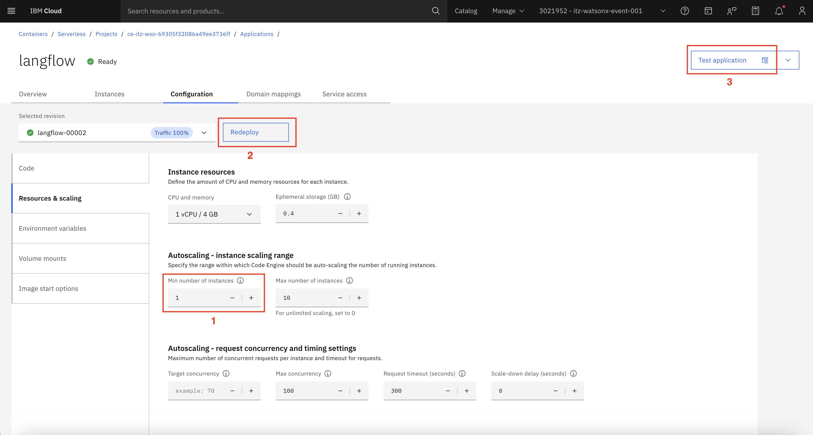
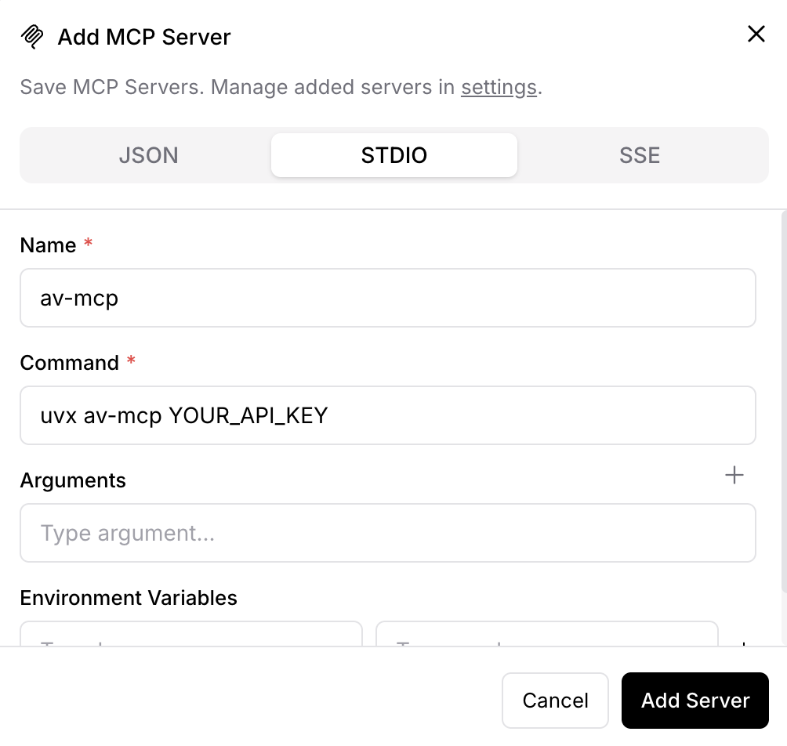
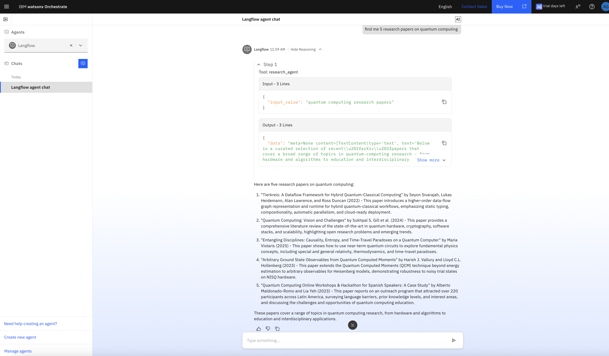
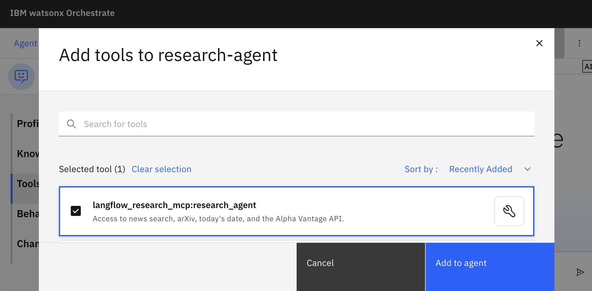
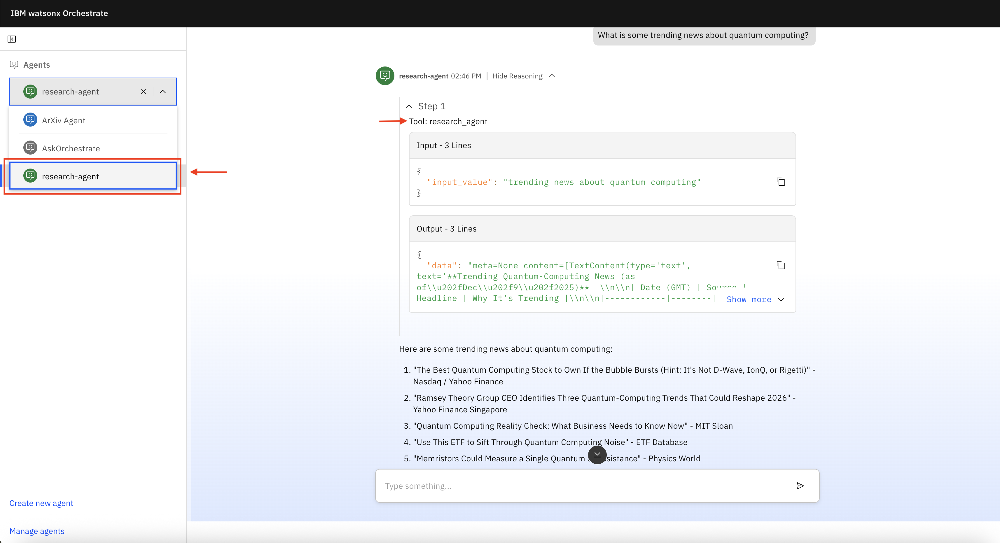
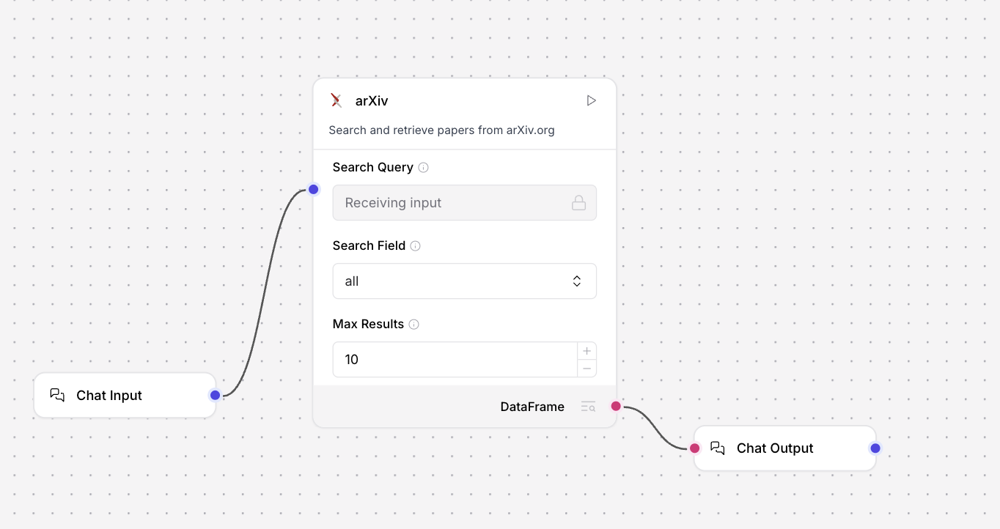
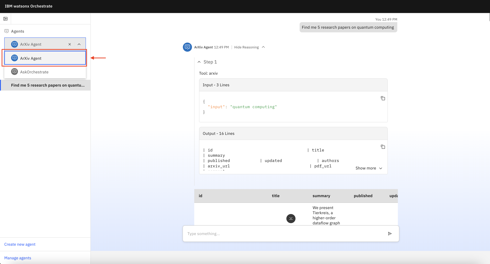

# Build a custom research agent with Langflow via the watsonx Orchestrate ADK and IBM Cloud
**Author:** Anna Gutowska

## Introduction
With the developing landscape of [AI agents](https://www.ibm.com/think/topics/ai-agents), some enterprises report hesitancies regarding widespread adoption of these autonomous agents.<sup>1</sup> Some challenges include governance, ethics, human-AI collaboration, deployment and scalability. However, building trustworthy AI agents does not need to be complex. With [IBM watsonx Orchestrate](https://www.ibm.com/products/watsonx-orchestrate), these concerns can be mitigated all in one place. In this tutorial, you will learn how to use [Langflow](https://www.ibm.com/think/topics/langflow) and watsonx Orchestrate to build reliable and scalable enterprise-ready agents. 

## What is Langflow? 
[Langflow](https://www.ibm.com/think/topics/langflow) is a Python-based, [open-source](https://www.ibm.com/think/topics/open-source) framework for building [AI agents](https://www.ibm.com/think/topics/ai-agents) and other AI applications. Langflow was originally built on [LangChain](https://www.ibm.com/think/topics/langchain), its parent framework. [LangGraph](https://www.ibm.com/think/topics/langgraph), another platform within the same family, is also used to build agentic systems by using graph-based architectures. What sets Langflow apart is its user-friendly drag-and-drop interface in which users can connect agent components to design personalized workflows or start with the prebuilt templates. As an alternative to this low-code or no-code approach, developers can build custom components and embed step-by-step agent flows into existing application code by using the Langflow API. In this Langflow tutorial, we explore how to build and deploy agents by:

1) Importing agentic LangFlow flows as MCP servers by using IBM® watsonx Orchestrate® as a [Software as a Service (SaaS)](https://www.ibm.com/think/topics/saas) along with IBM Cloud®. 
2) Importing basic LangFlow flows by using the IBM watsonx Orchestrate Agent Development Kit (ADK) locally. 

Both approaches correspond to a section of this tutorial. Note, you can also access this tutorial on [GitHub](https://github.com/IBM/ibmdotcom-tutorials). 

Let's begin!

## Prerequisites

This tutorial requires:
- The latest version of **Python** installed. 
- An [**IBM Cloud® account**](https://cloud.ibm.com/registration) to create a [watsonx.ai™](https://www.ibm.com/products/watsonx-ai) [**project ID**](https://www.ibm.com/docs/en/watsonx/saas?topic=projects-creating-project#create-a-project) and [**API key**](https://dataplatform.cloud.ibm.com/docs/content/wsj/analyze-data/ml-authentication.html?context=wx#generating-an-api-key). Lite and Free service plans are available. 
    - You can get your project ID from within your project. Click the **Manage** tab. Then, copy the project ID from the **Details** section of the **General** page. You need this ID for the ADK portion of this tutorial. 
- A **watsonx Orchestrate account** (can be a trial account). If you do not have an account already, click [here](https://www.ibm.com/account/reg/us-en/signup?formid=urx-52753) to sign up for a free 30-day trial. Check out the [documentation](https://www.ibm.com/docs/en/watsonx/watson-orchestrate/base?topic=orchestrate-accessing-trial-version#trial-access-on-ibm-cloud) for detailed instructions on how to receive trial access on IBM Cloud. 
- The **IBM watsonx Orchestrate ADK installed**. Follow the official documentation [here](https://developer.watson-orchestrate.ibm.com/getting_started/installing#setting-up-and-installing-the-adk) for setting up and installing the ADK. 
    - Note: If you have previously installed watsonx Orchestrate Developer edition before ADK version 2.0, first remove all containers by running `orchestrate server reset` before upgrading. watsonx Orchestrate Developer edition no longer has a dependency on an external container engine. Failing to reset before upgrading can result in multiple installations of the application consuming unnecessary system resources and will result in port conflicts. 
- The **IBM Cloud CLI** installed. The installation commands for MacOS, Linux and Windows can be found in the [getting started guide](https://cloud.ibm.com/docs/cli?topic=cli-getting-started).

Please note that without these requirements, this tutorial will not be reproducible. 

## Steps: IBM Cloud approach (SaaS)

### Step 1. Configure your IBM Cloud environment

In your terminal, run the following command. You will be prompted to log in to your IBM Cloud account by using your IBMid. If you have several accounts, you will need to select one. 

```sh
ibmcloud login
```

**Note:** Credentials rejected? You might be a federated user. Log in again using the `--sso` flag to use a corporate or enterprise single sign-on ID. For more information about logging in with federated IDs, refer to the [documentation](https://cloud.ibm.com/docs/account?topic=account-federated_id&interface=ui). In short, when prompted, allow the URL to open in your default browser and paste the one-time code that appears back into your terminal. 

You will know that your sign on was successful upon seeing similar output.

**Output:**

```sh
API endpoint:     https://cloud.ibm.com
Region:           us-south
User:             your.email@email.com
Account:          itz-watsonx-event-001 (f1zzz9a2e11b432ea5316227cb901888) <-> 3021952
Resource group:   No resource group targeted, use 'ibmcloud target -g RESOURCE_GROUP'
```
**Note:** If you notice that the [region](https://cloud.ibm.com/docs/hs-crypto?topic=hs-crypto-regions) is not correct, run `ibmcloud target -r` followed by correct region. For example, if your regional service endpoint is `us-east`, run `ibmcloud target -r us-east`. 

To see your Cloud resources, run `ibmcloud resource groups`. This command should result in retrieve your resource groups and produce similar output (the names and IDs of your resources will differ).

**Output:**
```sh 
Retrieving all resource groups under account f1zzz9a2e11b432ea5316227cb901888 as your.email@email.com...
OK
Name                             ID                                 Default Group   State    
watsonx                          93018fa55c342de104afb8jje20c222c   false           ACTIVE
itz-wxo-69305f32086a49ee3736ff   48bbeb07ec5a4994b2fd39beb6027090   false           ACTIVE
```

Next, target the specific resource, by running `ibmcloud target -g RESOURCE_GROUP`. In this example, the command would be `ibmcloud target -g itz-wxo-69305f32086a49ee3736ff`. 

This result should be similar in output.

**Output:**

```sh
Targeted resource group itz-wxo-69305f32086a49ee3736ff
                                                                                         
API endpoint:     https://cloud.ibm.com
Region:           us-south
User:             your.email@email.com
Account:          itz-watsonx-event-001 (f1zzz9a2e11b432ea5316227cb901888) <-> 3021952
Resource group:   itz-wxo-69305f32086a49ee3736ff
```

### Step 2. Install the IBM Cloud Code Engine CLI

With [IBM Cloud® Code Engine](https://cloud.ibm.com/docs/codeengine), you can run nearly any containerized workload without managing servers or infrastructure. The platform supports everything from microservices and web apps to batch jobs and event-driven functions. It also offers built-in image creation from your source code. Because all workloads share the same [Kubernetes](https://www.ibm.com/think/topics/kubernetes) environment, they integrate naturally. Code Engine is designed to keep infrastructure out of your way so you can stay focused on building applications. Installing the Code Engine CLI is our next step. Run the following command in your terminal.

```sh
ibmcloud plugin install code-engine -f
```

**Output:** 
```sh
Looking up 'code-engine' from repository 'IBM Cloud'...
Plug-in 'code-engine[ce] 1.57.0' found in repository 'IBM Cloud'
Attempting to download the binary file...
 74.08 MiB / 74.08 MiB [============================================] 100.00% 1s
77680050 bytes downloaded
Installing binary...
OK
Plug-in 'code-engine 1.57.0' was successfully installed into /your/path/to/code-engine. Use 'ibmcloud plugin show code-engine' to show its details.
```

Great! Now, let's target a project within Code Engine. First, display the list of projects by running `ibmcloud ce project list`.

**Output:** 
```sh
Getting projects...
OK

Name                               ID                                    Status  Enabled  Selected  Tags  Region    Resource Group                  Age  
ce-itz-wxo-69305f32086a49ee3736ff  8991a30c-944f-422d-9e00-00789043e90e  active  true     false           us-south  itz-wxo-69305f32086a49ee3736ff  7m32s  
```

A Code Engine project group entities like applications, jobs and builds. It serves as the unit for managing resources and governing access to those entities. **If you do not have any active Code Engine projects**, run `ibmcloud ce project create --name PROJECT_NAME` and replace `CE_PROJECT_NAME` with any project name of your choice (for example, "code-engine-project").

To target the specific project, run `ibmcloud ce project select --name CE_PROJECT_NAME`. In this example, the command would be `ibmcloud ce project select --name ce-itz-wxo-69305f32086a49ee3736ff`.

**Output:**
```sh
Selecting project 'ce-itz-wxo-69305f32086a49ee3736ff'...
OK
```

**Note:** If you experience an error here, ensure you have targeted the correct environment with `ibmcloud target -c ACCOUNT_ID -r REGION_NAME -g RESOURCE_GROUP_NAME`. 

### Step 3. Set up Langflow with the Code Engine CLI

To use Langflow while using the Code Engine CLI, run the following command. 

```sh
ibmcloud ce app create \
    --name langflow \
    --image langflowai/langflow:latest \
    --port 7860 
```

This command can run for several minutes. Do not interfere and allow it to run. 

**Output:**
```sh
Creating application 'langflow'...
Configuration 'langflow' is waiting for a Revision to become ready.
Ingress has not yet been reconciled.
Waiting for load balancer to be ready.
Run 'ibmcloud ce application get -n langflow' to check the application status.
OK

https://langflow.23h82g3y09cp.us-south.codeengine.appdomain.cloud
```

### Step 4. Connect wxO and activate Langflow

As the Langflow set up command runs, we can add an environment to interface with our local machine and out SaaS hosted solution.

In a **new** terminal window, activate a virtual environment in your chosen directory. You can change `my-env` to any environment name of your choice.

```sh
python -m venv my-env
```

Activate the virtual environment with the following command and replace `my-env` with your environment name if you used a different one:

MacOS/Linux: 
```sh
source my-env/bin/activate
```

Windows: 
```sh
my-env\Scripts\activate
```

Now, in your preferred browser, access your IBM Cloud [resource list](https://cloud.ibm.com/resources), expand the `AI/Machine Learning` dropdown and select the active wxO resource. Its name should resemble "Watson Orchestrate-itz," for example, then copy the URL found in the **Credentials** window. Keep this page open in your browser as you will need it shortly. In the following command, replace `YOUR_WXO_RESOURCE_URL` with the retrieved URL and run the command in the activated virtual environment in your terminal.


```sh
orchestrate env add \
    -n langflow \
    -u YOUR_WXO_RESOURCE_URL \
    --type ibm_iam \
    --activate
```

**Output:**
```
[INFO] - Environment 'langflow' has been created
Please enter WXO API key: 
```

When prompted for the wxO API key, return to the resource page that is open in your browser. **Do not** input the API key located above the URL you  copied. Instead, click the **Launch watsonx Orchestrate** button. Then, click the circular icon with your initials in the upper right corner of the screen and open the **Settings**. Select the **API details** tab and click the **Generate API key** button. Next, input any name and description for your API key and select "Disable the leaked key" in the "Leaked action" section. Most importantly, select "Yes" in the "Session management" section to enable session management for CLI logins and click "Create." Your API key should appear. Please copy and paste the key in the terminal you were using moments ago to satisfy the request to enter the wxO API key.

**Output:**
```sh
[INFO] - Environment 'langflow' is now active
```

Great! Langflow is now active.

### Step 5. Configure your Code Engine resources

To establish a stable Code Engine environment that does not delete our Langflow application after a fixed timeout period, open your browser once more. Access your IBM Cloud [containers overview](https://cloud.ibm.com/containers/overview). You should see your Code Engine project appear as it is most recently created. Open the project. Next, open your Langflow application. In the **Configuration** tab, open the **Resources and scaling** component. The only change that we need to make here is to increase the minimum number of instances from 0 to 1. Finally, click the **Deploy** button to apply this configuration revision.

Once you've completed this step, click the **Test application** button and click the **Application URL** hyperlink. This action will open our IBM Cloud instance of Langflow. 




### Step 6. Build your flow

There are many ways to build a Langflow flow. Either use prebuilt templates or create your own from scratch. In this tutorial, we will explore the latter. To start, click **+ Blank Flow**. This example demonstrates a flow that you can build, but feel free to explore the plethora of components and integrations built into Langflow.

1. Add the following built-in component nodes from the menu: 
- **Chat Input** - Receives the user input from the chat. 
- **Chat Output** - Returns the flow output back to the user in the chat. 
- **Agent** - Uses a large language model (LLM) integration to respond to user input and can be connected to several tools.<sup>2</sup>
- **MCP Tools** - Connects to a Model Context Protocol (MCP) server and exposes the MCP server's functions as tools for agents to use to respond to input.<sup>2</sup>
- **IBM watsonx.ai** - Provides access to IBM watsonx.ai® models for text generation.<sup>3</sup>
- **News Search** - Pulls Google News content and produces a structured DataFrame containing each article’s title, link, publication date, and summary.<sup>4</sup>
- **arXiv** - Searches arXiv.org for relevant papers and outputs the results in a DataFrame format.<sup>5</sup>

    Lastly, select **+ New Custom Component** at the bottom of the menu.

    For ease of visualization, arrange your flow in the following manner.

    

2. Connect the **Chat Input** component to the "Input" field of the **Agent** component.  

3. Connect the **Chat Output** component to the "Response" field of the **Agent** component. 

4. In the **Agent** component, set the "Model Provider" to "Custom" from the dropdown. Depending on the Langflow version that you are using, you might see "Connect other models" instead. Either option is acceptable.

5. In the **IBM watsonx.ai** component, select the appropriate watsonx.ai API endpoint for your API credentials. Next, paste your watsonx.ai project ID and API key in the appropriate fields. Then, select the large language model name of your choice. In this tutorial, we can select `openai/gpt-oss-120b`. Ensure that the component is set to "Language Model," rather than "Model Response." This setting is important because we want to use this model as the language model for our agent. Hence, we can now connect the **IBM watsonx.ai** component to the "Language Model" field of the **Agent** component.
    - **Note:** If you prefer to use global variables rather than pasting your API credentials directly, click your profile icon in the upper right corner of the screen and select **Settings**. In the **Global Variables** section, add your `WATSONX_PROJECT_ID` and `WATSONX_APIKEY` for your watsonx.ai connection that you generated as a prerequisite to this tutorial. Once you head back into your flow, you should see a globe icon in the "watsonx.ai Project ID" and "API key" text fields. Click the icon and select the appropriate key from the dropdown. 

6. Enable **Tools Mode** by using the toggle for the **arXiv**, **News Search** and **Custom Component**. You will see this toggle appear in the header menu by clicking anywhere on each of these components. With this mode enabled, you can now connect these components to the "Tools" field of the **Agent** component. The **arXiv** and **News Search** components are configured and ready to be used. We can focus on configuring the other components now.

7. In the header menu of the **Custom Component**, select **<> Code**. Here, we can customize the component’s behavior by editing the Python code that defines it.<sup>6</sup> As a simple example, we can create a tool that returns today's date, otherwise inaccessible knowledge to an LLM. Replace the boilerplate code with the following:

    ```python
    from langflow.custom.custom_component.component import Component
    from langflow.io import MessageTextInput, Output
    from langflow.schema.data import Data
    from datetime import date

    class CustomComponent(Component):
        display_name = "Date"
        description = "Returns today's date."
        documentation: str = "https://docs.langflow.org/components-custom-components"
        icon = "calendar-check"
        name = "CustomDateComponent"

        inputs = []  # No input needed

        outputs = [
            Output(display_name="Today's Date", name="output", method="build_output"),
        ]

        def build_output(self) -> Data:
            today = date.today()
            data = Data(value=today)
            self.status = data
            return data
    ```

    Go ahead and save your changes. You should now see the component reflecting its new name, description and icon.

8. The number of tools you provide to your agent is up to you. However, remember not to overwhelm your agent with too many tools as it might hinder performance and accuracy. The last tool that we will enable is an MCP server. You can connect to any server of your choice. In this tutorial, we can connect to the Alpha Vantage MCP server.<sup>7</sup> The official Alpha Vantage MCP server makes it easy for LLMs and agents to pull real-time and past stock data by using the Model Context Protocol. To connect to this server, open the "MCP Server" dropdown in your **MCP Tools** component and click **+ Add MCP Server**. In the **STDIO** tab, provide any name to your server, for example, "av_mcp," and paste the following command: `uvx av-mcp YOUR_API_KEY`. To generate a free Alpha Vantage API key, visit the official [Alpha Vantage website](https://www.alphavantage.co/support/#api-key) and paste it into the command, replacing the `YOUR_API_KEY` placeholder. Once you add the server, enable the **Tools Mode** toggle in the component node's header menu. You will see that a vast list of tools appear as “Actions.” This result means that your connection to the MCP server is successful. You can now connect this final component to the “Tools” field of the **Agent** component. 

    


Nice work! Your flow is complete and should resemble the following screen capture. 


To verify that the research pipeline is functioning as expected, open the **Playground** and chat with your newly built agent! Ask the agent questions that require an invocation of one of the connected tools. Some sample input values include: 
- Simple:
    - "What is today's date?"
    - "Find me 5 research papers on quantum computing." 
- Moderate:
    - "Analyze the stock price of IBM over the last 30 days."
- Complex:
    - "Is there any recent news that would indicate that IBM stock is bullish or bearish?"

You should see the agent invoke its available tools and produce the correct output. If you experience any issues at this stage, please return to your flow and ensure that your credentials are correct and that you have followed each of the steps. 

### Step 7. Import your flow to wxO as an MCP server

One way to connect this flow to watsonx Orchestrate is as an MCP server. Click the **Share** dropdown in the upper-right corner and select "MCP Server." Click into the "JSON" tab. You should see code similar to this example:

```json
{
  "mcpServers": {
    "lf-starter_project": {
      "command": "uvx",
      "args": [
        "mcp-proxy",
        "https://langflow.23h82g3y09cp.us-south.codeengine.appdomain.cloud/api/v1/mcp/project/b797fbc9-cd21-46e9-bc23-8fa813f94810/sse"
      ]
    }
  }
}
```

Copy the URL in your JSON snippet. Note that it will differ from the preceding example. Return to your terminal and paste your MCP server URL in place of the `MCP_SERVER_URL` placeholder. Running this following command in the watsonx Orchestrate CLI allows us to import this MCP server to the platform as a toolkit.  

```sh
orchestrate toolkits add \
    --kind mcp \
    --name langflow_mcp \
    --description "LangFlow MCP Server" \
    --command "uvx mcp-proxy MCP_SERVER_URL" \
    --tools "*"
```

**Output:**
```sh
[INFO] - Successfully imported tool kit langflow_mcp
```

### Step 8. Create an agent and test the tool calls

In your browser, head over to watsonx Orchestrate and build a new agent from scratch. Enter any name and description for your agent. Once created, open the **Toolset** tab, click the **Add tool** button. From there, select to import tools from an MCP server. From the **Select MCP server** dropdown, select the server we imported, activate the tools by toggling the activation and close the window. Next, click **Deploy**. Once deployed, you can chat with your agent in the **Preview** chat window or in the chat interface found in the collapsed page menu. 

Let's ask our agent a query! For example, "Find me 5 research papers on quantum computing." 



Awesome! The agentic chatbot is behaving as expected by not only outputting the correct response, but also invoking the correct arXiv tool. Feel free to experiment with different prompts. 

## Steps: ADK approach (local)

With this approach, Code Engine is not required. This approach sets up a local development environment by using the watsonx Orchestrate Developer Edition SDK, a lightweight version of watsonx Orchestrate that functions as a local development server. 

### Prerequisites

- **Machine specs**: 
    - 16GB RAM
    - 8 cores
    - 25GB disk space

### Step 1. Install the wxO Developer Edition SDK

Before you start building locally with Langflow, [install the Developer Edition](https://developer.watson-orchestrate.ibm.com/developer_edition/wxOde_setup) of the wxO ADK. Note that this Developer Edition was not required for the first approach in this tutorial. 

1. In your preferred IDE, set up your environment. Create a folder named `wxo-langflow-agent` to store all agents and tools. You can find this project on [Github](https://github.com/IBM/ibmdotcom-tutorials) to use as a reference. The folder structure should be: 

    ```markdown
        wxo-langflow-agent/
        ├── .env
        ├── tools/
        └── agents/
    ```

2. Open the terminal and activate a virtual environment. You can change `my-env` to be any environment name of your choice.

    ```sh
    python -m venv my-env
    ```

    Activate the virtual environment with the following command and replace `my-env` with your environment name if you used a different one:

    MacOS/Linux:
    ```sh
    source my-env/bin/activate
    ```

    Windows:
    ```sh
    my-env\Scripts\activate
    ```


3. In the `.env` file, set the following environment variables. For more information, see the [setup guide](https://developer.watson-orchestrate.ibm.com/developer_edition/wxOde_setup). 
    ```sh
    WO_DEVELOPER_EDITION_SOURCE=orchestrate
    WO_INSTANCE=<service_instance_url>
    WO_API_KEY=<wxo_api_key>
    ```

4. Run the following command to install the watsonx Orchestrate Developer Edition server. We do not need to install Langflow because it is included as part of the ADK Developer Edition. The `--with-langflow` command flag enables Langflow support by pulling the necessary container images and performing the initial configuration to make Langflow accessible locally. 

    ```sh
    orchestrate server start -e <path-.env-file> --with-langflow
    ```

    This command can run for several minutes if it is your first time activating a server. 
    
    **Troubleshooting**: If you installed watsonx Orchestrate Developer Edition before ADK version 2.0 in the past and you experience errors for starting containers, run:
    ```sh
    orchestrate server reset
    orchestrate server purge
    pip install --upgrade ibm-watsonx-orchestrate
    ```
    
    The tail-end of your output should resemble the following example. 

    **Output:** 
    ```sh
    [INFO] - Migration ran successfully.
    [INFO] - Waiting for orchestrate server to be fully initialized and ready...
    [INFO] - Orchestrate services initialized successfully
    [INFO] - no local tenant found. A default tenant is created
    [INFO] - You can run `orchestrate env activate local` to set your environment or `orchestrate chat start` to start the UI service and begin chatting.
    [INFO] - Langflow has been enabled, the Langflow UI is available at http://localhost:7861
    ```

### Step 2. Activate local wxO chat UI
1. The watsonx Orchestrate ADK defines environments as the watsonx Orchestrate instances you can connect to. Your environment will be a Developer Edition instance running on your laptop. You can use the `orchestrate env list` command to list all environments currently available to your CLI. By default, you have a `local` one. You can run the following command to activate the `local` environment. 

    ```sh
    orchestrate env activate local
    ```
    **Output:**
    ```sh
    [INFO] - local tenant found
    [INFO] - Environment 'local' is now active
    ```

2. Next, run this command to start the chat UI in your default browser.
    ```sh
    orchestrate chat start
    ```
    **Output:**
    ```sh
    [INFO] - Chat UI Service started successfully.
    [INFO] - Waiting for UI component to be initialized...
    [INFO] - Opening chat interface at http://localhost:3000/chat-lite
    ```

### Step 3. Create a Langflow flow

The Langflow editor is available through the watsonx Orchestrate Developer Edition on port 7861, as seen in the previous output.

1. In your web browser, navigate to http://localhost:7861.

2. Build your flow. We can repurpose the flow built in the first portion of this tutorial or you can build your own. You might find it helpful later in this tutorial to give your flow a custom name and description instead of the default ones. You can do so by hovering over the flow name at the top of your screen and clicking the pencil icon. 
- Example flow name: Research agent
- Example flow description: Access to news search, arXiv, today's date and the Alpha Vantage API.
 
### Step 4. Import the flow to wxO

We can explore two options for importing Langflow flows to our local watsonx Orchestrate server:

a) Import the flow as a local MCP server.

b) Import the flow as JSON. 

#### Option 1: Import as a local MCP server

This step resembles step 7 in the first half of this tutorial with some minor changes. 

1. Click the **Share** dropdown in the upper-right corner of your Langflow and select "MCP Server." Click into the "JSON" tab. You should see code similar to the following example:
    ```sh
    {
        "mcpServers": {
            "lf-starter_project": {
            "command": "uvx",
            "args": [
                "mcp-proxy",
                "http://localhost:7861/api/v1/mcp/project/41c9434f-67bf-439e-8dac-b7bb09b1d1ca/sse"
                ]
            }
        }
    }
    ```

2. Copy the URL in your JSON snippet. Note that it will differ from the preceding example. Return to your terminal and paste the following command by using your URL instead of the following example one. **Unlike the command we ran when using IBM Cloud, here you must replace `localhost` with `host.docker.internal`.** Here is an example:

    ```sh
    orchestrate toolkits add \
        --kind mcp \
        --name langflow_research_mcp \
        --description "LangFlow MCP Server" \
        --command "uvx mcp-proxy http://host.docker.internal:7861/api/v1/mcp/project/41c9434f-67bf-439e-8dac-b7bb09b1d1ca/sse" \
        --tools "*"
    ```

    **Output:**
    ```sh
    [INFO] - Successfully imported tool kit langflow_research_mcp
    ```

3. In the local instance of watsonx Orchestrate running on your browser, click "Create new agent" and enter a name and description for your new agent. Then, click the **Create** button. 

    

4. In the **Toolset** tab, click the **Add tool** button. Select "local instance" to add our already imported MCP server, check the box corresponding to the imported MCP server and click **Add to agent**. 

    

5. Start chatting!

    


#### Option 2: Import as JSON
As an alternative to importing flows as MCP servers, we can use the ADK to import flows as exported JSON files. 

1. This approach works best for simple flows. For demonstrative purposes, let's use this flow:

    

    Export the flow to JSON by clicking the **Share** button and selecting **Export**. Enter any name and description for the tool/flow that you would like. The tool name must contain only alphanumeric characters and underscores and must not start with a number or underscore. 

2. Add the newly exported JSON file to the `tools` folder.

    <details>
        <summary> Click to view JSON code example </summary>

        ```json
            {
        "data": {
            "edges": [
            {
                "className": "",
                "data": {
                "sourceHandle": {
                    "dataType": "ChatInput",
                    "id": "ChatInput-DcjSB",
                    "name": "message",
                    "output_types": [
                    "Message"
                    ]
                },
                "targetHandle": {
                    "fieldName": "search_query",
                    "id": "ArXivComponent-HadTW",
                    "inputTypes": [
                    "Message"
                    ],
                    "type": "str"
                }
                },
                "id": "xy-edge__ChatInput-DcjSB{œdataTypeœ:œChatInputœ,œidœ:œChatInput-DcjSBœ,œnameœ:œmessageœ,œoutput_typesœ:[œMessageœ]}-ArXivComponent-HadTW{œfieldNameœ:œsearch_queryœ,œidœ:œArXivComponent-HadTWœ,œinputTypesœ:[œMessageœ],œtypeœ:œstrœ}",
                "source": "ChatInput-DcjSB",
                "sourceHandle": "{œdataTypeœ:œChatInputœ,œidœ:œChatInput-DcjSBœ,œnameœ:œmessageœ,œoutput_typesœ:[œMessageœ]}",
                "target": "ArXivComponent-HadTW",
                "targetHandle": "{œfieldNameœ:œsearch_queryœ,œidœ:œArXivComponent-HadTWœ,œinputTypesœ:[œMessageœ],œtypeœ:œstrœ}"
            },
            {
                "className": "",
                "data": {
                "sourceHandle": {
                    "dataType": "ArXivComponent",
                    "id": "ArXivComponent-HadTW",
                    "name": "dataframe",
                    "output_types": [
                    "DataFrame"
                    ]
                },
                "targetHandle": {
                    "fieldName": "input_value",
                    "id": "ChatOutput-yK3ap",
                    "inputTypes": [
                    "Data",
                    "DataFrame",
                    "Message"
                    ],
                    "type": "other"
                }
                },
                "id": "xy-edge__ArXivComponent-HadTW{œdataTypeœ:œArXivComponentœ,œidœ:œArXivComponent-HadTWœ,œnameœ:œdataframeœ,œoutput_typesœ:[œDataFrameœ]}-ChatOutput-yK3ap{œfieldNameœ:œinput_valueœ,œidœ:œChatOutput-yK3apœ,œinputTypesœ:[œDataœ,œDataFrameœ,œMessageœ],œtypeœ:œotherœ}",
                "source": "ArXivComponent-HadTW",
                "sourceHandle": "{œdataTypeœ:œArXivComponentœ,œidœ:œArXivComponent-HadTWœ,œnameœ:œdataframeœ,œoutput_typesœ:[œDataFrameœ]}",
                "target": "ChatOutput-yK3ap",
                "targetHandle": "{œfieldNameœ:œinput_valueœ,œidœ:œChatOutput-yK3apœ,œinputTypesœ:[œDataœ,œDataFrameœ,œMessageœ],œtypeœ:œotherœ}"
            }
            ],
            "nodes": [
            {
                "data": {
                "id": "ChatInput-DcjSB",
                "node": {
                    "base_classes": [
                    "Message"
                    ],
                    "beta": false,
                    "conditional_paths": [],
                    "custom_fields": {},
                    "description": "Get chat inputs from the Playground.",
                    "display_name": "Chat Input",
                    "documentation": "https://docs.langflow.org/components-io#chat-input",
                    "edited": false,
                    "field_order": [
                    "input_value",
                    "should_store_message",
                    "sender",
                    "sender_name",
                    "session_id",
                    "files",
                    "background_color",
                    "chat_icon",
                    "text_color"
                    ],
                    "frozen": false,
                    "icon": "MessagesSquare",
                    "legacy": false,
                    "lf_version": "1.5.0.post2",
                    "metadata": {},
                    "minimized": true,
                    "output_types": [],
                    "outputs": [
                    {
                        "allows_loop": false,
                        "cache": true,
                        "display_name": "Chat Message",
                        "group_outputs": false,
                        "method": "message_response",
                        "name": "message",
                        "selected": "Message",
                        "tool_mode": true,
                        "types": [
                        "Message"
                        ],
                        "value": "__UNDEFINED__"
                    }
                    ],
                    "pinned": false,
                    "template": {
                    "_type": "Component",
                    "background_color": {
                        "_input_type": "MessageTextInput",
                        "advanced": true,
                        "display_name": "Background Color",
                        "dynamic": false,
                        "info": "The background color of the icon.",
                        "input_types": [
                        "Message"
                        ],
                        "list": false,
                        "list_add_label": "Add More",
                        "load_from_db": false,
                        "name": "background_color",
                        "placeholder": "",
                        "required": false,
                        "show": true,
                        "title_case": false,
                        "tool_mode": false,
                        "trace_as_input": true,
                        "trace_as_metadata": true,
                        "type": "str",
                        "value": ""
                    },
                    "chat_icon": {
                        "_input_type": "MessageTextInput",
                        "advanced": true,
                        "display_name": "Icon",
                        "dynamic": false,
                        "info": "The icon of the message.",
                        "input_types": [
                        "Message"
                        ],
                        "list": false,
                        "list_add_label": "Add More",
                        "load_from_db": false,
                        "name": "chat_icon",
                        "placeholder": "",
                        "required": false,
                        "show": true,
                        "title_case": false,
                        "tool_mode": false,
                        "trace_as_input": true,
                        "trace_as_metadata": true,
                        "type": "str",
                        "value": ""
                    },
                    "code": {
                        "advanced": true,
                        "dynamic": true,
                        "fileTypes": [],
                        "file_path": "",
                        "info": "",
                        "list": false,
                        "load_from_db": false,
                        "multiline": true,
                        "name": "code",
                        "password": false,
                        "placeholder": "",
                        "required": true,
                        "show": true,
                        "title_case": false,
                        "type": "code",
                        "value": "from langflow.base.data.utils import IMG_FILE_TYPES, TEXT_FILE_TYPES\nfrom langflow.base.io.chat import ChatComponent\nfrom langflow.inputs.inputs import BoolInput\nfrom langflow.io import (\n    DropdownInput,\n    FileInput,\n    MessageTextInput,\n    MultilineInput,\n    Output,\n)\nfrom langflow.schema.message import Message\nfrom langflow.utils.constants import (\n    MESSAGE_SENDER_AI,\n    MESSAGE_SENDER_NAME_USER,\n    MESSAGE_SENDER_USER,\n)\n\n\nclass ChatInput(ChatComponent):\n    display_name = \"Chat Input\"\n    description = \"Get chat inputs from the Playground.\"\n    documentation: str = \"https://docs.langflow.org/components-io#chat-input\"\n    icon = \"MessagesSquare\"\n    name = \"ChatInput\"\n    minimized = True\n\n    inputs = [\n        MultilineInput(\n            name=\"input_value\",\n            display_name=\"Input Text\",\n            value=\"\",\n            info=\"Message to be passed as input.\",\n            input_types=[],\n        ),\n        BoolInput(\n            name=\"should_store_message\",\n            display_name=\"Store Messages\",\n            info=\"Store the message in the history.\",\n            value=True,\n            advanced=True,\n        ),\n        DropdownInput(\n            name=\"sender\",\n            display_name=\"Sender Type\",\n            options=[MESSAGE_SENDER_AI, MESSAGE_SENDER_USER],\n            value=MESSAGE_SENDER_USER,\n            info=\"Type of sender.\",\n            advanced=True,\n        ),\n        MessageTextInput(\n            name=\"sender_name\",\n            display_name=\"Sender Name\",\n            info=\"Name of the sender.\",\n            value=MESSAGE_SENDER_NAME_USER,\n            advanced=True,\n        ),\n        MessageTextInput(\n            name=\"session_id\",\n            display_name=\"Session ID\",\n            info=\"The session ID of the chat. If empty, the current session ID parameter will be used.\",\n            advanced=True,\n        ),\n        FileInput(\n            name=\"files\",\n            display_name=\"Files\",\n            file_types=TEXT_FILE_TYPES + IMG_FILE_TYPES,\n            info=\"Files to be sent with the message.\",\n            advanced=True,\n            is_list=True,\n            temp_file=True,\n        ),\n        MessageTextInput(\n            name=\"background_color\",\n            display_name=\"Background Color\",\n            info=\"The background color of the icon.\",\n            advanced=True,\n        ),\n        MessageTextInput(\n            name=\"chat_icon\",\n            display_name=\"Icon\",\n            info=\"The icon of the message.\",\n            advanced=True,\n        ),\n        MessageTextInput(\n            name=\"text_color\",\n            display_name=\"Text Color\",\n            info=\"The text color of the name\",\n            advanced=True,\n        ),\n    ]\n    outputs = [\n        Output(display_name=\"Chat Message\", name=\"message\", method=\"message_response\"),\n    ]\n\n    async def message_response(self) -> Message:\n        background_color = self.background_color\n        text_color = self.text_color\n        icon = self.chat_icon\n\n        message = await Message.create(\n            text=self.input_value,\n            sender=self.sender,\n            sender_name=self.sender_name,\n            session_id=self.session_id,\n            files=self.files,\n            properties={\n                \"background_color\": background_color,\n                \"text_color\": text_color,\n                \"icon\": icon,\n            },\n        )\n        if self.session_id and isinstance(message, Message) and self.should_store_message:\n            stored_message = await self.send_message(\n                message,\n            )\n            self.message.value = stored_message\n            message = stored_message\n\n        self.status = message\n        return message\n"
                    },
                    "files": {
                        "_input_type": "FileInput",
                        "advanced": true,
                        "display_name": "Files",
                        "dynamic": false,
                        "fileTypes": [
                        "txt",
                        "md",
                        "mdx",
                        "csv",
                        "json",
                        "yaml",
                        "yml",
                        "xml",
                        "html",
                        "htm",
                        "pdf",
                        "docx",
                        "py",
                        "sh",
                        "sql",
                        "js",
                        "ts",
                        "tsx",
                        "jpg",
                        "jpeg",
                        "png",
                        "bmp",
                        "image"
                        ],
                        "file_path": "",
                        "info": "Files to be sent with the message.",
                        "list": true,
                        "list_add_label": "Add More",
                        "name": "files",
                        "placeholder": "",
                        "required": false,
                        "show": true,
                        "temp_file": true,
                        "title_case": false,
                        "trace_as_metadata": true,
                        "type": "file",
                        "value": ""
                    },
                    "input_value": {
                        "_input_type": "MultilineInput",
                        "advanced": false,
                        "copy_field": false,
                        "display_name": "Input Text",
                        "dynamic": false,
                        "info": "Message to be passed as input.",
                        "input_types": [],
                        "list": false,
                        "list_add_label": "Add More",
                        "load_from_db": false,
                        "multiline": true,
                        "name": "input_value",
                        "placeholder": "",
                        "required": false,
                        "show": true,
                        "title_case": false,
                        "tool_mode": false,
                        "trace_as_input": true,
                        "trace_as_metadata": true,
                        "type": "str",
                        "value": ""
                    },
                    "sender": {
                        "_input_type": "DropdownInput",
                        "advanced": true,
                        "combobox": false,
                        "dialog_inputs": {},
                        "display_name": "Sender Type",
                        "dynamic": false,
                        "info": "Type of sender.",
                        "name": "sender",
                        "options": [
                        "Machine",
                        "User"
                        ],
                        "options_metadata": [],
                        "placeholder": "",
                        "required": false,
                        "show": true,
                        "title_case": false,
                        "toggle": false,
                        "tool_mode": false,
                        "trace_as_metadata": true,
                        "type": "str",
                        "value": "User"
                    },
                    "sender_name": {
                        "_input_type": "MessageTextInput",
                        "advanced": true,
                        "display_name": "Sender Name",
                        "dynamic": false,
                        "info": "Name of the sender.",
                        "input_types": [
                        "Message"
                        ],
                        "list": false,
                        "list_add_label": "Add More",
                        "load_from_db": false,
                        "name": "sender_name",
                        "placeholder": "",
                        "required": false,
                        "show": true,
                        "title_case": false,
                        "tool_mode": false,
                        "trace_as_input": true,
                        "trace_as_metadata": true,
                        "type": "str",
                        "value": "User"
                    },
                    "session_id": {
                        "_input_type": "MessageTextInput",
                        "advanced": true,
                        "display_name": "Session ID",
                        "dynamic": false,
                        "info": "The session ID of the chat. If empty, the current session ID parameter will be used.",
                        "input_types": [
                        "Message"
                        ],
                        "list": false,
                        "list_add_label": "Add More",
                        "load_from_db": false,
                        "name": "session_id",
                        "placeholder": "",
                        "required": false,
                        "show": true,
                        "title_case": false,
                        "tool_mode": false,
                        "trace_as_input": true,
                        "trace_as_metadata": true,
                        "type": "str",
                        "value": ""
                    },
                    "should_store_message": {
                        "_input_type": "BoolInput",
                        "advanced": true,
                        "display_name": "Store Messages",
                        "dynamic": false,
                        "info": "Store the message in the history.",
                        "list": false,
                        "list_add_label": "Add More",
                        "name": "should_store_message",
                        "placeholder": "",
                        "required": false,
                        "show": true,
                        "title_case": false,
                        "tool_mode": false,
                        "trace_as_metadata": true,
                        "type": "bool",
                        "value": true
                    },
                    "text_color": {
                        "_input_type": "MessageTextInput",
                        "advanced": true,
                        "display_name": "Text Color",
                        "dynamic": false,
                        "info": "The text color of the name",
                        "input_types": [
                        "Message"
                        ],
                        "list": false,
                        "list_add_label": "Add More",
                        "load_from_db": false,
                        "name": "text_color",
                        "placeholder": "",
                        "required": false,
                        "show": true,
                        "title_case": false,
                        "tool_mode": false,
                        "trace_as_input": true,
                        "trace_as_metadata": true,
                        "type": "str",
                        "value": ""
                    }
                    },
                    "tool_mode": false
                },
                "showNode": false,
                "type": "ChatInput"
                },
                "dragging": false,
                "id": "ChatInput-DcjSB",
                "measured": {
                "height": 48,
                "width": 192
                },
                "position": {
                "x": -230.57290113214438,
                "y": 141.22370961913822
                },
                "selected": false,
                "type": "genericNode"
            },
            {
                "data": {
                "id": "ChatOutput-yK3ap",
                "node": {
                    "base_classes": [
                    "Message"
                    ],
                    "beta": false,
                    "conditional_paths": [],
                    "custom_fields": {},
                    "description": "Display a chat message in the Playground.",
                    "display_name": "Chat Output",
                    "documentation": "https://docs.langflow.org/components-io#chat-output",
                    "edited": false,
                    "field_order": [
                    "input_value",
                    "should_store_message",
                    "sender",
                    "sender_name",
                    "session_id",
                    "data_template",
                    "background_color",
                    "chat_icon",
                    "text_color",
                    "clean_data"
                    ],
                    "frozen": false,
                    "icon": "MessagesSquare",
                    "legacy": false,
                    "lf_version": "1.5.0.post2",
                    "metadata": {},
                    "minimized": true,
                    "output_types": [],
                    "outputs": [
                    {
                        "allows_loop": false,
                        "cache": true,
                        "display_name": "Output Message",
                        "group_outputs": false,
                        "method": "message_response",
                        "name": "message",
                        "selected": "Message",
                        "tool_mode": true,
                        "types": [
                        "Message"
                        ],
                        "value": "__UNDEFINED__"
                    }
                    ],
                    "pinned": false,
                    "template": {
                    "_type": "Component",
                    "background_color": {
                        "_input_type": "MessageTextInput",
                        "advanced": true,
                        "display_name": "Background Color",
                        "dynamic": false,
                        "info": "The background color of the icon.",
                        "input_types": [
                        "Message"
                        ],
                        "list": false,
                        "list_add_label": "Add More",
                        "load_from_db": false,
                        "name": "background_color",
                        "placeholder": "",
                        "required": false,
                        "show": true,
                        "title_case": false,
                        "tool_mode": false,
                        "trace_as_input": true,
                        "trace_as_metadata": true,
                        "type": "str",
                        "value": ""
                    },
                    "chat_icon": {
                        "_input_type": "MessageTextInput",
                        "advanced": true,
                        "display_name": "Icon",
                        "dynamic": false,
                        "info": "The icon of the message.",
                        "input_types": [
                        "Message"
                        ],
                        "list": false,
                        "list_add_label": "Add More",
                        "load_from_db": false,
                        "name": "chat_icon",
                        "placeholder": "",
                        "required": false,
                        "show": true,
                        "title_case": false,
                        "tool_mode": false,
                        "trace_as_input": true,
                        "trace_as_metadata": true,
                        "type": "str",
                        "value": ""
                    },
                    "clean_data": {
                        "_input_type": "BoolInput",
                        "advanced": true,
                        "display_name": "Basic Clean Data",
                        "dynamic": false,
                        "info": "Whether to clean the data",
                        "list": false,
                        "list_add_label": "Add More",
                        "name": "clean_data",
                        "placeholder": "",
                        "required": false,
                        "show": true,
                        "title_case": false,
                        "tool_mode": false,
                        "trace_as_metadata": true,
                        "type": "bool",
                        "value": true
                    },
                    "code": {
                        "advanced": true,
                        "dynamic": true,
                        "fileTypes": [],
                        "file_path": "",
                        "info": "",
                        "list": false,
                        "load_from_db": false,
                        "multiline": true,
                        "name": "code",
                        "password": false,
                        "placeholder": "",
                        "required": true,
                        "show": true,
                        "title_case": false,
                        "type": "code",
                        "value": "from collections.abc import Generator\nfrom typing import Any\n\nimport orjson\nfrom fastapi.encoders import jsonable_encoder\n\nfrom langflow.base.io.chat import ChatComponent\nfrom langflow.helpers.data import safe_convert\nfrom langflow.inputs.inputs import BoolInput, DropdownInput, HandleInput, MessageTextInput\nfrom langflow.schema.data import Data\nfrom langflow.schema.dataframe import DataFrame\nfrom langflow.schema.message import Message\nfrom langflow.schema.properties import Source\nfrom langflow.template.field.base import Output\nfrom langflow.utils.constants import (\n    MESSAGE_SENDER_AI,\n    MESSAGE_SENDER_NAME_AI,\n    MESSAGE_SENDER_USER,\n)\n\n\nclass ChatOutput(ChatComponent):\n    display_name = \"Chat Output\"\n    description = \"Display a chat message in the Playground.\"\n    documentation: str = \"https://docs.langflow.org/components-io#chat-output\"\n    icon = \"MessagesSquare\"\n    name = \"ChatOutput\"\n    minimized = True\n\n    inputs = [\n        HandleInput(\n            name=\"input_value\",\n            display_name=\"Inputs\",\n            info=\"Message to be passed as output.\",\n            input_types=[\"Data\", \"DataFrame\", \"Message\"],\n            required=True,\n        ),\n        BoolInput(\n            name=\"should_store_message\",\n            display_name=\"Store Messages\",\n            info=\"Store the message in the history.\",\n            value=True,\n            advanced=True,\n        ),\n        DropdownInput(\n            name=\"sender\",\n            display_name=\"Sender Type\",\n            options=[MESSAGE_SENDER_AI, MESSAGE_SENDER_USER],\n            value=MESSAGE_SENDER_AI,\n            advanced=True,\n            info=\"Type of sender.\",\n        ),\n        MessageTextInput(\n            name=\"sender_name\",\n            display_name=\"Sender Name\",\n            info=\"Name of the sender.\",\n            value=MESSAGE_SENDER_NAME_AI,\n            advanced=True,\n        ),\n        MessageTextInput(\n            name=\"session_id\",\n            display_name=\"Session ID\",\n            info=\"The session ID of the chat. If empty, the current session ID parameter will be used.\",\n            advanced=True,\n        ),\n        MessageTextInput(\n            name=\"data_template\",\n            display_name=\"Data Template\",\n            value=\"{text}\",\n            advanced=True,\n            info=\"Template to convert Data to Text. If left empty, it will be dynamically set to the Data's text key.\",\n        ),\n        MessageTextInput(\n            name=\"background_color\",\n            display_name=\"Background Color\",\n            info=\"The background color of the icon.\",\n            advanced=True,\n        ),\n        MessageTextInput(\n            name=\"chat_icon\",\n            display_name=\"Icon\",\n            info=\"The icon of the message.\",\n            advanced=True,\n        ),\n        MessageTextInput(\n            name=\"text_color\",\n            display_name=\"Text Color\",\n            info=\"The text color of the name\",\n            advanced=True,\n        ),\n        BoolInput(\n            name=\"clean_data\",\n            display_name=\"Basic Clean Data\",\n            value=True,\n            info=\"Whether to clean the data\",\n            advanced=True,\n        ),\n    ]\n    outputs = [\n        Output(\n            display_name=\"Output Message\",\n            name=\"message\",\n            method=\"message_response\",\n        ),\n    ]\n\n    def _build_source(self, id_: str | None, display_name: str | None, source: str | None) -> Source:\n        source_dict = {}\n        if id_:\n            source_dict[\"id\"] = id_\n        if display_name:\n            source_dict[\"display_name\"] = display_name\n        if source:\n            # Handle case where source is a ChatOpenAI object\n            if hasattr(source, \"model_name\"):\n                source_dict[\"source\"] = source.model_name\n            elif hasattr(source, \"model\"):\n                source_dict[\"source\"] = str(source.model)\n            else:\n                source_dict[\"source\"] = str(source)\n        return Source(**source_dict)\n\n    async def message_response(self) -> Message:\n        # First convert the input to string if needed\n        text = self.convert_to_string()\n\n        # Get source properties\n        source, icon, display_name, source_id = self.get_properties_from_source_component()\n        background_color = self.background_color\n        text_color = self.text_color\n        if self.chat_icon:\n            icon = self.chat_icon\n\n        # Create or use existing Message object\n        if isinstance(self.input_value, Message):\n            message = self.input_value\n            # Update message properties\n            message.text = text\n        else:\n            message = Message(text=text)\n\n        # Set message properties\n        message.sender = self.sender\n        message.sender_name = self.sender_name\n        message.session_id = self.session_id\n        message.flow_id = self.graph.flow_id if hasattr(self, \"graph\") else None\n        message.properties.source = self._build_source(source_id, display_name, source)\n        message.properties.icon = icon\n        message.properties.background_color = background_color\n        message.properties.text_color = text_color\n\n        # Store message if needed\n        if self.session_id and self.should_store_message:\n            stored_message = await self.send_message(message)\n            self.message.value = stored_message\n            message = stored_message\n\n        self.status = message\n        return message\n\n    def _serialize_data(self, data: Data) -> str:\n        \"\"\"Serialize Data object to JSON string.\"\"\"\n        # Convert data.data to JSON-serializable format\n        serializable_data = jsonable_encoder(data.data)\n        # Serialize with orjson, enabling pretty printing with indentation\n        json_bytes = orjson.dumps(serializable_data, option=orjson.OPT_INDENT_2)\n        # Convert bytes to string and wrap in Markdown code blocks\n        return \"```json\\n\" + json_bytes.decode(\"utf-8\") + \"\\n```\"\n\n    def _validate_input(self) -> None:\n        \"\"\"Validate the input data and raise ValueError if invalid.\"\"\"\n        if self.input_value is None:\n            msg = \"Input data cannot be None\"\n            raise ValueError(msg)\n        if isinstance(self.input_value, list) and not all(\n            isinstance(item, Message | Data | DataFrame | str) for item in self.input_value\n        ):\n            invalid_types = [\n                type(item).__name__\n                for item in self.input_value\n                if not isinstance(item, Message | Data | DataFrame | str)\n            ]\n            msg = f\"Expected Data or DataFrame or Message or str, got {invalid_types}\"\n            raise TypeError(msg)\n        if not isinstance(\n            self.input_value,\n            Message | Data | DataFrame | str | list | Generator | type(None),\n        ):\n            type_name = type(self.input_value).__name__\n            msg = f\"Expected Data or DataFrame or Message or str, Generator or None, got {type_name}\"\n            raise TypeError(msg)\n\n    def convert_to_string(self) -> str | Generator[Any, None, None]:\n        \"\"\"Convert input data to string with proper error handling.\"\"\"\n        self._validate_input()\n        if isinstance(self.input_value, list):\n            return \"\\n\".join([safe_convert(item, clean_data=self.clean_data) for item in self.input_value])\n        if isinstance(self.input_value, Generator):\n            return self.input_value\n        return safe_convert(self.input_value)\n"
                    },
                    "data_template": {
                        "_input_type": "MessageTextInput",
                        "advanced": true,
                        "display_name": "Data Template",
                        "dynamic": false,
                        "info": "Template to convert Data to Text. If left empty, it will be dynamically set to the Data's text key.",
                        "input_types": [
                        "Message"
                        ],
                        "list": false,
                        "list_add_label": "Add More",
                        "load_from_db": false,
                        "name": "data_template",
                        "placeholder": "",
                        "required": false,
                        "show": true,
                        "title_case": false,
                        "tool_mode": false,
                        "trace_as_input": true,
                        "trace_as_metadata": true,
                        "type": "str",
                        "value": "{text}"
                    },
                    "input_value": {
                        "_input_type": "HandleInput",
                        "advanced": false,
                        "display_name": "Inputs",
                        "dynamic": false,
                        "info": "Message to be passed as output.",
                        "input_types": [
                        "Data",
                        "DataFrame",
                        "Message"
                        ],
                        "list": false,
                        "list_add_label": "Add More",
                        "name": "input_value",
                        "placeholder": "",
                        "required": true,
                        "show": true,
                        "title_case": false,
                        "trace_as_metadata": true,
                        "type": "other",
                        "value": ""
                    },
                    "sender": {
                        "_input_type": "DropdownInput",
                        "advanced": true,
                        "combobox": false,
                        "dialog_inputs": {},
                        "display_name": "Sender Type",
                        "dynamic": false,
                        "info": "Type of sender.",
                        "name": "sender",
                        "options": [
                        "Machine",
                        "User"
                        ],
                        "options_metadata": [],
                        "placeholder": "",
                        "required": false,
                        "show": true,
                        "title_case": false,
                        "toggle": false,
                        "tool_mode": false,
                        "trace_as_metadata": true,
                        "type": "str",
                        "value": "Machine"
                    },
                    "sender_name": {
                        "_input_type": "MessageTextInput",
                        "advanced": true,
                        "display_name": "Sender Name",
                        "dynamic": false,
                        "info": "Name of the sender.",
                        "input_types": [
                        "Message"
                        ],
                        "list": false,
                        "list_add_label": "Add More",
                        "load_from_db": false,
                        "name": "sender_name",
                        "placeholder": "",
                        "required": false,
                        "show": true,
                        "title_case": false,
                        "tool_mode": false,
                        "trace_as_input": true,
                        "trace_as_metadata": true,
                        "type": "str",
                        "value": "AI"
                    },
                    "session_id": {
                        "_input_type": "MessageTextInput",
                        "advanced": true,
                        "display_name": "Session ID",
                        "dynamic": false,
                        "info": "The session ID of the chat. If empty, the current session ID parameter will be used.",
                        "input_types": [
                        "Message"
                        ],
                        "list": false,
                        "list_add_label": "Add More",
                        "load_from_db": false,
                        "name": "session_id",
                        "placeholder": "",
                        "required": false,
                        "show": true,
                        "title_case": false,
                        "tool_mode": false,
                        "trace_as_input": true,
                        "trace_as_metadata": true,
                        "type": "str",
                        "value": ""
                    },
                    "should_store_message": {
                        "_input_type": "BoolInput",
                        "advanced": true,
                        "display_name": "Store Messages",
                        "dynamic": false,
                        "info": "Store the message in the history.",
                        "list": false,
                        "list_add_label": "Add More",
                        "name": "should_store_message",
                        "placeholder": "",
                        "required": false,
                        "show": true,
                        "title_case": false,
                        "tool_mode": false,
                        "trace_as_metadata": true,
                        "type": "bool",
                        "value": true
                    },
                    "text_color": {
                        "_input_type": "MessageTextInput",
                        "advanced": true,
                        "display_name": "Text Color",
                        "dynamic": false,
                        "info": "The text color of the name",
                        "input_types": [
                        "Message"
                        ],
                        "list": false,
                        "list_add_label": "Add More",
                        "load_from_db": false,
                        "name": "text_color",
                        "placeholder": "",
                        "required": false,
                        "show": true,
                        "title_case": false,
                        "tool_mode": false,
                        "trace_as_input": true,
                        "trace_as_metadata": true,
                        "type": "str",
                        "value": ""
                    }
                    },
                    "tool_mode": false
                },
                "showNode": false,
                "type": "ChatOutput"
                },
                "dragging": false,
                "id": "ChatOutput-yK3ap",
                "measured": {
                "height": 48,
                "width": 192
                },
                "position": {
                "x": 463.5472412547093,
                "y": 197.0490210903807
                },
                "selected": false,
                "type": "genericNode"
            },
            {
                "data": {
                "id": "ArXivComponent-HadTW",
                "node": {
                    "base_classes": [
                    "DataFrame"
                    ],
                    "beta": false,
                    "category": "arxiv",
                    "conditional_paths": [],
                    "custom_fields": {},
                    "description": "Search and retrieve papers from arXiv.org",
                    "display_name": "arXiv",
                    "documentation": "",
                    "edited": false,
                    "field_order": [
                    "search_query",
                    "search_type",
                    "max_results"
                    ],
                    "frozen": false,
                    "icon": "arXiv",
                    "key": "ArXivComponent",
                    "legacy": false,
                    "metadata": {},
                    "minimized": false,
                    "output_types": [],
                    "outputs": [
                    {
                        "allows_loop": false,
                        "cache": true,
                        "display_name": "DataFrame",
                        "group_outputs": false,
                        "method": "search_papers_dataframe",
                        "name": "dataframe",
                        "selected": "DataFrame",
                        "tool_mode": true,
                        "types": [
                        "DataFrame"
                        ],
                        "value": "__UNDEFINED__"
                    }
                    ],
                    "pinned": false,
                    "score": 4.930380657631324e-32,
                    "template": {
                    "_type": "Component",
                    "code": {
                        "advanced": true,
                        "dynamic": true,
                        "fileTypes": [],
                        "file_path": "",
                        "info": "",
                        "list": false,
                        "load_from_db": false,
                        "multiline": true,
                        "name": "code",
                        "password": false,
                        "placeholder": "",
                        "required": true,
                        "show": true,
                        "title_case": false,
                        "type": "code",
                        "value": "import urllib.request\nfrom urllib.parse import urlparse\nfrom xml.etree.ElementTree import Element\n\nfrom defusedxml.ElementTree import fromstring\n\nfrom langflow.custom.custom_component.component import Component\nfrom langflow.io import DropdownInput, IntInput, MessageTextInput, Output\nfrom langflow.schema.data import Data\nfrom langflow.schema.dataframe import DataFrame\n\n\nclass ArXivComponent(Component):\n    display_name = \"arXiv\"\n    description = \"Search and retrieve papers from arXiv.org\"\n    icon = \"arXiv\"\n\n    inputs = [\n        MessageTextInput(\n            name=\"search_query\",\n            display_name=\"Search Query\",\n            info=\"The search query for arXiv papers (e.g., 'quantum computing')\",\n            tool_mode=True,\n        ),\n        DropdownInput(\n            name=\"search_type\",\n            display_name=\"Search Field\",\n            info=\"The field to search in\",\n            options=[\"all\", \"title\", \"abstract\", \"author\", \"cat\"],  # cat is for category\n            value=\"all\",\n        ),\n        IntInput(\n            name=\"max_results\",\n            display_name=\"Max Results\",\n            info=\"Maximum number of results to return\",\n            value=10,\n        ),\n    ]\n\n    outputs = [\n        Output(display_name=\"DataFrame\", name=\"dataframe\", method=\"search_papers_dataframe\"),\n    ]\n\n    def build_query_url(self) -> str:\n        \"\"\"Build the arXiv API query URL.\"\"\"\n        base_url = \"http://export.arxiv.org/api/query?\"\n\n        # Build the search query\n        search_query = f\"{self.search_type}:{self.search_query}\"\n\n        # URL parameters\n        params = {\n            \"search_query\": search_query,\n            \"max_results\": str(self.max_results),\n        }\n\n        # Convert params to URL query string\n        query_string = \"&\".join([f\"{k}={urllib.parse.quote(str(v))}\" for k, v in params.items()])\n\n        return base_url + query_string\n\n    def parse_atom_response(self, response_text: str) -> list[dict]:\n        \"\"\"Parse the Atom XML response from arXiv.\"\"\"\n        # Parse XML safely using defusedxml\n        root = fromstring(response_text)\n\n        # Define namespace dictionary for XML parsing\n        ns = {\"atom\": \"http://www.w3.org/2005/Atom\", \"arxiv\": \"http://arxiv.org/schemas/atom\"}\n\n        papers = []\n        # Process each entry (paper)\n        for entry in root.findall(\"atom:entry\", ns):\n            paper = {\n                \"id\": self._get_text(entry, \"atom:id\", ns),\n                \"title\": self._get_text(entry, \"atom:title\", ns),\n                \"summary\": self._get_text(entry, \"atom:summary\", ns),\n                \"published\": self._get_text(entry, \"atom:published\", ns),\n                \"updated\": self._get_text(entry, \"atom:updated\", ns),\n                \"authors\": [author.find(\"atom:name\", ns).text for author in entry.findall(\"atom:author\", ns)],\n                \"arxiv_url\": self._get_link(entry, \"alternate\", ns),\n                \"pdf_url\": self._get_link(entry, \"related\", ns),\n                \"comment\": self._get_text(entry, \"arxiv:comment\", ns),\n                \"journal_ref\": self._get_text(entry, \"arxiv:journal_ref\", ns),\n                \"primary_category\": self._get_category(entry, ns),\n                \"categories\": [cat.get(\"term\") for cat in entry.findall(\"atom:category\", ns)],\n            }\n            papers.append(paper)\n\n        return papers\n\n    def _get_text(self, element: Element, path: str, ns: dict) -> str | None:\n        \"\"\"Safely extract text from an XML element.\"\"\"\n        el = element.find(path, ns)\n        return el.text.strip() if el is not None and el.text else None\n\n    def _get_link(self, element: Element, rel: str, ns: dict) -> str | None:\n        \"\"\"Get link URL based on relation type.\"\"\"\n        for link in element.findall(\"atom:link\", ns):\n            if link.get(\"rel\") == rel:\n                return link.get(\"href\")\n        return None\n\n    def _get_category(self, element: Element, ns: dict) -> str | None:\n        \"\"\"Get primary category.\"\"\"\n        cat = element.find(\"arxiv:primary_category\", ns)\n        return cat.get(\"term\") if cat is not None else None\n\n    def run_model(self) -> DataFrame:\n        return self.search_papers_dataframe()\n\n    def search_papers(self) -> list[Data]:\n        \"\"\"Search arXiv and return results.\"\"\"\n        try:\n            # Build the query URL\n            url = self.build_query_url()\n\n            # Validate URL scheme and host\n            parsed_url = urlparse(url)\n            if parsed_url.scheme not in {\"http\", \"https\"}:\n                error_msg = f\"Invalid URL scheme: {parsed_url.scheme}\"\n                raise ValueError(error_msg)\n            if parsed_url.hostname != \"export.arxiv.org\":\n                error_msg = f\"Invalid host: {parsed_url.hostname}\"\n                raise ValueError(error_msg)\n\n            # Create a custom opener that only allows http/https schemes\n            class RestrictedHTTPHandler(urllib.request.HTTPHandler):\n                def http_open(self, req):\n                    return super().http_open(req)\n\n            class RestrictedHTTPSHandler(urllib.request.HTTPSHandler):\n                def https_open(self, req):\n                    return super().https_open(req)\n\n            # Build opener with restricted handlers\n            opener = urllib.request.build_opener(RestrictedHTTPHandler, RestrictedHTTPSHandler)\n            urllib.request.install_opener(opener)\n\n            # Make the request with validated URL using restricted opener\n            response = opener.open(url)\n            response_text = response.read().decode(\"utf-8\")\n\n            # Parse the response\n            papers = self.parse_atom_response(response_text)\n\n            # Convert to Data objects\n            results = [Data(data=paper) for paper in papers]\n            self.status = results\n        except (urllib.error.URLError, ValueError) as e:\n            error_data = Data(data={\"error\": f\"Request error: {e!s}\"})\n            self.status = error_data\n            return [error_data]\n        else:\n            return results\n\n    def search_papers_dataframe(self) -> DataFrame:\n        \"\"\"Convert the Arxiv search results to a DataFrame.\n\n        Returns:\n            DataFrame: A DataFrame containing the search results.\n        \"\"\"\n        data = self.search_papers()\n        return DataFrame(data)\n"
                    },
                    "max_results": {
                        "_input_type": "IntInput",
                        "advanced": false,
                        "display_name": "Max Results",
                        "dynamic": false,
                        "info": "Maximum number of results to return",
                        "list": false,
                        "list_add_label": "Add More",
                        "name": "max_results",
                        "placeholder": "",
                        "required": false,
                        "show": true,
                        "title_case": false,
                        "tool_mode": false,
                        "trace_as_metadata": true,
                        "type": "int",
                        "value": 10
                    },
                    "search_query": {
                        "_input_type": "MessageTextInput",
                        "advanced": false,
                        "display_name": "Search Query",
                        "dynamic": false,
                        "info": "The search query for arXiv papers (e.g., 'quantum computing')",
                        "input_types": [
                        "Message"
                        ],
                        "list": false,
                        "list_add_label": "Add More",
                        "load_from_db": false,
                        "name": "search_query",
                        "placeholder": "",
                        "required": false,
                        "show": true,
                        "title_case": false,
                        "tool_mode": true,
                        "trace_as_input": true,
                        "trace_as_metadata": true,
                        "type": "str",
                        "value": ""
                    },
                    "search_type": {
                        "_input_type": "DropdownInput",
                        "advanced": false,
                        "combobox": false,
                        "dialog_inputs": {},
                        "display_name": "Search Field",
                        "dynamic": false,
                        "info": "The field to search in",
                        "name": "search_type",
                        "options": [
                        "all",
                        "title",
                        "abstract",
                        "author",
                        "cat"
                        ],
                        "options_metadata": [],
                        "placeholder": "",
                        "required": false,
                        "show": true,
                        "title_case": false,
                        "toggle": false,
                        "tool_mode": false,
                        "trace_as_metadata": true,
                        "type": "str",
                        "value": "all"
                    }
                    },
                    "tool_mode": false
                },
                "showNode": true,
                "type": "ArXivComponent"
                },
                "dragging": false,
                "id": "ArXivComponent-HadTW",
                "measured": {
                "height": 369,
                "width": 320
                },
                "position": {
                "x": 62.75458111662917,
                "y": -168.7968601893696
                },
                "selected": false,
                "type": "genericNode"
            }
            ],
            "viewport": {
            "x": 182.67689627106301,
            "y": 267.21081362099346,
            "zoom": 0.8919153127652691
            }
        },
        "description": "A tool that searches arXiv and returns up to 10 relevant research papers.",
        "endpoint_name": null,
        "id": "3b2cde04-e1d8-4e26-9da6-2012964a7b11",
        "is_component": false,
        "last_tested_version": "1.5.0.post2",
        "name": "arxiv",
        "tags": []
        }
        ```
    </details>

3. Run the following command to import your flow to watsonx Orchestrate. 
    ```sh
    orchestrate tools import -k langflow -f tools/arxiv.json
    ```

4. After importing the Langflow flow as a tool, the next step is to connect it to an agent system. You could do this step by creating a new agent in the watsonx Orchestrate UI or by copying the following agent definition to a new `arxiv_agent.yml` file in your `agents` folder.

    ```yaml
    kind: native
    name: arxiv_agent
    display_name: ArXiv Agent
    description: Access to arXiv tool. 
    context_access_enabled: true
    context_variables: []
    llm: watsonx/ibm/granite-4-h-small 
    style: default
    instructions: ''
    guidelines: []
    collaborators: []
    tools:
    - arxiv
    knowledge_base: []
    spec_version: v1
    ```

    Now, import the simple agent by running:

    ```sh
    orchestrate agents import -f  agents/arxiv_agent.yml
    ```

5. Refresh the browser of the locally running watsonx Orchestrate chat UI to see our changes reflected. In the **Agents** dropdown menu, select the "ArXiv Agent," and ask questions that would require the use of the arXiv tool!

    Example prompt: "Find me 5 research papers on quantum computing."

    **Output:**
    

    Great! The agent determined it was necessary to invoke the `arxiv` tool for this user query. The tool output is displayed in the collapsed reasoning flow and in the chat window as a response.

## Conclusion 

This tutorial has equipped you with the essential skills to leverage Langflow and watsonx Orchestrate for constructing robust, scalable, and enterprise-ready agents. You learned how to import agentic LangFlow flows as MCP servers by using watsonx Orchestrate as a Software as a Service (SaaS) along with IBM Cloud. Also, you are now familiar with how to import basic LangFlow flows when using the IBM watsonx Orchestrate Agent Development Kit (ADK) locally. By following the step-by-step instructions, you’ve learned to design, develop, and deploy agents that invoke custom and prebuilt tools to solve user queries. With Langflow’s intuitive visual interface, you created intricate workflows and watsonx Orchestrate has empowered you to manage and scale these agents efficiently. As a next step, apply the knowledge gained from this tutorial by working on a real-world use case. Choose a specific business problem or process within your organization that could benefit from automation and design a Langflow and watsonx Orchestrate-based solution to address it. This hands-on experience will solidify your understanding and help you identify areas for further improvement or exploration. 

If you encounter issues or have questions, check the documentation. Most
common issues are covered in the [troubleshooting guide](https://developer.watson-orchestrate.ibm.com/developer_edition/wxOde_setup#troubleshooting).
You can also review GitHub issues to see if others have experienced similar problems.

### Footnotes

<sup>1</sup> Satyadhar Joshi. “Review of Autonomous Systems and Collaborative AI Agent Frameworks.” *International Journal of Science and Research Archive*, vol. 14, no. 2, 28 Feb. 2025, pp. 961–972, https://doi.org/10.30574/ijsra.2025.14.2.0439.

<sup>2</sup> “Agents | Langflow Documentation.” *Langflow.org*, 2025, docs.langflow.org/components-agents.

<sup>3</sup> “IBM | Langflow Documentation.” *Langflow.org*, 2025, docs.langflow.org/bundles-ibm. 

<sup>4</sup> “Data | Langflow Documentation.” *Langflow.org*, 2025, docs.langflow.org/components-data. 

<sup>5</sup> “ArXiv | Langflow Documentation.” *Langflow.org*, 2025, docs.langflow.org/bundles-arxiv.

<sup>6</sup> “Components Overview | Langflow Documentation.” *Langflow.org*, 2025, docs.langflow.org/concepts-components.

<sup>7</sup> “Alpha Vantage MCP for Stock Market Data.” *Alphavantage.co*, 2025, mcp.alphavantage.co/.
