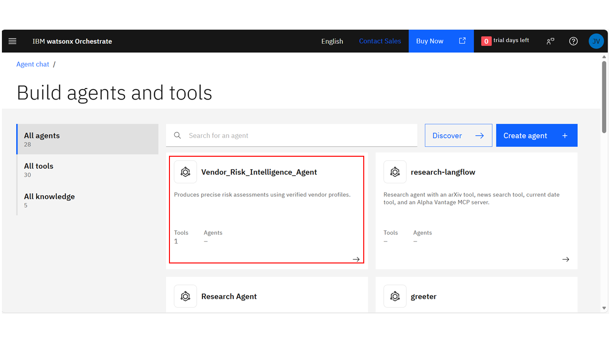

# Enhance AI agent observability with Langfuse using watsonx Orchestrate

As the number of [AI agents](https://www.ibm.com/think/topics/ai-agents) built grows daily, enterprises are exploring autonomous systems to support decision-making and operational workflows. At the same time, organizations often express concerns about explainability, governance, and production readiness, especially in [multi-agent systems](https://www.ibm.com/think/topics/multiagent-system) that rely on [large language models](https://www.ibm.com/think/topics/large-language-models) (LLMs) for reasoning. It is a challenge to use agents in business settings that provide responses without a clear explanation or that exhibit inconsistent behavior.

These challenges can be addressed by using IBM® watsonx Orchestrate® that provides a structured platform which supports self-hosting, tool-based reasoning, API calls and enterprise-grade control without requiring custom orchestration code.

In this tutorial, you will learn how to create an AI agent in watsonx Orchestrate using the watsonx Orchestrate Agent Development Kit (ADK). In [LangChain](https://www.ibm.com/think/topics/langchain) or LangGraph-based AI systems, developers frequently handle retries, state handling, and async execution manually. Watsonx Orchestrate ADK makes this easier by integrated lifecycle management, that allows consistent, enterprise-ready agent deployments. You will use Python to create the risk evaluation logic, define agent behavior, and incorporate [Langfuse](https://www.ibm.com/think/topics/langfuse) to monitor and enhance agent behavior using real execution traces. You can find this tutorial on [GitHub](https://github.com/IBM/ibmdotcom-tutorials) as well.

## What is Langfuse?

Langfuse is an open-source [LLM observability](https://www.ibm.com/think/topics/llm-observability) platform built on [OpenTelemetry](https://www.ibm.com/think/topics/opentelemetry) for monitoring LLM applications and agents. It uses telemetry (traces, metrics and logs) to monitor traces of agent executions, including LLM calls, tool calls, token usage, metadata and [latency](https://www.ibm.com/think/topics/latency) at a per-request and per-session level. It helps developers understand how agents behave in real usage scenarios and identify the root cause of incorrect outputs and optimize the behavior of the agent accordingly.

## Use case overview: Vendor risk intelligence

The goal of this tutorial is to build an AI agent for enterprise governance that evaluates vendor risk through deterministic, rule-based analysis. We created a synthetic dataset of vendors with financial ratings, security certifications, and incident history. The agent processes this and classifies vendors into specific risk tiers (low, medium, or high) while providing justifications for its decisions. It also supports interactive follow-ups allowing users to compare vendors or simulate how changing data points would impact a risk score, ensuring the high level of auditability required for corporate compliance.

## Prerequisites

To complete this tutorial, you need:

- Python 3.11 or later installed on your system. 

- A watsonx Orchestrate account. For this tutorial, a trial account is sufficient. You can use IBM Cloud to create a free 30-day trial if you don't have an account. 

- A watsonx Orchestrate API key from the Orchestrate user interface (UI).

- To install watsonx Orchestrate ADK.


## Steps

### Step 1: Sign in to watsonx Orchestrate

Sign in to watsonx Orchestrate through IBM Cloud and open the watsonx Orchestrate UI. Go to `API details` after opening `Settings` from the profile menu. Create a new API key, copy it and save it safely. During local development, the Watsonx Orchestrate ADK is authenticated using this API key. Watsonx Orchestrate acts like a local [SDK](https://www.ibm.com/think/topics/api-vs-sdk) (Software Development Kit) for building and testing agent logic.


### Step 2: Set up a local development environment

In this step, create a local development environment. Throughout this tutorial, you will run a local development server, import tools, set up environments, and create agents using the orchestrate command-line interface (CLI) provided by the ADK in Powershell. Start by navigating to the directory where you want to build your project. Then create a new Python virtual environment:

```powershell
python -m venv .venv
```

An isolated Python environment is created in a **.venv** folder. Using a virtual environment ensures that all dependencies for this tutorial are separated from Python installation in your entire system.

Then, activate the virtual environment. Your operating system determines which activation command to use.


**On Windows:**

```powershell
.\.venv\Scripts\activate
```

**macOS and Linux:**

```powershell
source ./.venv/bin/activate
```

Once activated, your terminal prompt will display **.venv** at the beginnning to show that you are working in a virtual environment.

### Step 3: Install watsonx Orchestrate ADK

With the virtual environment active, install the watsonx Orchestrate ADK on your local machine. To use the ADK, connect it to your existing watsonx Orchestrate environment. Run the following command in PowerShell:

```powershell
pip install --upgrade ibm-watsonx-orchestrate
```

You can follow the next steps of ADK installation by following the steps in the [official installation document](https://developer.watson-orchestrate.ibm.com/getting_started/installing).

**Note:** This tutorial runs the watsonx Orchestrate Developer Edition runtime locally, and connects it to the watsonx Orchestrate SaaS instance using the credentials.

To execute this method, create a file called **.env** at the project folder's root and add the following values:

```powershell
WO_DEVELOPER_EDITION_SOURCE=orchestrate

WO_INSTANCE=<your_watsonx_orchestrate_instance_url>

WO_API_KEY=<your_watsonx_orchestrate_api_key>
```

This **.env** file is required for running the server using `orchestrate server start -e .env -l` in the next steps.

### Step 4: Configure the watsonx Orchestrate environment in the ADK

Next, you need to set up your ADK with a valid Watsonx Orchestrate API key in order to connect your local environment to Watsonx Orchestrate.

**Note:** The watsonx Orchestrate ADK is compatible with multiple environment types, including IBM Cloud, AWS, and on-premises deployments. In this tutorial, we use the on-prem environment and authenticate using an API key through the ADK CLI. The ADK securely manages credentials internally, so no manual environment variable configuration is implemented for this setup.

From your project directory (with the virtual environment activated), run the following command to add your watsonx Orchestrate environment:

```powershell
orchestrate env add -n onprem-env -u <service-instance-url>
```

Here, **service-instance-url** is your watsonx Orchestrate instance URL. You can find this in the same `API details` tab in `Settings` in watsonx Orchestrate UI. 

Next, activate the environment that you added:

```powershell
orchestrate env activate onprem-env
```

Now, when prompted, enter the watsonx Orchestrate key obtained in Step 1. As soon as the environment has been activated, any subsequent commands related to the ADK, such as importing agents, tools, or running the server, will be executed in the watsonx Orchestrate environment.

**Note:** If you want to run everything locally using the Developer Edition, you can activate the default local environment using:

```powershell
orchestrate env activate local
```

This switches your ADK to the built-in local Orchestrate environment, which is useful for local testing.

### Step 5: Initialize the local watsonx Orchestrate project

In this step, you will create the agent framework template that contains your `Vendor Risk Intelligence Agent's` definition, tools, and source code. Then, create the folder structure required for local ADK-based development:

    ── adk-project(vendor-risk-intel)/
    ── agents/
    ── tools/
    ── src/

You can add the command given below to create the structure of the agent:

```powershell
mkdir -p adk-project\(vendor-risk-intel\)/{agents,src,tools}
```

Each folder has a specific purpose:

The `agents` folder contains the YAML file with the instructions, reasoning rules, and configuration of the agent model. It is responsible for determining the response to questions posed to the system by the user. The `tools` folder holds a YAML file which describes the tool provided to the agent. The `src` folder contains the Python implementation for custom tools and business logic.


### Step 6: Start the watsonx Orchestrate server

Start the Watsonx Orchestrate server so that it can receive and store your imports before importing tools and agents. Run this from the project folder's root:

```powershell
orchestrate server start -e .env -l
```

### Step 7: Configure Langfuse observability (SaaS)

The next step is [agent observability](https://www.ibm.com/think/insights/ai-agent-observability) where you analyze how the agent behaves at runtime such as which tools are called, latency, and where errors occur. For that, enable Langfuse observability in the watsonx Orchestrate ADK environment.

In this tutorial, the Langfuse SaaS version is used, which allows you to capture traces without running Langfuse locally.

Make sure the watsonx Orchestrate server is running (Step 6) before configuring Langfuse.

Next, create a Langfuse account at https://cloud.langfuse.com. After signing in, create a new organization and project. From the project settings, copy your project ID, your public key, your secret key, and your host URL.

Now set up Langfuse in the watsonx Orchestrate ADK using the command shown below, and replace the placeholders with your copied values:

```powershell
orchestrate settings observability langfuse configure `

  --url "<LANGFUSE_HOSTNAME>/api/public/otel" `


  --api-key "<LANGFUSE_SECRET_KEY>" `
  --health-uri "https://cloud.langfuse.com" `

  --config-json "{\"public_key\":\"<LANGFUSE_PUBLIC_KEY>\"}" `

  --project-id "<LANGFUSE_PROJECT_ID>"
```

Once this command has finished successfully, the Langfuse module will be fully integrated into the watsonx Orchestrate environment. At this point, all interactions with the agents are automatically recorded on the Langfuse module.

Now that the server is running, you can test the agent.

### Step 8: Define the Vendor Risk Intelligence Agent

The next step is to define the Vendor Risk Intelligence Agent. Agents in Watsonx Orchestrate ADK are declared using YAML files that describe the agent's goal, reasoning limitations, model configuration, and permitted tools.

Inside the `agents` directory, create a file named `vendor-risk-agent.yaml`. This file is the agent's prompt management layer that guarantees all answers are based on deterministic reasoning as opposed to free-form inference.

The agent definition used in this tutorial is shown below. You can copy and paste the following agent definition exactly into your `agents/vendor-risk-agent.yaml` file, then save it.


```python
spec_version: v1
kind: native
name: Vendor_Risk_Intelligence_Agent
description: Produces precise risk assessments using verified vendor profiles.
instructions: |
  You are a Vendor Risk Auditor.
  You MUST answer ALL questions by:
  1. Calling the Python tool `evaluate_all_vendor_risks`
  2. Reasoning strictly from the returned structured data
  3. Explaining answers using rules, signals, and outcomes from the tool
  4. Call evaluate_all_vendor_risks exactly once per question
  5. For definition questions, quote rules directly from the tool output
  NEVER infer meanings of financial ratings.
  NEVER guess intent.
  NEVER answer without tool evidence.
  Question handling rules:
  - Definition questions (e.g. "Does B+ mean High risk?"):
    → Explain the rule from the tool’s `rules` section.
  - Why questions (e.g. "Why is DataSecure Ltd High risk?"):
    → Cite strong and weak signals for that vendor.
  - Comparison questions (e.g. "Why is A Medium but B High?"):
    → Compare signal counts and types.
  - Policy questions (e.g. "What causes High risk?"):
    → Quote the tool’s rules exactly.
  - If the tool does not support a claim:
    → Say so explicitly.
  Use deterministic language only.
  Do not use speculative words like "might", "could", or "appears".

llm: watsonx/meta-llama/llama-3-2-90b-vision-instruct
style: react
tools:
  - evaluate_all_vendor_risks

```
    

This configuration ensures that the agent behaves predictably across what, why, how, and comparison questions. It also prevents hallucinations by forbidding assumptions about financial ratings or risk meanings unless they are explicitly defined by the tool’s output.

### Step 9: Implement the vendor risk evaluation logic

In this step, implement the Python tool that performs the vendor risk assessment. In watsonx Orchestrate ADK, the custom business logic is implemented through Python tools that the agents invoke to get the results. Rather than relying on fine-tuning a model for domain-specific behavior, this tutorial demonstrates how deterministic, rule-based reasoning can be implemented through Python tools ensuring consistent outcomes. 

Inside the `src` folder, create a file named `main.py`. This file contains the vendor dataset we created, the risk evaluation rules, and a Python tool named `evaluate_all_vendor_risks` that provides the logic to the agent.

The risk logic is completely rule-based. When it comes to high-risk signals, a company can receive a high risk score because of its poor financial performance, security incidents in the past, or regulatory inquiries. A company can receive a medium risk score because of the absence of certifications, single operational incidents, or disruptions by weather conditions.

The `evaluate_all_vendor_risks` function is made as a watsonx Orchestrate tool, making it callable by the agent during execution. The tool returns structured output that includes the final risk level along with the exact reasons that caused the classification.

**Note:** The `main.py` file included in this tutorial is the final updated version of the vendor risk evaluation logic. The first sets of code caused erroneous behavior of agents, which were analyzed using Langfuse traces. You can find the Langfuse traces in the screenshots given in the later steps of this tutorial. 

The complete implementation of `main.py` file used in this tutorial is given below. You can copy and paste the complete `main.py` implementation below into `src/main.py`, then save the file.


```python
from ibm_watsonx_orchestrate.agent_builder.tools import tool

# =====================================================
# IN-MEMORY VENDOR DATA
# =====================================================

VENDORS = [
    {
        "name": "CloudHostCo",
        "financial_rating": "A-",
        "security_certifications": ["ISO 27001", "SOC2 Type II"],
        "past_incidents": [{"type": "Operational", "year": 2023}],
        "recent_news": ["Minor service disruption in EU region"]
    },
    {
        "name": "DataSecure Ltd",
        "financial_rating": "B",
        "security_certifications": ["SOC2 Type I"],
        "past_incidents": [{"type": "Security", "year": 2022}],
        "recent_news": ["Suspicious login attempts on admin accounts"]
    },
    {
        "name": "FinPay Solutions",
        "financial_rating": "A",
        "security_certifications": ["PCI-DSS"],
        "past_incidents": [],
        "recent_news": ["Regulatory inquiry about payment delays"]
    },
    {
        "name": "GreenLogistics Corp",
        "financial_rating": "B+",
        "security_certifications": ["ISO 9001"],
        "past_incidents": [{"type": "Operational", "year": 2023}],
        "recent_news": ["Weather-related disruptions in the UK"]
    }
]

REQUIRED_CERTS = {"ISO 27001", "SOC2 Type II", "PCI-DSS"}

# =====================================================
# RISK COMPUTATION (FIXED)
# =====================================================

def compute_vendor_risk(vendor: dict) -> dict:
    strong_signals = []
    weak_signals = []

    # ---------- Strong signals ----------

    # Financial risk ONLY for B or worse (NOT B+)
    if vendor["financial_rating"] in {"B", "B-", "C", "C-", "D"}:
        strong_signals.append("Weak financial rating")

    # Security incident
    if any(i["type"].lower() == "security" for i in vendor.get("past_incidents", [])):
        strong_signals.append("Past security incident")

    # Regulatory inquiry
    for news in vendor.get("recent_news", []):
        if "regulatory inquiry" in news.lower():
            strong_signals.append("Regulatory inquiry")
            break

    # ---------- Weak signals ----------

    # Missing key certifications
    certs = set(vendor.get("security_certifications", []))
    if not REQUIRED_CERTS.issubset(certs):
        weak_signals.append("Missing key security certifications")

    # Single operational incident
    incidents = vendor.get("past_incidents", [])
    if len(incidents) == 1 and incidents[0]["type"].lower() == "operational":
        weak_signals.append("Single operational incident")

    # Weather-related disruptions are weak only
    for news in vendor.get("recent_news", []):
        if "weather" in news.lower():
            weak_signals.append("Weather-related disruption")
            break

    # ---------- Final decision ----------

    if len(strong_signals) >= 2:
        risk = "High"
    elif len(strong_signals) == 1 or len(weak_signals) >= 2:
        risk = "Medium"
    else:
        risk = "Low"

    return {
        "risk": risk,
        "strong_signals": strong_signals,
        "weak_signals": weak_signals
    }

# =====================================================
# PYTHON TOOL
# =====================================================

@tool
def evaluate_all_vendor_risks() -> dict:
    """
    Returns structured vendor risk assessments with explanations and rules.
    """
    return {
        "rules": {
            "financial_rating_rule": "Only financial ratings of B or lower are treated as strong risk signals. B+ and above are not strong signals.",
            "high_risk_rule": "High risk requires two or more strong signals.",
            "medium_risk_rule": "Medium risk occurs with one strong signal or two or more weak signals.",
            "weather_rule": "Weather-related disruptions are always weak signals.",
            "operational_rule": "A single operational incident is a weak signal."
        },
        "vendors": {
            v["name"]: {
                "financial_rating": v["financial_rating"],
                "risk": compute_vendor_risk(v)["risk"],
                "strong_signals": compute_vendor_risk(v)["strong_signals"],
                "weak_signals": compute_vendor_risk(v)["weak_signals"]
            }
            for v in VENDORS
        }
    }

```

### Step 10: Import the Python tool and agent into watsonx Orchestrate

In this step, the tool and agent have to be made available to watsonx Orchestrate. This is done by importing these into the activated ADK environment. Before running the import commands, make sure you are inside the root folder of your project (the same folder that contains the agents, src, and tools directories).

First, import the Python tool so that watsonx Orchestrate can register it as an executable capability. From the root of your project directory, run the following command:

```powershell
orchestrate tools import --kind python --file src/main.py --package-root .
```

This command packages the Python code into a module, registers the `evaluate_all_vendor_risks` tool, and allows it to be called by agents.

```powershell
orchestrate agents import -f agents/vendor-risk-agent.yaml
```

The Vendor Risk Intelligence Agent is then fully integrated with the Python tool in the watsonx Orchestrate environment.

### Step 11: Test the agent and analyze behavior using Langfuse

With the local watsonx Orchestrate server running and agent observability enabled, you can now test the agent and analyze its behavior in real time.

Start the chat interface by running the following command:

```powershell
orchestrate chat start
``` 
Now open the watsonx Orchestrate chat UI in your browser. From the agent selector, choose `Vendor_Risk_Intelligence_Agent` and begin asking questions related to vendor risk.



To verify that the agent is responding correctly (and calling the Python tool deterministically), here are a few sample questions you can use for testing:

1. Does B+ mean High risk?

2. What risk is DataSecure Ltd?

3. What is the criteria for Medium risk?

4. Which vendor has the weakest financial rating?

5. If FinPay Solutions experienced a security incident, how would its risk level change?

6. Which vendors have experienced operational incidents?


As you interact with the agent, open the Langfuse dashboard in your browser. Each user query creates a new trace, includes a session_id, and a user_id. These traces record the full execution path of the agent. By selecting a trace, you can analyze:

-	The complete input and output of the agent

-	The Python tool invocation 

-	The structured data returned by the tool

-	The reasoning process followed to reach the final answer

-	Latency for each step in the process

-	Session-based conversation flow for multiple questions


This observability helps you to analyze the performance metrics that point out bottlenecks such as errors in assumption, incomplete rules, or unexpected agent behavior. 

### Step 12: Refine agent behavior using Langfuse insights

After testing the agent, use Langfuse traces to identify incorrect responses. Langfuse shows each tool invocation, reasoning step, and response latency, making it easy to understand why an answer was produced. 


In this use case, trace analysis revealed that some incorrect answers occurred when the agent inferred financial meanings or responded without explicitly citing rule-based evidence. To change this action, the agent instructions and corresponding python code were modified to fix strict rule-based thinking with required tool action.


After re-importing the updated files, the agent was again tested. The new traces ensures that responses were firmly rooted in structured tool output, explanations were deterministic and responses to all descriptive questions were correct.

This observation and refinement process shows how Langfuse helps safe and sound development of agents based on user feedback.

## Conclusion

This tutorial has walked you through the creation of a structured and trustworthy AI agent using watsonx Orchestrate that is developed for the creation of enterprise grade agents. With the integration of simple rule-based Python logic and clear agent instructions and reusable tools, you have implemented a use case in vendor risk assessment with minimal code and maximum transparency. The addition of Langfuse has made it easy to detect agent behavior and identify the issues with reasoning to continuously improve accuracy without guesswork. This approach helps enterprises to optimize agent systems end-to-end, automate complex workflows, and deploy AI systems with full transparency. More importantly, together, watsonx Orchestrate ADK and Langfuse allow enterprises to design, debug, and scale complex agentic workflows and AI applications faster, with stronger governance and clearer reasoning and significantly reduced development time.
