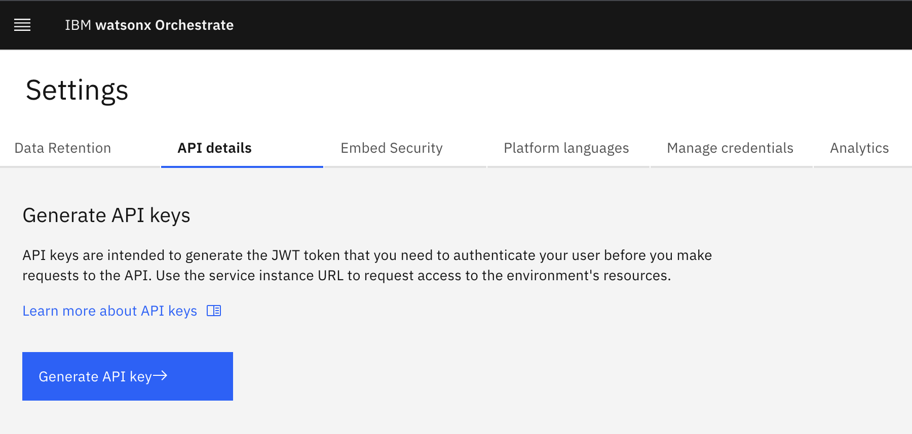
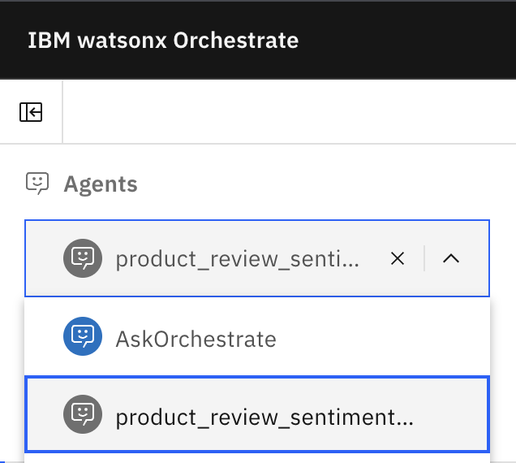
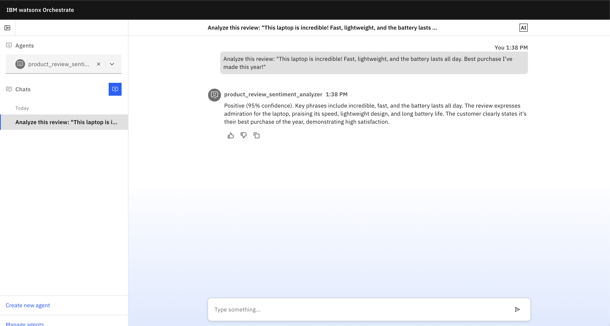
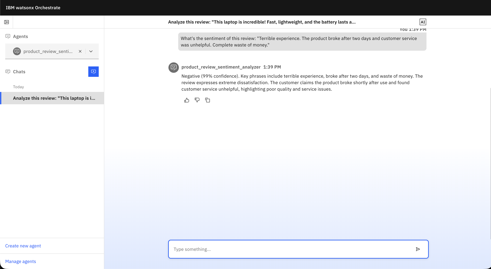
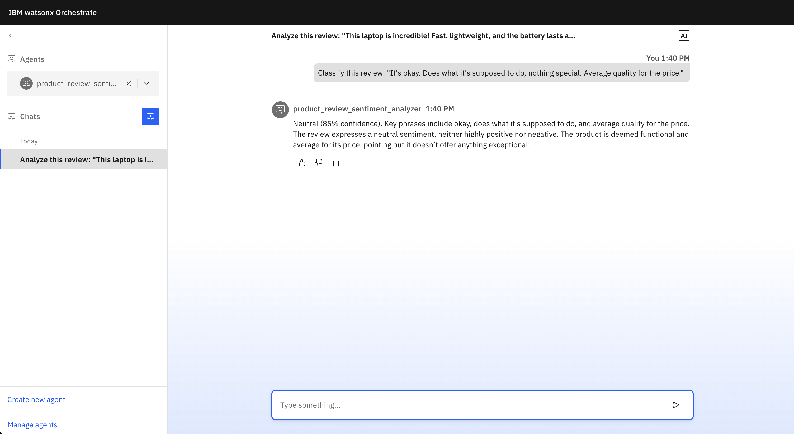
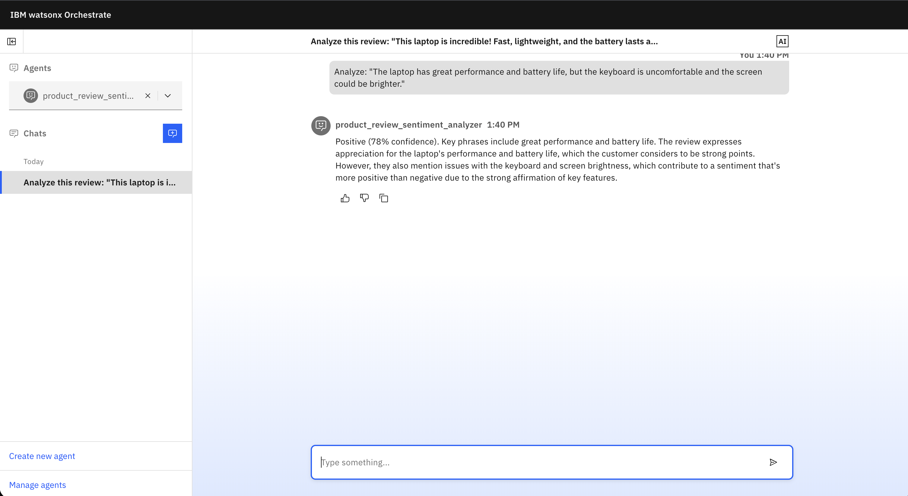

# Build an AI agent for text classification with Python and watsonx Orchestrate

Every day businesses receive thousands of customer reviews, support tickets, and
feedback messages. Hidden within this flood of text data are patterns that reveal
what customers like, and where products fall short. Manually reading and categorizing
this information, however, is time-consuming and inconsistent.  

[Text classification](https://www.ibm.com/think/topics/text-classification)
is a fundamental natural language processing ([NLP](https://www.ibm.com/think/topics/natural-language-processing))
task that solves this by automatically categorizing text into predefined labels.
These categorizations can then be used by AI systems to make decisions or trigger
actions.  

In this tutorial, you'll build an [AI agent](https://www.ibm.com/think/topics/ai-agents)
that uses a text classification model to analyze product reviews and determine customer
sentiment. The agent will classify text as positive, negative, or neutural and
respond with insights about the feedback. From spam detection to content moderation,
text classification powers countless AI applications across industries. Follow along
to learn how to integrate this capability into your intelligent systems.

## From traditional ML to transformer models

Traditional data science approaches to this classification problem rely on machine
learning algorithms like [Naive Bayes](https://www.ibm.com/think/topics/naive-bayes)
and logistic regression. Before training a model with these algorithms, documents
must go through text preprocessing and be converted into numerical features that
the model can interpret. Common techniques include bag-of-words ([BoW](https://www.ibm.com/think/topics/bag-of-words))
or Term Frequency–Inverse Document Frequency (TF-IDF) vectors. In many workflows,
these features are generated from datasets stored in CSV files and loaded into a
pandas DataFrame for modeling with tools like scikit-learn ([sklearn](https://www.ibm.com/think/topics/scikit-learn))
and NumPy.

While effective for simple tasks, these methods require explicit
[feature engineering](https://www.ibm.com/think/topics/feature-engineering), where
developers must manually define how text is represented in the training data. Neural
networks take a different approach. [Transformer-based model](https://www.ibm.com/think/topics/transformer-model)
architectures create special numerical embeddings that capture semantic relationships,
helping to optimize efficiency on more complex tasks.

This tutorial takes the transformer approach. Rather than manually engineering
features, you'll used a fine-tuned DistilBERT model that already understands
semantic relationships in text.

## Why combine a Python text classification tool with an AI agent?

Text classifiers help machines make sense of large volumes of [unstructured data](https://www.ibm.com/think/topics/unstructured-data)
by automatically assigning labels to text. They power everyday AI tasks like email
filtering, content moderation, support ticket routing, and sentiment analysis.
Combining a Python text classification tool with an AI agent can make these
tasks faster, more accurate, and easier to scale.

Modern AI applications often combine specialized machine learning models with
conversational AI agents. Instead of relying on a single model for every task,
agents can invoke tools designed for specific capabilities.  

In this example, the AI agent uses a [sentiment analysis](https://www.ibm.com/think/topics/sentiment-analysis)
tool powered by a fine-tuned version of DistilBERT, a lightweight open source
transformer-based deep learning model derived from BERT.[^1] The agent itself
uses IBM Granite as the large language model (LLM) to handle natural language
interaction and orchestrate the workflow. The classification tool performs the
prediction, while the agent interprets the results and responds to the user.

This modular approach improves performance, flexibility, and scalability, allowing
AI systems to combine the strengths of multiple models.

## What you'll build

You'll create a fully functional AI system for sentiment analysis that
demonstrates practical classification in action, while gaining hands-on
experience with NLP and agent workflows.

### Your sentiment analysis agent

Your agent will:  

- **Understand natural language requests:** Users can ask "*Analyze this review*"
or "*What's the sentiment of this feedback?*", and the agent invokes your Python
tool to deliver results
- **Classify sentiment accurately:** The Python tool use a pre-trained, fine-tuned
DistilBERT model to label text as positive, negative, or neutral, demonstrating
how NLP models can be integrated into an agent workflow.
- **Provide explainable results:** The tool outputs confidence scores for each predication
and key phrases to help interpret results.
- **Handle edge cases:** Mixed sentiment, neutral reviews, and varying lengths are
managed by the tool, ensuring more reliable testing and validation.

### Technical components

- **Python classification tool (`sentiment_tool.py`):** Preprocesses text, runs
sentiment classification, extracts key phrases, and outputs structured JSON for
the agent.
- **AI agent configuration(`agent.yaml`):** Defines conversational style, workflow,
behavior, and connects to the classification tool using IBM Granite.
- **Local testing with watsonx Orchestrate Developer Edition:** Test your agent
with real reviews, iterate on behavior, and validate accuracy on a test set before
deployment.

By the end, you'll have a modular, interactive AI agent system and hands-on experience
integrating NLP models, building agent-invokable tools and configuring workflows
for real-world applications.

## Prerequisites

- Python 3.11 or later - Check your system with `python --version`.
- 16 GB RAM minimum
- A code editor - Visual Studio Code, or any editor your prefer.

This guide includes installation steps for the watsonx Orchestrate Agent
Development Kit (ADK).

## Authorization requirements

- **watsonx Orchestrate Developer Edition** - Required to use the ADK for local
development. The Developer Edition provides access to the ADK tools and local
testing environment. [Learn more about Developer Edition](https://developer.watson-orchestrate.ibm.com/developer_edition/wxOde_overview#what-is-watsonx-orchestrate-developer-edition)
or [sign up for a free 30-day trial](https://www.ibm.com/products/watsonx-orchestrate)
- **watsonx Orchestrate Service Instance URL** - From your IBM Cloud® dashboard
(see Step 5 for details)

**Note:** The watsonx Orchestrate ADK is only available with the Developer Edition. It lets you to
build, test, and deploy AI agents locally before publishing them to your watsonx
Orchestrate environment.

## Steps

### Step 1. Set up your development environment

You have two options to set up your project:

**Option A: Clone the tutorial repository**

[Clone our GitHub repository](https://github.com/IBM/ibmdotcom-tutorials) to get
all project files pre-configured:

```bash
git clone https://github.com/IBM/ibmdotcom-tutorials.git
```

Navigate to the `wxo-text-classification` project directory within the cloned
repository. This option provides you with all the necessary files and code
examples ready to use.

**Option B: Create from scratch**

If you prefer to build the project step-by-step, create a new project directory:

```bash
mkdir product-review-sentiment-agent
cd product-review-sentiment-agent
```

This directory is where you'll be working as you follow along, creating each file
manually.

#### 1a. Create a virtual environment

Creating a virtual environment isolates your project dependencies from other
Python projects on your system.

```bash
python -m venv .venv
```

#### 1b. Activate your virtual environment

This activation command differs depending on your operating system.  

**macOS and Linux:**  

```bash
source .venv/bin/activate
```

**Windows:**

```powershell
.venv/Scripts/activate
```

You should see a `(.venv)` appear at the beginning of your terminal prompt, indicating
the virtual environment is active.  

### Step 2. Install and configure the watsonx Orchestrate ADK

The IBM watsonx Orchestrate Agent Development Kit (ADK) is a Python library and
CLI tool that enables you to build, test, and deploy AI agents.

With your virtual environment activated, install the ADK using pip:

```bash
pip install ibm-watsonx-orchestrate
```

This installs the watsonx Orchestrate ADK along with its dependencies.

### Step 3. Create the sentiment analysis tool

Now we'll create a Python tool that performs [sentiment analysis](https://www.ibm.com/think/topics/sentiment-analysis).
In the watsonx Orchestrate ADK, tools are Python functions that agents can invoke
to accomplish specific tasks.  

#### 3a. Install required dependencies

Create a `requirements.txt` file in your project directory and copy and paste the
following dependencies:  

```txt
ibm-watsonx-orchestrate 
transformers>=4.30.0
torch>=2.0.0
nltk>=3.8.0
```

Orchestrate also uses this file to install the specified dependencies when
running any [Python-based agent tools](https://developer.watson-orchestrate.ibm.com/tools/create_tool).

Install the dependencies:  

```bash
pip install -r requirements.txt
```

#### 3b. Add the Python file to your project

Create a file inside your project directory named `sentiment_tool.py` with the
following code:

```python
"""
Sentiment Analysis Tool for Product Reviews
Uses a pre-trained transformer model to classify review sentiment
"""

from ibm_watsonx_orchestrate.agent_builder.tools import tool
from transformers import pipeline
import nltk
from typing import Dict, Any

# Download required NLTK data
nltk.download('punkt', quiet=True)
nltk.download('stopwords', quiet=True)

# Initialize the sentiment analysis pipeline
# This uses a pre-trained DistilBERT model fine-tuned for sentiment analysis
classifier = pipeline(
    "sentiment-analysis",
    model="distilbert-base-uncased-finetuned-sst-2-english"
)


@tool
def analyze_sentiment(review_text: str, product_name: str = "") -> Dict[str, Any]:
    """Analyzes the sentiment of a product review and returns classification results.
    
    This tool uses a pre-trained transformer model to classify the emotional tone
    of product reviews as positive or negative, along with a confidence score and
    key phrases that influenced the classification.
    
    Args:
        review_text (str): The product review text to analyze
        product_name (str, optional): The name of the product being reviewed. Defaults to "".
        
    Returns:
        Dict[str, Any]: A dictionary containing sentiment, confidence_score, key_phrases, and product_name
    """
    
    # Validate input
    if not review_text or len(review_text.strip()) == 0:
        return {
            "error": "Review text cannot be empty",
            "sentiment": None,
            "confidence_score": 0,
            "key_phrases": [],
            "product_name": product_name
        }
    
    # Perform sentiment classification
    # Limit to 512 tokens (model's maximum input length)
    result = classifier(review_text[:512])[0]
    
    # Map model output to our sentiment labels
    sentiment_map = {
        'POSITIVE': 'positive',
        'NEGATIVE': 'negative'
    }
    
    sentiment = sentiment_map.get(result['label'], 'neutral')
    confidence = result['score']
    
    # Extract key phrases from the review
    key_phrases = extract_key_phrases(review_text)
    
    return {
        "sentiment": sentiment,
        "confidence_score": round(confidence, 3),
        "key_phrases": key_phrases,
        "product_name": product_name if product_name else "Unknown Product"
    }


def extract_key_phrases(text: str) -> list:
    """
    Extracts important words from the review text.
    
    Args:
        text: The review text to analyze
        
    Returns:
        List of key words (up to 5) that are meaningful
    """
    # Tokenize the text
    tokens = nltk.word_tokenize(text.lower())
    
    # Get English stopwords
    stopwords = set(nltk.corpus.stopwords.words('english'))
    
    # Filter out stopwords, punctuation, and short words
    key_words = [
        word for word in tokens 
        if word.isalnum() and word not in stopwords and len(word) > 3
    ]
    
    # Return top 5 most relevant words
    return key_words[:5]


# Test the tool locally
if __name__ == "__main__":
    print("Testing Sentiment Analysis Tool\n" + "="*60)
    
    test_reviews = [
        {
            'review_text': "This product exceeded my expectations! The quality is outstanding and it arrived quickly. Highly recommend!",
            'product_name': "Wireless Headphones"
        },
        {
            'review_text': "Terrible experience. The product broke after two days and customer service was unhelpful.",
            'product_name': "Smart Watch"
        },
        {
            'review_text': "It's okay. Does what it's supposed to do, nothing special.",
            'product_name': "USB Cable"
        }
    ]
    
    for review in test_reviews:
        print(f"\nProduct: {review['product_name']}")
        print(f"Review: {review['review_text'][:60]}...")
        
        result = analyze_sentiment(
            review_text=review['review_text'],
            product_name=review['product_name']
        )
        
        # Access the content from the ToolResponse object
        content = result.content
        print(f"Sentiment: {content['sentiment']}")
        print(f"Confidence: {content['confidence_score']}")
        print(f"Key phrases: {', '.join(content['key_phrases'])}")
        print("-" * 60)
```

This tool was written based on the parameters and guidance from
[*Authoring Python-Based tools*](https://developer.watson-orchestrate.ibm.com/tools/create_tool), 
however if you did already have a Python tool ready to test,
the ADK can automatically import and convert ordinary Python files, as well as
generate docstrings for functions in the source file. This is done using the
**Auto-discover** feature, a simple command that converts a Python file into a
format ready to be uploaded to Orchestrate.

#### 3c. Understanding the code

The sentiment analysis tool performs text classification through several key steps:

1. **Load the pre-trained model**

```python
classifier = pipeline("sentiment-analysis",
                     model="distilbert-base-uncased-finetuned-sst-2-english")
```

This loads a DistilBERT transformer model from [Hugging Face](https://huggingface.co/distilbert/distilbert-base-uncased-finetuned-sst-2-english)
that's been fine-tuned for sentiment analysis. The model has been fine-tuned on
the Standford Sentiment Treebank ([SST-2](https://nlp.stanford.edu/sentiment/treebank.html))
dataset, which makes it well-suited for classifying product reviews and similar
short-form feedback.  

Depending on your use case, you may want to swap in a different model. For example,
a model trained on news articles would be better suited for media monitoring,
while a domain-specific model fine-tuned on customer support data might perform
better for ticket routing. You can browse models on [HuggingFace](https://huggingface.co/models)
and replace the model string in the pipeline to optimize for your specific classification
task. If you do swap models, performance metrics such as accuracy, precision, and
F1 score can help you evaluate whether the new model is a better fit for your data.

2. **Register the tool with `@tool` decorator**

```python
@tool
def analyze_sentiment(review_text: str, product_name: str = "") -> Dict[str, Any]:
    """Analyzes the sentiment of a product review and returns classification results.
    
    This tool uses a pre-trained transformer model to classify the emotional tone
    of product reviews as positive or negative, along with a confidence score and
    key phrases that influenced the classification.
    
    Args:
        review_text (str): The product review text to analyze
        product_name (str, optional): The name of the product being reviewed
        
    Returns:
        Dict[str, Any]: A dictionary containing sentiment, confidence_score, key_phrases, and product_name
    """
```

The `@tool` decorater registers this function with the watsonx Orchestrate agent.
The agent can invoke this tool when it needs to classify sentiment. The docstring
helps the agent understand when and how to use the tool.

3. **Validate input and perform classification**

```python
# Validate input (data quality check before classification)
if not review_text or len(review_text.strip()) == 0:
    return {
        "error": "Review text cannot be empty",
        "sentiment": None,
        "confidence_score": 0,
        "key_phrases": [],
        "product_name": product_name
    }

# Perform sentiment classification
# The model handles preprocessing internally (tokenization, encoding)
result = classifier(review_text[:512])[0]

# Map model output to our sentiment labels
sentiment_map = {
    'POSITIVE': 'positive',
    'NEGATIVE': 'negative'
}
sentiment = sentiment_map.get(result['label'], 'neutral')
confidence = result['score']
```

The tool first validates that the input text is not empty, then passes it to the
transformer model. The `[:512]` truncates the text to 512 tokens, the maximum
sequence length the DistilBERT model can process. This ensures that longer reviews
don't cause errors. The model internally handles preprocessing and returns a
sentiment label and confidence score, which we map to lowercase for consistency.
This is where we define our classification taxonomy (positive/negative/neutral).  

4. **Extract key phrases (Post-processing)**  

```python
def extract_key_phrases(text: str) -> list:
    """Extracts important words from the review text."""
    # Tokenize the text
    tokens = nltk.word_tokenize(text.lower())
    
    # Get English stopwords
    stopwords = set(nltk.corpus.stopwords.words('english'))
    
    # Filter out stopwords, punctuation, and short words
    key_words = [
        word for word in tokens
        if word.isalnum() and word not in stopwords and len(word) > 3
    ]
    
    # Return top 5 most relevant words
    return key_words[:5]
```

This helper function identifies the most important words in the review by
tokenizing the text, removing common words ("the", "is", "a"), and keeping
only meaningful terms longer than 3 characters. This provides explainability
for classification by showing users which specific words influenced the sentiment
decision.

5. **Return structured results (Output)**

```python
# Extract key phrases from the review
key_phrases = extract_key_phrases(review_text)

# Package all results into a structured dictionary
return {
    "sentiment": sentiment,
    "confidence_score": round(confidence, 3),
    "key_phrases": key_phrases,
    "product_name": product_name if product_name else "Unknown Product"
}
```

The tool packages everything into a structured directory that makes the results
easy to use and understand. This structured format allows the agent to easily
present results to users and enables downstream systems to process the sentiment
data programmatically.

#### 3e. Test the tool locally

Before integrating with an agent, test your tool to ensure it works correctly:

```bash
python sentiment_tool.py
```

You should see output similar to:  

```bash
Testing Sentiment Analysis Tool
============================================================

Product: Wireless Headphones
Review: This product exceeded my expectations! The quality is out...
Sentiment: positive
Confidence: 1.0
Key phrases: product, exceeded, expectations, quality, outstanding
------------------------------------------------------------

Product: Smart Watch
Review: Terrible experience. The product broke after two days and...
Sentiment: negative
Confidence: 1.0
Key phrases: terrible, experience, product, broke, days
------------------------------------------------------------

Product: USB Cable
Review: It's okay. Does what it's supposed to do, nothing special...
Sentiment: positive
Confidence: 0.995
Key phrases: okay, supposed, nothing, special
------------------------------------------------------------
```

**Note about the warning message:** You may see a message like:

```bash
[WARNING] - Unable to properly parse parameter descriptions due to missing or incorrect type hints.
```

This is an informational warning from the watsonx Orchestrate ADK and does not
affect the functionality of your tool. The ADK is being strict about docstring
format pasting, but your sentiment analysis results will be accurate.

### Step 4. Define your AI agent

Now that you have a working tool, you'll create an AI agent that can use it
to help users analyze product reviews through natural conversation. Our Product
Review Sentiment Analyzer agent combines conversational AI with advanced sentiment
analysis to provide comprehensive review insights.

Agents are defined using YAML configuration files that specify the agent's behavior,
capabilities, and available tools.

#### 4a. Create the agent configuration

Create a file named `agent.yaml` in your project directory with the following configuration:

```yaml
spec_version: v1
kind: native
name: product_review_sentiment_analyzer
description: An AI agent that analyzes product reviews and classifies sentiment as positive, negative, or neutral

instructions: |
  You are a sentiment analysis agent specialized in analyzing product reviews.
  
  When a user provides a product review, use the analyze_sentiment tool to classify it.
  Always provide:
  1. The sentiment classification (positive, negative, or neutral)
  2. The confidence score
  3. Key phrases that influenced the classification
  4. A brief explanation of why the review has that sentiment
  
  Be helpful and professional in your responses. If the review is negative, acknowledge
  the customer's concerns. If positive, highlight what they appreciated.

  Formatting requirement: Respond in natural, conversational paragraphs — do NOT
  include code fences, markdown lists, or labeled blocks. Integrate the required
  items into fluent text. For example: "The review is positive (98% confidence).
  Key phrases include incredible, fast, and lightweight. The customer praises the
  laptop's speed, light weight, and battery life, and describes it as their best
  purchase this year." Keep responses concise and user-friendly.

llm: "watsonx/ibm/granite-3-3-8b-instruct"
style: default
tools:
  - analyze_sentiment
```

Let's breakdown the key fields:  

- **kind:** Refers to the type of agent, external or native. Native agents run in
the watsonx Orchestrate environment. External agents are built outside of the platform
and can be used as collaborators for native agents using communication protocols
like [A2A](https://www.ibm.com/think/topics/agent2agent-protocol#684929709) or external
chat provider API.
- **name:** A unique identifier for your agent (use lowercase with hyphens)
- **description:** A brief explanation of what the agent does
- **instructions:** Detailed guidance for how the agent should behave and use its tools
- **llm:** Configuration for the large language model
    - **model:** The specific LLM to use (e.g., `watsonx/ibm/granite-3-3-8b-instruct`)
- **style:** The interaction style (default, concise, detailed, etc.)
- **tools:** List of tool references that the agent can invoke.

### Step 5. Set up you local watsonx Orchestrate environment

Now that you have created your sentiment analysis tool and agent configuration,
you'll set up a local watsonx Orchestrate environment to test your agent.

#### 5a. Create your .env file

Inside your project directory, create a `.env` file to store your watsonx
Orchestrate credentials. If you cloned the repo in Step 1, you can copy
the provided template and configure the necessary fields:

```bash
cp env.template .env
```

Otherwise, create a file within your `product-review-sentiment-agent` directory:

```bash
touch .env
```

#### 5b. Configure the required fields

Open the `.env` file in your text editor and configure the following three
essential fields:

**WO_DEVELOPER_EDITION_SOURCE:** The source ID for the watsonx Orchestrate Developer
Edition. Set this to `orchestrate`.

```text
WO_DEVELOPER_EDITION_SOURCE=orchestrate
```

**WO_INSTANCE:** This URL is your watsonx Orchestrate service instance. You can
find this information by logging into your [watsonx Orchestrate account](https://dl.watson-orchestrate.ibm.com/login?redirUrl=/chat)
and navigating to your instance details. Click your profile icon > **Settings**,
then select **API details** tab.  

The URL follows this format:  

```text
WO_INSTANCE=https://api.us-south.watson-orchestrate.cloud.ibm.com/instances/<your-instance-id>
```

Copy and paste your service instance URL to replace the template value in your
`.env` file. The region (for example, `us-south`) depends on geographical
location.

**WO_API_KEY:** This key is your watsonx Orchestrate API key, which authenticates
your connection to IBM Cloud services. You can create this key  by clicking
"Generate API Key" on the **API details** tab where you'll be redirected to your
IBM Cloud account dashboard to generate a key.  



Replace `<your-api-key>` with your actual API key.  

```text
WO_API_KEY=<your-api-key>
```

Your complete `.env` file should look like this:

```env
WO_DEVELOPER_EDITION_SOURCE=orchestrate
WO_INSTANCE=https://api.us-south.watson-orchestrate.cloud.ibm.com/instances/<your-instance-id>
WO_API_KEY=<your-api-key>
```

#### 5c. Start watsonx Orchestrate Developer Edition

Once you have configured the environment variables in your `.env` file, start the
watsonx Orchestrate Developer Edition server by running: 

```bash
orchestrate server start -e .env
```

This command starts the local watsonx Orchestrate server and loads your credentials
from the `.env` file. It may take several minutes to complete, especially on the
first run. You should see similar output to this when complete:

```bash
[INFO] - Waiting for orchestrate server to be fully initialized and ready...
[INFO] - Orchestrate services initialized successfully
[INFO] - local tenant found
[INFO] - You can run `orchestrate env activate local` to set your environment or `orchestrate chat start` to start the UI service and begin chatting.
```

##### Troubleshooting initialization

If the server initialization fails or hangs, try starting from a clean slate using
the following steps:

1. **Reset the server:**

```bash
orchestrate server reset
```

This command stops and removes all containers created for watsonx Orchestrate.

2. **Restart the installation:**

After resetting, run the start command again:  

```bash
orchestrate server start -e .env
```

3. **Check the server logs container status:**

You can view service logs for the Orchestrate server to check for warnings
or errors:

```bash
orchestrate server logs
```

If the preceding steps do not work, reset the server and completely remove
the server environment: `orchestrate server purge` and reinstall.

### Step 6. Import and test your agent

Now you'll import your sentiment analysis tool and agent into the local
environment and test them with sample product reviews that act as test
data to validate the model's predictions.

#### 6a. Import the sentiment analysis tool

Before importing the agent, you need to import the sentiment analysis
tool so it's available in your watsonx Orchestrate environment.  

Run this command to import the tool:

```bash
orchestrate tools import -k python -f sentiment_tool.py -r requirements.txt
```

This command imports the Python tool directly and uses the `-r requirements.txt`
flag to specify dependencies.

#### 6b. Import the sentiment analysis agent

Now that the tool is imported, you can import the agent that uses it. Use the
`orchestrate agents import` command to import your agent from the YAML configuration
file:

```bash
orchestrate agents import -f agent.yaml
```

The agent configuration and tool references are validated before the agent is
registered with Orchestrate environment.

#### 6c. Launch the chat interface

Now that both the tool and agent are imported, you can start the chat interface
with your agent:

```bash
orchestrate chat start
```

This command opens a web-based chat interface in your default browser at
`http://localhost:3000/chat-lite`. If the browser doesn't open automatically,
you can manually navigate to that URL.

#### 6d. Activate the agent in the chat interface

Click the **agent dropdown menu** at the top left of the chat interface and
select *product-review-sentiment-analyzer* from the list. 



The agent is now active
and ready to analyze product reviews.

#### 6e. Test the agent with sample reviews

With your agent selected, try asking it to analyze various product reviews. Here
are some examples to test out different sentiment types:

**Example 1: Positive review**

```text
Analyze this review: "This laptop is incredible! Fast, lightweight, and the battery lasts all day. Best purchase I've made this year!"
```



The expected response should display the sentiment tool results in a conversational
tone.

**Example 2: Negative review**

```text
What's the sentiment of this review: "Terrible experience. The product broke after two days and customer service was unhelpful. Complete waste of money."
```



**Example 3: Neutral review**

```text
Classify this review: "It's okay. Does what it's supposed to do, nothing special. Average quality for the price."
```



**Example 4: Mixed review**

```text
Analyze: "The laptop has great performance and battery life, but the keyboard is uncomfortable and the screen could be brighter."
```



Try testing the agent with your own product reviews or real customer feedback.

### Step 7. Stop the server and clean up

When you're finished testing your agent, you can stop the watsonx Orchestrate
server.

```bash
orchestrate server stop
```

When you're done working in the project, deactivate your Python virtual environment:

```bash
deactivate
```

You can reactivate it anytime by running the activation command from Step 1.

## Conclusion

You've built a working AI agent that uses text classification to analyze product
reviews and respond with meaningful sentiment insights by combining a fine-tuned
DistilBERT classification tool with a conversational IBM Granite agent in
watsonx Orchestrate.

The pattern you've implemented here is the same foundation used in production
AI systems across industries. Rather than simply returning a label, the agent
uses classification results to decide how to respond, which is what separates an
NLP script from an intelligent agent workflow.

As a next step, consider extending the agent to trigger actions based on classification
results. A high-confidence negative review could automatically create a support
ticket, a positive one could be fed into a marketing pipeline, and a neutral response
could be queued for human follow-up. You could also apply the same architecture
to entirely different problems, (spam detections, content moderation, or support
ticket routing), by swapping the model and updating the agent instructions.

Text classification is a small capability with a large impact. As you scale the
system, performance metrics will help you optimize model performance overtime.
Now that you understand how to integrate it into an agent workflow, you have a
reusable pattern for building smarter, more responsive AI systems.

## Footnotes

1 Sanh, Victor, Lysandre Debut, Julien Chaumond, and Thomas Wolf. "DistilBERT, a distilled version of BERT: smaller, faster, cheaper and lighter." arXiv preprint arXiv:1910.01108 (2019).