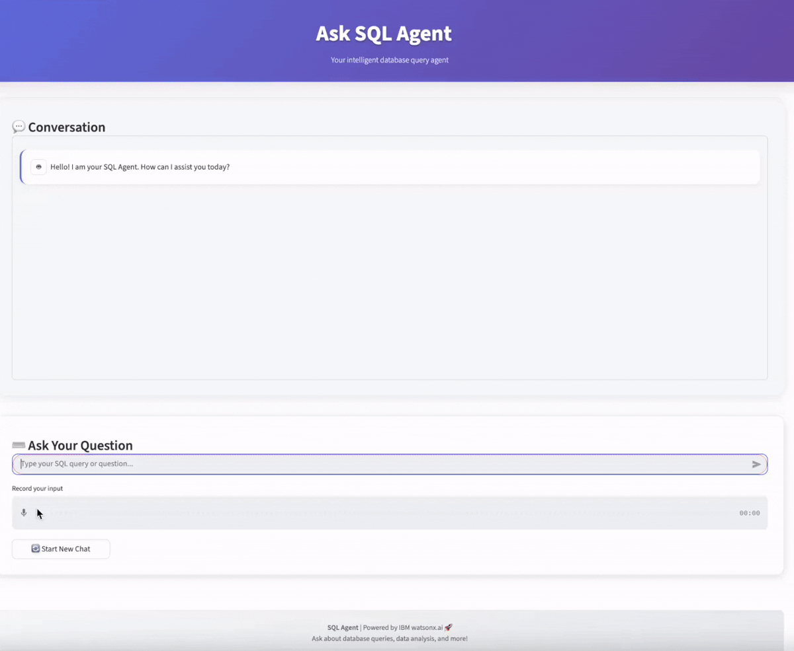

# SQL Agent with LangGraph
**Author:** Anna Gutowska
## Overview

This AI agent can execute and generate Python and SQL queries for your custom SQLite database using **IBM watsonx.ai**. You can follow along to the [tutorial on IBM.com](https://www.ibm.com/think/tutorials/build-sql-agent-langgraph-mistral-medium-3-watsonx-ai) (`langgraph-mistral-sql-agent.ipynb`) or run the Streamlit app with an interactive UI using this README.md file.

#### Project Structure 🔧
- **Files**: 
    - `.env.example`: Example environment configuration file.
    - `src/watsonx.py`: Configures and initializes the IBM watsonx AI client for LLM interactions.
    - `src/agent.py`: Implements a ReAct agent with content moderation using LangGraph for SQL query processing.
    - `src/database.py`: Creates and populates a sample SQLite database with car dealership, cars, and sales data.
    - `src/tools.py`: Provides SQL database tools and Python REPL tool for the agent to execute queries and calculations.
    - `src/speech.py`: Handles speech-to-text and text-to-speech functionality using IBM watsonx.ai services.
    - `app.py`: Main Streamlit application that creates the chat interface and orchestrates the SQL agent workflow.
    - `requirements.txt`: Lists all Python dependencies needed to run the application. 

## App Preview


### Quick Setup

#### 1. Environment Configuration

Copy the contents of `.env.example` to a new `.env` file and input your API credentials. For API credential generation instructions, see steps 1 and 2 of `langgraph-mistral-sql-agent.ipynb`.

**For IBM watsonx.ai:**
```bash
WATSONX_APIKEY="your_watsonx_api_key_here"
WATSONX_PROJECT_ID="your_project_id_here"
URL="https://us-south.ml.cloud.ibm.com"
```

**For speech services (optional):**


```bash
# IBM Watson Speech services (for voice features)
WATSONX_SPEECH_TO_TEXT_APIKEY="" 
WATSONX_SPEECH_TO_TEXT_URL="" #(e.g., "https://api.us-south.speech-to-text.watson.cloud.ibm.com")
WATSONX_TEXT_TO_SPEECH_APIKEY=""
WATSONX_TEXT_TO_SPEECH_URL=""
```

If you're interested in enabling text-to-speech and speech-to-text, you must:
- Include the above credentials in your `.env` file.
- Set the `include_speech` boolean to `True` at the top of `app.py`. You may set it to `False` otherwise.

#### 2. Install dependencies

```bash
# Change directory
cd sql-agent-app

# Create virtual environment
virtualenv venv --python python3.12
source venv/bin/activate

# Install dependencies
pip install -r requirements.txt
```

#### 3. Run the app

```bash
# Run the main Streamlit file
streamlit run app.py
```

### Features ✨

- 🎤 **Voice Input**: Ask questions with speech-to-text
- 🔊 **Voice Output**: Hear responses with text-to-speech  
- 🔧 **SQL Tools**: Automatic SQL query generation and execution
- 📊 **Data**: Synthetic car dealership, car, and sales data
- 🛡️ **Content Moderation and Guardrails**: IBM Granite Guardian integration
- 🎯 **Tool Calling**: Automatic SQL-related tool calling

### Troubleshooting

- **Speech services not working?** They're optional - the app can work with text only
- **API errors?** Check your `.env` file and API keys

For the detailed tutorial, see `langgraph-mistral-sql-agent.ipynb`.
