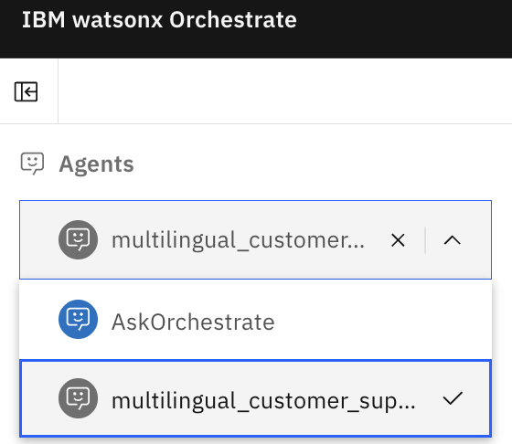
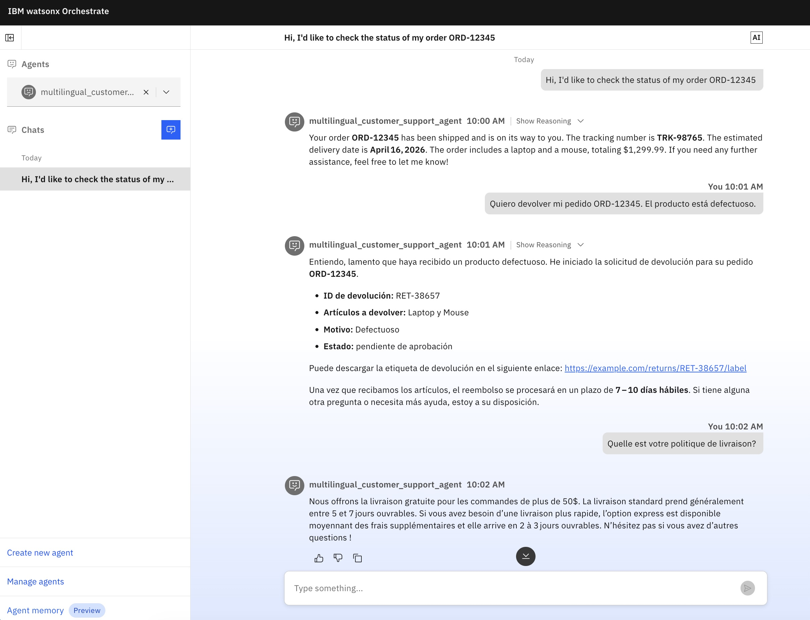

# Build a multilingual customer support agent with IBM watsonx Orchestrate
**Author:** Anna Gutowska

Your business is scaling rapidly. Orders are coming in from every corner of the globe. It’s a milestone you’ve worked hard for, but it’s also exhausting. You’re now spending more time answering customer support questions than growing your business. Fortunately, [AI agents](https://www.ibm.com/think/topics/ai-agents) enabled by multilingual LLMs can handle this workload for you.

In this step-by-step tutorial, you will build a production-ready AI-powered support agent that serves customers across different languages, powered by cross-lingual [large language models (LLMs)](https://www.ibm.com/think/topics/large-language-models) and [watsonx Orchestrate®](https://www.ibm.com/products/watsonx-orchestrate). Our multilingual support agent will have the following target languages: English, Spanish, French, Japanese, Korean and Arabic.

## Overview
Multilingual large language model development begins with large-scale pre-training on training data spanning dozens or hundreds of languages. The LLM used in this tutorial is `gpt-oss-120b`, OpenAI’s powerful model with support for global [natural language processing (NLP)](https://www.ibm.com/think/topics/natural-language-processing) tasks.

Other state-of-the-art multilingual models include GPT-4 (which exhibits strong multilingual capabilities despite its English-centric pre-training emphasis), Meta’s Llama family (with open source weights available through [Hugging Face](https://www.ibm.com/think/topics/hugging-face)), and IBM’s [Granite®](https://www.ibm.com/granite) models.

The [open source](https://www.ibm.com/think/topics/open-source) Aya dataset provides instruction-tuning examples in over 100 languages and has significantly advanced non-English model performance across various benchmarks. Users can also [fine-tune](https://www.ibm.com/think/topics/fine-tuning) models for low-resource languages—ones for which there is very limited digitized data and complex encoding requirements, making it difficult to train high‑quality language models for them.

## What you will build

A production-ready multilingual customer support agent built with IBM watsonx Orchestrate that can handle customer inquiries and instruction-following in diverse languages: English, Spanish, French, Japanese, Korean and Arabic. The agent will be equipped with tools to lookup order status, submit return requests, escalate requests to a human, check product availability and cancel orders.<br>
<br>
**Features:**

- **Multilingual support**: Automatically detects and responds in the customer's language.
- **Intelligent tool usage**: Executes actions like order lookups, returns and escalations.
- **Context awareness**: Maintains conversation history for coherent interactions.
- **Built with watsonx Orchestrate**: Leverages IBM's enterprise-grade AI orchestration platform.
- **Easy deployment**: Simple YAML configuration and Python tools.

## Prerequisites
This tutorial requires:
- The latest version of Python installed. Check your system with `python --version`.
- 16 GB RAM minimum
- A code editor such as Visual Studio Code, IBM Bob or any editor you prefer.
- An IBM Cloud® account to create a watsonx.ai® project ID and API key. Lite and Free service plans are available.
    - You can get your project ID from within your project. Click the Manage tab. Then, copy the project ID from the Details section of the General page. You need this ID for the ADK portion of this tutorial.
- watsonx Orchestrate Developer Edition is required to use the ADK for local development. The Developer Edition provides access to the ADK tools and  local testing environment. [Learn more about Developer Edition](https://developer.watson-orchestrate.ibm.com/developer_edition/wxOde_overview#what-is-watsonx-orchestrate-developer-edition)
or [sign up for a free 30-day trial](https://www.ibm.com/products/watsonx-orchestrate).
    - You need the watsonx Orchestrate Service Instance URL from your IBM Cloud® dashboard.

**Note:** The watsonx Orchestrate ADK is only available with the Developer Edition. It allows you to build, test and deploy AI agents locally before publishing them to your watsonx Orchestrate environment.


## Steps

### Step 1. Set up your development environment

You have two options to set up your project:

**Option A: Clone the tutorial repository**

[Clone our GitHub repository](https://github.com/IBM/ibmdotcom-tutorials) to get all project files preconfigured:

```bash
git clone https://github.com/IBM/ibmdotcom-tutorials.git
```

Navigate to the `multilingual-llm-customer-support-agent` project directory within the cloned repository. This option provides you with all the necessary files and code examples ready to use.

**Option B: Create from scratch**

If you prefer to build the project step-by-step, create a new project directory:

```bash
mkdir multilingual-llm-customer-support-agent
cd multilingual-llm-customer-support-agent
```

This directory is where you'll be working as you follow along, creating each file manually. Here is a preview of the project structure:

```
multilingual-llm-customer-support-agent/
├── agent.yaml                    # Agent configuration (watsonx Orchestrate)
├── customer_support_tools.py     # Tool definitions with @tool decorator
├── .env.example                  # Environment variables template
└── .env                          # Your credentials  
```

#### 1a. Create a virtual environment

Creating a virtual environment isolates your project dependencies from other
Python projects on your system.

```bash
python -m venv .venv
```

#### 1b. Activate your virtual environment

This activation command differs depending on your operating system.  

**macOS and Linux:**  

```bash
source .venv/bin/activate
```

**Windows:**

```powershell
.venv/Scripts/activate
```

You should see a `(.venv)` appear at the beginning of your terminal prompt, indicating
the virtual environment is active.  

#### 1c. Install required dependency

The only dependency we need for this tutorial is the watsonx Orchestrate SDK. You can run the following command in your terminal to install it.

```bash
pip install ibm-watsonx-orchestrate
```

#### 1d. Set environment variables

Inside your project directory, create a `.env` file to store your watsonx Orchestrate credentials. If you cloned the repo in step 1, you can copy the provided template and configure the necessary fields:

```bash
cp .env.example .env
```

Otherwise, create a file within your working directory:

```bash
touch .env
```

For more information, see the [setup guide](https://developer.watson-orchestrate.ibm.com/developer_edition/wxOde_setup).

Open the `.env` file in your text editor and configure the following three
essential fields:

**WO_DEVELOPER_EDITION_SOURCE:** The source ID for the watsonx Orchestrate Developer Edition. Set it to `orchestrate`.

```text
WO_DEVELOPER_EDITION_SOURCE=orchestrate
```

**WO_INSTANCE:** This URL is your watsonx Orchestrate service instance. You can find this information by logging into your [watsonx Orchestrate account](https://dl.watson-orchestrate.ibm.com/login?redirUrl=/chat)
and navigating to your instance details. Click your profile icon > **Settings**,
then select **API details** tab.  

The URL follows this format:  

```text
WO_INSTANCE=https://api.us-south.watson-orchestrate.cloud.ibm.com/instances/<your-instance-id>
```

Copy and paste your service instance URL to replace the template value in your `.env` file. The region (for example, `us-south`) depends on geographical location.

**WO_API_KEY:** This key is your watsonx Orchestrate API key, which authenticates your connection to IBM Cloud services. You can create this key  by clicking "Generate API Key" on the **API details** tab where you'll be redirected to your IBM Cloud account dashboard to generate a key.  


Replace `<your-api-key>` with your actual API key.  

```text
WO_API_KEY=<your-api-key>
```

Your complete `.env` file should look like this:

```env
WO_DEVELOPER_EDITION_SOURCE=orchestrate
WO_INSTANCE=https://api.us-south.watson-orchestrate.cloud.ibm.com/instances/<your-instance-id>
WO_API_KEY=<your-api-key>
```

### Step 2. Create the tools

Before we start the watsonx Orchestrate Developer Edition server, we need to create the tools for our agent. Our tools will be stored in the `customer_suport_tools.py` file and all apply to the customer support use case.

#### 2a. Database of orders

As you will see shortly, the agent's tools depend on a database of orders. In a production environment, this database would be a relational database or a NoSQL database, depending on the system’s requirements. In this tutorial, we will use a simple Python dictionary, `ORDERS_DB`, for demonstrative purposes.

```python
ORDERS_DB: Dict[str, Dict] = {
    "ORD-12345": {
        "status": "shipped",
        "tracking": "TRK-98765",
        "estimated_delivery": (datetime.now() + timedelta(days=2)).strftime("%Y-%m-%d"),
        "items": ["Laptop", "Mouse"],
        "total": 1299.99,
        "customer_email": "customer@example.com"
    },
    "ORD-67890": {
        "status": "processing",
        "tracking": None,
        "estimated_delivery": (datetime.now() + timedelta(days=5)).strftime("%Y-%m-%d"),
        "items": ["Headphones"],
        "total": 199.99,
        "customer_email": "customer@example.com"
    },
    "ORD-11111": {
        "status": "delivered",
        "tracking": "TRK-11111",
        "estimated_delivery": (datetime.now() - timedelta(days=3)).strftime("%Y-%m-%d"),
        "items": ["Keyboard", "Monitor"],
        "total": 599.99,
        "customer_email": "customer@example.com"
    }
}
```

Now, we can define our tools. The `@tool` decorator registers this function with the watsonx Orchestrate agent. The agent can invoke this tool when it needs to perform a certain action.

#### 2b. lookup_order_status
Look up the status of a customer order.

```python
@tool
def lookup_order_status(order_id: str) -> Dict[str, Any]:
    if order_id in ORDERS_DB:
        return {
            "success": True,
            "order_id": order_id,
            "data": ORDERS_DB[order_id]
        }
    else:
        return {
            "success": False,
            "error": "Order not found",
            "order_id": order_id
        }
```

**Parameters:**
- `order_id` (str): The order ID to look up (for example, "ORD-12345")

**Returns:**
- Order status, tracking number, estimated delivery, items and total

#### 2c. submit_return_request

Submit a return request for an order.

```python
@tool
def submit_return_request(order_id: str, reason: str, items: List[str]) -> Dict[str, Any]:
    if order_id in ORDERS_DB:
        return_id = f"RET-{random.randint(10000, 99999)}"
        return {
            "success": True,
            "return_id": return_id,
            "order_id": order_id,
            "status": "pending_approval",
            "items": items,
            "reason": reason,
            "estimated_refund_days": 7,
            "return_label_url": f"https://example.com/returns/{return_id}/label"
        }
    else:
        return {
            "success": False,
            "error": "Order not found"
        }
```

**Parameters:**
- `order_id` (str): The order ID to return items from
- `reason` (str): Reason for the return
- `items` (List[str]): List of item names to return

**Returns:**
- Return ID, status, estimated refund days and return label URL

#### 2d. escalate_to_human

Escalate the conversation to a human agent.

```python
@tool
def escalate_to_human(issue_summary: str, customer_language: str, priority: str = "normal") -> Dict[str, Any]:
    ticket_id = f"TKT-{random.randint(10000, 99999)}"

    # Estimate wait time based on priority
    wait_times = {
        "urgent": "2-5 minutes",
        "high": "5-10 minutes",
        "normal": "10-15 minutes",
        "low": "15-20 minutes"
    }

    return {
        "success": True,
        "ticket_id": ticket_id,
        "status": "escalated",
        "language": customer_language,
        "priority": priority,
        "estimated_wait_time": wait_times.get(priority, "10-15 minutes"),
        "issue_summary": issue_summary,
        "queue_position": random.randint(1, 10)
    }
```

**Parameters:**
- `issue_summary` (str): Brief summary of the customer's issue
- `customer_language` (str): The language the customer is using
- `priority` (str): Priority level ("low", "normal", "high", "urgent")

**Returns:**
- Ticket ID, estimated wait time and queue position

#### 2e. check_product_availability

Check if a product is in stock using a simulated product database for demonstrative purposes.

```python
@tool
def check_product_availability(product_id: str) -> Dict[str, Any]:
    # Simulated product database
    products = {
        "PROD-001": {"name": "Laptop", "in_stock": True, "quantity": 15},
        "PROD-002": {"name": "Mouse", "in_stock": True, "quantity": 50},
        "PROD-003": {"name": "Keyboard", "in_stock": False, "quantity": 0},
        "PROD-004": {"name": "Monitor", "in_stock": True, "quantity": 8}
    }

    if product_id in products:
        product = products[product_id]
        return {
            "success": True,
            "product_id": product_id,
            "name": product["name"],
            "in_stock": product["in_stock"],
            "quantity": product["quantity"],
            "estimated_restock": None if product["in_stock"] else (datetime.now() + timedelta(days=7)).strftime("%Y-%m-%d")
        }
    else:
        return {
            "success": False,
            "error": "Product not found"
        }
```

**Parameters:**
- `product_id` (str): The product ID to check

**Returns:**
- Product name, stock status, quantity and estimated restock date

#### 2f. cancel_order

Cancel an order that hasn't shipped yet.

```python
@tool
def cancel_order(order_id: str, reason: str) -> Dict[str, Any]:
    if order_id in ORDERS_DB:
        order = ORDERS_DB[order_id]

        # Can only cancel if order hasn't shipped yet
        if order["status"] == "processing":
            return {
                "success": True,
                "order_id": order_id,
                "status": "cancelled",
                "reason": reason,
                "refund_amount": order["total"],
                "estimated_refund_days": 5
            }
        else:
            return {
                "success": False,
                "error": f"Cannot cancel order. Order status: {order['status']}. Please submit a return request instead."
            }
    else:
        return {
            "success": False,
            "error": "Order not found"
        }
```

**Parameters:**
- `order_id` (str): The order ID to cancel
- `reason` (str): Reason for cancellation

**Returns:**
- Cancellation status, refund amount and estimated refund days

#### 2g. Test the tools locally
Before integrating with an agent, test your tool to ensure it works correctly:

```bash
python customer_support_tools.py
```

You should see output similar to:  

```bash
Testing Customer Support Tools
======================================================================

1. Testing Order Lookup:
   Order Status: {'success': True, 'order_id': 'ORD-12345', 'data': {'status': 'shipped', 'tracking': 'TRK-98765', 'estimated_delivery': '2026-04-15', 'items': ['Laptop', 'Mouse'], 'total': 1299.99, 'customer_email': 'customer@example.com'}}

2. Testing Return Request:
   Return Request: {'success': True, 'return_id': 'RET-89168', 'order_id': 'ORD-12345', 'status': 'pending_approval', 'items': ['Laptop'], 'reason': 'Product defective', 'estimated_refund_days': 7, 'return_label_url': 'https://example.com/returns/RET-89168/label'}

3. Testing Escalation:
   Escalation: {'success': True, 'ticket_id': 'TKT-98100', 'status': 'escalated', 'language': 'en', 'priority': 'high', 'estimated_wait_time': '5-10 minutes', 'issue_summary': 'Order not received after 3 weeks', 'queue_position': 8}

4. Testing Product Availability:
   Product Availability: {'success': True, 'product_id': 'PROD-001', 'name': 'Laptop', 'in_stock': True, 'quantity': 15, 'estimated_restock': None}

5. Testing Order Cancellation:
   Cancellation: {'success': True, 'order_id': 'ORD-67890', 'status': 'cancelled', 'reason': 'Changed mind', 'refund_amount': 199.99, 'estimated_refund_days': 5}

======================================================================
All tools tested successfully!
```

**Note about the warning message:** You may see a message like the following.

```bash
[WARNING] - Unable to properly parse parameter descriptions due to missing or incorrect type hints.
```

This is an informational warning from the watsonx Orchestrate ADK and does not
affect the functionality of your tool. The ADK is being strict about docstring
format pasting, but your tool results will be accurate.

### Step 3. Create the agent configuration

Create a file named `agent.yaml` in your project directory with the following configuration:

```yaml
spec_version: v1
kind: native
name: multilingual_customer_support_agent
description: A multilingual AI agent that provides customer support in English, Spanish, French, Japanese, Korean, and Arabic

instructions: |
  You are a helpful multilingual customer support agent that can communicate in multiple languages.

  CRITICAL INSTRUCTIONS:
  1. ALWAYS detect the customer's language and respond in the SAME language they use
  2. Be polite, professional, empathetic, and helpful
  3. Use the available tools to help customers with:
     - Order status lookups
     - Return requests
     - Product availability checks
     - Order cancellations
     - Escalations to human agents when needed

  SUPPORTED LANGUAGES:
  - English (en)
  - Spanish (es)
  - French (fr)
  - Japanese (ja)
  - Korean (ko)
  - Arabic (ar)

  KNOWLEDGE BASE - Use this information to answer policy questions:

  SHIPPING POLICY:
  - English: We offer free shipping on orders over $50. Standard shipping takes 5-7 business days. Express shipping is available for an additional fee and takes 2-3 business days.
  - Spanish: Ofrecemos envío gratuito en pedidos superiores a $50. El envío estándar tarda de 5 a 7 días hábiles. El envío exprés está disponible por una tarifa adicional y tarda de 2 a 3 días hábiles.
  - French: Nous offrons la livraison gratuite pour les commandes de plus de 50 $. La livraison standard prend 5 à 7 jours ouvrables. La livraison express est disponible moyennant des frais supplémentaires et prend 2 à 3 jours ouvrables.
  - Japanese: 50ドル以上のご注文で送料無料です。通常配送は5〜7営業日かかります。速達配送は追加料金で利用可能で、2〜3営業日かかります。
  - Korean: $50 이상 주문 시 무료 배송을 제공합니다. 표준 배송은 영업일 기준 5-7일이 소요됩니다. 특급 배송은 추가 요금으로 이용 가능하며 영업일 기준 2-3일이 소요됩니다.
  - Arabic: نحن نقدم الشحن المجاني للطلبات التي تزيد عن 50 دولارًا. يستغرق الشحن القياسي من 5 إلى 7 أيام عمل. الشحن السريع متاح برسوم إضافية ويستغرق من 2 إلى 3 أيام عمل.

  RETURN POLICY:
  - English: We accept returns within 30 days of purchase. Items must be unused and in original packaging. Refunds are processed within 7-10 business days after we receive the return.
  - Spanish: Aceptamos devoluciones dentro de los 30 días posteriores a la compra. Los artículos deben estar sin usar y en su embalaje original. Los reembolsos se procesan dentro de 7 a 10 días hábiles después de recibir la devolución.
  - French: Nous acceptons les retours dans les 30 jours suivant l'achat. Les articles doivent être inutilisés et dans leur emballage d'origine. Les remboursements sont traités dans les 7 à 10 jours ouvrables après réception du retour.
  - Japanese: 購入後30日以内の返品を受け付けています。商品は未使用で元の梱包状態である必要があります。返品を受け取ってから7〜10営業日以内に返金が処理されます。
  - Korean: 구매 후 30일 이내에 반품을 받습니다. 제품은 미사용 상태이고 원래 포장 상태여야 합니다. 환불은 반품을 받은 후 영업일 기준 7-10일 이내에 처리됩니다.
  - Arabic: نحن نقبل المرتجعات في غضون 30 يومًا من الشراء. يجب أن تكون العناصر غير مستخدمة وفي عبواتها الأصلية. تتم معالجة المبالغ المستردة في غضون 7-10 أيام عمل بعد استلام المرتجع.

  WARRANTY INFO:
  - English: All electronics come with a 1-year manufacturer warranty. Extended warranties are available for purchase. The warranty covers manufacturing defects but not accidental damage.
  - Spanish: Todos los productos electrónicos vienen con una garantía del fabricante de 1 año. Las garantías extendidas están disponibles para su compra. La garantía cubre defectos de fabricación pero no daños accidentales.
  - French: Tous les appareils électroniques sont couverts par une garantie fabricant d'un an. Des garanties prolongées sont disponibles à l'achat. La garantie couvre les défauts de fabrication mais pas les dommages accidentels.
  - Japanese: すべての電子機器には1年間のメーカー保証が付いています。延長保証は購入可能です。保証は製造上の欠陥をカバーしますが、偶発的な損傷はカバーしません。
  - Korean: 모든 전자제품에는 1년 제조업체 보증이 제공됩니다. 연장 보증은 구매 가능합니다. 보증은 제조 결함을 보장하지만 우발적인 손상은 보장하지 않습니다.
  - Arabic: تأتي جميع الأجهزة الإلكترونية مع ضمان الشركة المصنعة لمدة عام واحد. الضمانات الممتدة متاحة للشراء. يغطي الضمان عيوب التصنيع ولكن ليس الأضرار العرضية.

  RESPONSE FORMATTING:
  - Respond in natural, conversational paragraphs
  - Do NOT use code fences, markdown lists, or labeled blocks
  - Integrate information into fluent text
  - Keep responses concise and user-friendly
  - Match the customer's language

  WHEN TO USE TOOLS:
  - Use lookup_order_status when customer asks about their order
  - Use submit_return_request when customer wants to return items
  - Use check_product_availability when customer asks if something is in stock
  - Use cancel_order when customer wants to cancel an unshipped order
  - Use escalate_to_human when you cannot resolve the issue or customer explicitly requests human help

  ESCALATION CRITERIA:
  - Complex issues beyond your capabilities
  - Customer is frustrated or angry
  - Legal or compliance matters
  - Refund disputes
  - Customer explicitly requests human agent

llm: "groq/openai/gpt-oss-120b"
style: default
tools:
  - lookup_order_status
  - submit_return_request
  - escalate_to_human
  - check_product_availability
  - cancel_order
```

Let's breakdown the key fields:  

- **kind:** Refers to the type of agent, external or native. Native agents run in the watsonx Orchestrate environment. External agents are built outside the platform and can be used as collaborators for native agents using communication [protocols](https://www.ibm.com/think/topics/ai-agent-protocols) or external chat provider APIs.
- **name:** A unique identifier for your agent (use lowercase).
- **description:** A brief explanation of what the agent does.
- **instructions:** Detailed guidance for how the agent should behave and use its tools.
- **llm:** Configuration for the large language model. While IBM watsonx Orchestrate provides access to a catalog of AI models, only a subset are preferred. Preferred models have undergone LLM evaluation and are optimized for use with the watsonx Orchestrate platform.<sup>1</sup> You can access the list of preferred models by running the `orchestrate models list` command.
    - **model:** The specific LLM to use (for example, `groq/openai/gpt-oss-120b`, a preferred model).
- **style:** The interaction style (default, concise, detailed, and so on).
- **tools:** List of tool references that the agent can invoke.

### Step 4. Start watsonx Orchestrate Developer Edition

After you have configured the environment variables in your `.env` file, start the
watsonx Orchestrate Developer Edition server by running:

```bash
orchestrate server start -e .env
```

This command starts the local watsonx Orchestrate server and loads your credentials
from the `.env` file. It might take several minutes to complete, especially on the
first run. The system might prompt you to enter a master password during the first setup and it must contain at least eighteen characters. Finally, you should see similar output to this when complete:

```bash
[INFO] - Waiting for orchestrate server to be fully initialized and ready...
[INFO] - Orchestrate services initialized successfully
[INFO] - local tenant found
[INFO] - You can run `orchestrate env activate local` to set your environment or `orchestrate chat start` to start the UI service and begin chatting.
```

#### Troubleshooting initialization

If the server initialization fails or hangs, try starting from a clean slate by following these steps:

1. **Reset the server.**

```bash
orchestrate server reset
```

This command stops and removes all containers created for watsonx Orchestrate.

2. **Restart the installation.**

After resetting, run the start command again:  

```bash
orchestrate server start -e .env
```

3. **Check the server logs container status,**

You can view service logs for the Orchestrate server to check for warnings
or errors:

```bash
orchestrate server logs
```

If the preceding steps do not work, reset the server and completely remove
the server environment: `orchestrate server purge` and reinstall.

### Step 5. Import and test your agent

Now you'll import your customer support tools and agent into the local environment and test them with sample product reviews that act as test data to validate the model's predictions.

#### 5a. Import the sentiment analysis tool

Before importing the agent, you need to import the tools so they are available in your watsonx Orchestrate environment.  

Run this command to import the tools:

```bash
orchestrate tools import -k python -f customer_support_tools.py
```

This command imports the Python tool directly. Your output should resemble the following:

```bash
[INFO] - Tool 'cancel_order' imported successfully
[INFO] - Tool 'check_product_availability' imported successfully
[INFO] - Tool 'escalate_to_human' imported successfully
[INFO] - Tool 'lookup_order_status' imported successfully
[INFO] - Tool 'submit_return_request' imported successfully
```

#### 5b. Import the agent

Now that the tools are imported, you can import the agent that uses it. Use the
`orchestrate agents import` command to import your agent from the YAML configuration
file:

```bash
orchestrate agents import -f agent.yaml
```

**Output:**
```bash
[INFO] - Agent 'multilingual_customer_support_agent' imported successfully
```

The agent configuration and tool references are validated before the agent is registered with the Orchestrate environment.

#### 5c. Launch the chat interface

Now that both the tool and agent are imported, you can start the chat interface with your agent:

```bash
orchestrate chat start
```

**Output:**
```bash
[INFO] - local tenant found
[INFO] - Auto-detecting local IP address for async tool callbacks...
[INFO] - Auto-configured CALLBACK_HOST_URL to: http://9.65.70.92:4321
[INFO] - Waiting for orchestrate server to be fully started and ready...
[INFO] - Starting docker-compose UI service inside LimaLifecycleManager...
[INFO] - Chat UI Service started successfully.
[INFO] - Waiting for UI component to be initialized...
[INFO] - Opening chat interface at http://localhost:3000/chat-lite
```

This command opens a web-based chat interface in your default browser at `http://localhost:3000/chat-lite`. If the browser doesn't open automatically, you can manually navigate to that URL.

#### 5d. Activate the agent in the chat interface

Click the **agent dropdown menu** at the top left of the chat interface and select *multilingual_customer_support_agent* from the list.



The agent is now active and ready to provide multilingual support.

### Step 6. Test the agent

With your agent selected, try asking it to provide customer support. Here are some examples to test out different languages:

| Language | Code | Example Query |
|----------|------|---------------|
| English | en | "What is your shipping policy?" |
| Spanish | es | "¿Cuál es su política de envío?" |
| French | fr | "Quelle est votre politique de livraison?" |
| Japanese | ja | "配送ポリシーは何ですか？" |
| Korean | ko | "배송 정책은 무엇입니까?" |
| Arabic | ar | "ما هي سياسة الشحن الخاصة بك؟" |

For a more in-depth look at expected agent-user interactions, take a look at these sample outputs.

#### English - Order Status

**Customer**: "Hi, I'd like to check the status of my order ORD-12345"

**Agent**: "Your order **ORD-12345** has been shipped and is on its way to you. The tracking number is **TRK-98765**. The estimated delivery date is **April 16, 2026**. The order includes a laptop and a mouse, totaling $1,299.99. If you need any further assistance, feel free to let me know!"

---

#### Spanish - Return Request

**Customer**: "Quiero devolver mi pedido ORD-12345. El producto está defectuoso."

**Agent**: "Entiendo, lamento que haya recibido un producto defectuoso. He iniciado la solicitud de devolución para su pedido **ORD-12345**.  

- **ID de devolución:** RET-38657  
- **Artículos a devolver:** Laptop y Mouse  
- **Motivo:** Defectuoso  
- **Estado:** pendiente de aprobación  

Puede descargar la etiqueta de devolución en el siguiente enlace: https://example.com/returns/RET-38657/label  

Una vez que recibamos los artículos, el reembolso se procesará en un plazo de **7 – 10 días hábiles**. Si tiene alguna otra pregunta o necesita más ayuda, estoy a su disposición."

---

#### French - Shipping Policy

**Customer**: "Quelle est votre politique de livraison?"

**Agent**: "Nous offrons la livraison gratuite pour les commandes de plus de 50 $. La livraison standard prend généralement entre 5 et 7 jours ouvrables. Si vous avez besoin d’une livraison plus rapide, l’option express est disponible moyennant des frais supplémentaires et elle arrive en 2 à 3 jours ouvrables. N’hésitez pas si vous avez d’autres questions !"

---



This output is quite impressive! Our agent is altenrating different languages in the same chat and pulling data from our sample database accurately.

Now, try testing the agent with your own queries in any of the supported languages.

### Step 7. Stop the server and clean up

When you're finished testing your agent, you can stop the watsonx Orchestrate server.

```bash
orchestrate server stop
```

**Output:**
```bash
[INFO] - Stopping docker-compose services...
[INFO] - Services stopped successfully.
[INFO] - Stopping Lima VM...
[INFO] - Lima VM stopped.
```


When you're done working in the project, deactivate your Python virtual environment:

```bash
deactivate
```

You can reactivate it anytime by running the activation command in step 1.

## Conclusion
The AI system built in this tutorial is a multilingual customer support [chatbot](https://www.ibm.com/think/topics/chatbots) that detects a user’s language and handles real‑world support tasks through tool‑based orchestration. Using a [transformer‑based LLM](https://www.ibm.com/think/topics/transformer-model) with language-specific [embedding](https://www.ibm.com/think/topics/embedding) handling and cross-lingual transfer, it moves beyond [machine translation](https://www.ibm.com/think/topics/machine-translation) to deliver consistent, scalable support.

As a next step, you can integrate enterprise systems so the agent can access real data and deliver real-world customer and language support.


### Footnotes
<sup>1</sup> IBM. (n.d.). Choosing your LLM. IBM watsonx Orchestrate Developer Documentation. https://developer.watson-orchestrate.ibm.com/llm/getting_started_llm
