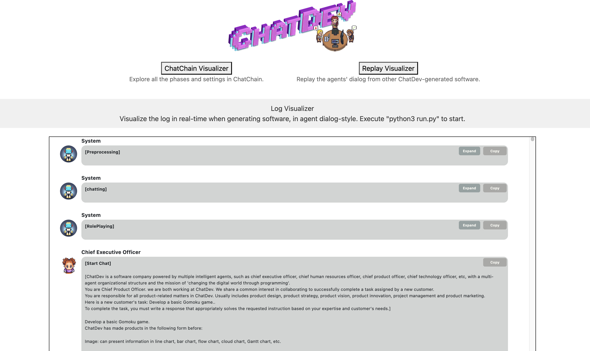
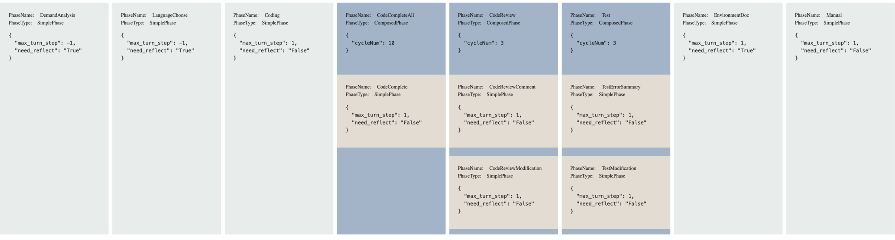

# Use ChatDev ChatChain for agent communication on IBM® watsonx.ai®

**Author**: Vanna Winland

In this tutorial, we demonstrate how to build a collaborative AI system using
the [ChatDev framework](https://www.ibm.com/think/topics/chatdev), and explore
its role-based agent communication structure, ChatChain. ChatDev uses AI agents
with assigned roles to simulate a virtual software company. Each intelligent
agent collaborates with others through structured communication, following a
sequential workflow based on phases of the software development lifecycle.

To power these agents, we integrated the IBM® [watsonx.ai®](https://www.ibm.com/products/watsonx-ai)
API as a model backend. Leveraging watsonx.ai® ‘s integration with Hugging Face,
we configured the framework to use
[Llama-4-Maverick](https://huggingface.co/meta-llama/Llama-4-Maverick-17B-128E-Instruct-FP8)
to generate a simple software solution. This example serves as a foundation for
exploring ChatChain and other internal agent communication mechanisms that guide
agent behavior and decision-making throughout the workflow.

By the end of this tutorial, you should have hands-on experience setting up and
running ChatDev, and a clearer understanding of how agent communication protocols
enable effective and reliable multiagent collaboration.

**Collaborative AI** - Artificial intelligence systems, often using deep learning
or other advanced techniques, that are designed to work  alongside humans or AI
Agents, enabling cooperation and shared decision-making, and joint problem-solving
to achieve common goals.

**Multiagent collaboration** - Multiple autonomous agents that share information
and coordinate to accomplish a shared objective. These agents may have varying
levels of knowledge, capabilities, and perspectives, and their collaboration often
involves negotiation, planning, and coordinated action.

**Role-playing agents** – AI agents that simulate specific roles or personas to
interact and collaborate in a goal-driven manner. These roles can reflect
real-world professions or characters, enabling more context-aware and
purpose-driven interactions.

**Agent communication protocols** - Standards or frameworks that define how AI agents
interact with one another by exchanging structured data messages. These protocols
govern the format, semantics, and rules of communication for agents coordinating
within multiagent systems.

## Collaborative AI in Chatdev

[ChatDev](https://github.com/OpenBMB/ChatDev) is a role-based implementation of
collaborative AI, where individual agents assume specialized roles to work toward
a shared objective. This design reflects principles of collective intelligence—
essentially effective collaboration—and positions ChatDev as a valuable resource
for studying and advancing this field.

ChatDev is an opensource multiagent framework developed by OpenBMB, a research-driven
initiative focused on advancing AI tools and artificial general intelligence (AGI).
The framework uses the software development process as a practical domain for studying
collaborative AI agents. Each agent is powered by a large language model (LLM)
and prompted to take on specific roles such as CEO, CTO, Designer, Tester and
Programmer.  

Starting from a short, descriptive user input, these agents collaborate to
iteratively design, implement, and test a complete software project. Each agent
is implemented as a Python class that communicates sequentially using structured
natural language prompts. These prompts follow predefined templates that includes
the agent’s role, task-specific instructions, and relevant context from earlier
interactions. This templating strategy ensures continuity and coherence by
embedding role identity and shared memory within the prompt itself.

ChatDev’s team of specialized agents works together to generate a simple software
solution from a one-line user input describing their idea.

**User input: ‘Build a to-do list app’ → CEO delegates to CTO → CTO assigns to
Developer → Developer writes code → Tester validates**

### How ChatDev works

Agent interactions are orchestrated by ChatChain, the custom coordination logic
within the ChatDev framework. Communication between agents happens through a multi-turn
dialogue, or message-passing system, where agents sequentially exchange structured
JSON messages. These messages represent outputs and context updates and act as a
shared memory buffer, allowing agents to build on each other’s outputs across
development phases.

This architecture enables consistent communication and context-aware collaboration
by blending natural and programming languages to complete the project end-to-end.
The process relies on coordinated multiagent communication, with internal mechanisms
acting as protocols to orchestrate effective [AI agent communication](https://www.ibm.com/think/topics/ai-agent-communication)
to complete each phase.

Users can monitor and review the [agentic workflow](https://www.ibm.com/think/topics/agentic-workflows)
using ChatDev’s Visualizer tool, a Flask-based web interface that supports both
post-run analysis and real-time monitoring. The Visualizer provides several modes,
such as a **Log Viewer** to inspect real-time agent interactions, a **Replay Viewer**
to visualize saved multiagent conversation logs, and a **ChatChain Viewer** to examine
the task coordination flow. This interactive interface enables users to debug,
experiment with, and study multiagent collaboration through a structured environment
via a local browser.

### Note on model compatibility and output variability

This tutorial uses a customized version of ChatDev adpated specifically for the
IBM® watsonx.ai® API. While the core ChatDev supports multiple model providers,
this version was modified using a pragmatic, “vibecoding” approach, making it functional
but not exhaustively tested across all scenarios.

**Key adaptations include:**

- Wrapping the IBM® watsonx.ai® API to conform to ChatDev’s expected LLM interface.
- Adjusting prompt templates to work with IBM® watsonx.ai® API’s token and formatting
  requirements
- Modifying model selection logic to support IBM® watsonx.ai® as a model backend
  option.

This implementation demonstrates how ChatDev can be extended to support alternative
LLM providers. Other model providers (e.g., OpenAI, Ollama) have not been tested
with this customized version of ChatDev and would require code-level adjustments.

As with many generative AI workflows, output may vary between runs. While the agents
generally produce coherent, well-structured code and documentation, the resulting
applications may require manual refinement to become fully functional. Factors like
prompt design, task complexity, and the inherent variability of LLM responses all
contribute to this unpredictability.

This tutorial serves as a hands-on introduction to collaborative multiagent systems,
focusing on how agents communicate and coordinate within ChatDev. It is not intended
as a production-ready solution, but rather a foundation for learning, experimentation,
and exploring LLM-driven agent collaboration. We’re grateful to the researchers
behind ChatDev for open-sourcing their work, making this kind of exploration
possible.

## Steps

### Step 1. Set up your environment

While ChatDev is designed to be cross-platform, users may encounter
platform-specific issues during setup or execution. For example, PowerShell on
Windows may require adjustments to shell commands intended for Unix-based systems.
Variations in OS, Python versions, and CPU architectures can also affect performance
or behavior. To ensure smooth setup and usability, users should consult the official
ChatDev documentation and installation guides for troubleshooting and
environment-specific instructions.

With that in mind, let’s begin by setting up the environment to run the
application.  You can follow these steps in the markdown file within the
[project folder on GitHub](https://github.com/IBM/ibmdotcom-tutorials/tree/main/chatdev-watsonx)
or by following along here.

  1. Ensure you have Python 3.11 installed on your system.  
     > You can check your Python version using the `python3 –-version` command.
  2. Clone the [GitHub repository](https://github.com/IBM/ibmdotcom-tutorials/tree/main).
     > For detailed steps on how to clone a repository, refer to the [GitHub documentation](https://docs.github.com/en/repositories/creating-and-managing-repositories/cloning-a-repository).
  3. Verify the project structure resembles the following:

```text
src/chatdev_watsonx/
 
├── camel/
│   ├── model_backend.py  # Unified interface for interacting with multiple AI models
│   ├── typing.py         # Defines various type classes including supported AI models 
│   ├── configs.py        # Defines the model parameters based on model interface
│   ├── utils.py          # Various utility functions including model token limit configuration
│   └── ...
├── Visualizer/
│   └──app.py             # Runs a Flask application in a local web browser to view logs and ChatChain 
├── WareHouse             # Where the generated software is saved 
├── run.py                # Application entry point
└── chatdev_watsonx.md    # A markdown version of this tutorial
```

### Step 2. Obtain watsonx API credentials

1. Log in to [watsonx.ai](https://dataplatform.cloud.ibm.com/registration/stepone?context=wx&apps=all) using your IBM Cloud account.
2. Create a [watsonx.ai project](https://www.ibm.com/docs/en/watsonx/saas?topic=projects-creating-project#create-a-project).
    >Take note of your project ID in project > Manage > General > Project ID.  
    You'll need this ID for this tutorial.
3. Create a [watsonx.ai Runtime](https://cloud.ibm.com/catalog/services/watsonxai-runtime) service instance (choose the Lite plan, which is a free instance).
4. Generate a watsonx [API Key](https://dataplatform.cloud.ibm.com/docs/content/wsj/analyze-data/ml-authentication.html).
5. Associate the watsonx.ai Runtime service to the project you created in [watsonx.ai](https://dataplatform.cloud.ibm.com/docs/content/wsj/getting-started/assoc-services.html?context=cpdaas).

### Step 3. Create a virtual environment

From the tutorial’s project directory create a virtual environment using Python 3.11:

```bash
  python3.11 -m venv venv
  source venv/bin/activate
```

## Step 4. Install requirements.txt  

This installs the project dependencies.

```bash
  pip install -r requirements.txt
```

## Step 5. Set environment variables for LLM integration

The variable is set for the current terminal session (closing the terminal will
reset them).

Although this tutorial uses IBM® watsonx.ai® as the model backend, ChatDev’s
underlying framework was originally designed to support multiple LLM providers,
including a default, OpenAI. Some parts of the codebase (e.g., model selection
logic or shared interfaces) still reference the `OPENAI_API_KEY` environment variable.
**To prevent runtime errors, a dummy value is required even if OpenAI is not used.** 

```bash
export OPENAI_API_KEY="your_openai_api_key_or_dummy_value"
export WATSONX_URL="https://us-south.ml.cloud.ibm.com"
export WATSONX_APIKEY="your_watsonx_api_key"
export WATSONX_PROJECT_ID="your_watsonx_project_id"
```

## Step 6. (Optional)  Run the visualizer app for the ChatDev interface  

You may optionally run ChatDev’s Visualizer, a Flask-based GUI that allows you
to inspect agent logs in real-time, explore the ChatChain workflow, or replay saved
agent dialogues. This tool is useful for debugging, monitoring, or studying agent
interactions, but it is not required to run ChatDev’s core multiagent workflow.

To launch the Visualizer, first install Flask:

```bash
pip install flask
```

Then run the app:  

```bash
python visualizer/app.py
```

Once running, open a browser and go to: http://127.0.0.1:8000/

## Step 7. (Optional) LLM Configuration  

Note: This tutorial uses a version of ChatDev that is preconfigured to use the
IBM® watsonx.ai® API as the model backend. No additional setup or changes to the
model configuration is required for the tutorial to function correctly. While
customizable, modifying LLM configurations may result in incomplete, incorrect,
and varied outputs.

ChatDev is built on top of the CAMEL framework, which manages agent roles, tasks,
and interactions with language models. The original implementation uses the OpenAI
API as a model backend to interface with ChatGPT models, like GPT-4 and uses
GPT-3.5-turbo by default. The opensource project is also designed to support multiple
LLM providers models through a unified model interface.

Skip this step if you plan to use the default IBM® watsonx.ai configuration. For
experimentation, model type, parameters, and token limits can be adjusted to work
with the IBM® watsonx.ai® API.

- **Model type**  
  
  To experiment with different **model types**, update the `WATSONX` entry in the
  `ModelType` enum in `camel/typing.py`.
  
  ```python
  # camel/typing.py
  
  class ModelType(Enum):
    WATSONX = "meta-llama/llama-4-maverick-17b-128e-instruct-fp8"  # Model identifier used by the Watsonx API
  ```

- **Model Parameters**
  
  The **model parameters** can be configured within `camel/configs.py` under the
  `WatsonxConfig` data class.

```python
# camel/configs.py

@dataclass(frozen=True)
class WatsonxConfig:
    """Defines the parameters for generating completions using watsonx.ai models."""
 
    temperature: float = 0.3
    top_k: int = 100
    top_p: float = 0.0
```

- **Token limit**

The **token limit** for the model can be configured in the `camel/utils.py` file.

```python
# camel/utils.py

def get_model_token_limit(model: ModelType) -> int:
    if model == ModelType.WATSONX:
        return 128000  # Token limit for Watsonx.ai models
```

## Step 8. Run the script to generate an app

This step runs the core ChatDev workflow. When you run this script, the agents
will simulate a collaborative software development process based on your input.
The generated code, documentation, and related artifacts will be saved in the
`WareHouse/` directory of the project. You can inspect logs or replay conversations
using the Visualizer.

The script takes the following arguments:

- **–-task**: The description of the desired software solution

- **–-name**: The name of the app or project

- **–-model**: The AI model to use (must be set to `WATSONX` for this tutorial)

Example script:

```bash
python3 run.py --task "Build a simple website using Flask for a local bookstore called 'Turn the Page'. The website should include a homepage, an about page, and a product page. " --name "bookstore-site" --model "WATSONX"
```

Note: Although ChatDev’s architecture is extensible, this tutorial version only
works reliably with `WATSONX`. Extending it to use other LLM providers requires
modifying the `camel/model_backend.py` interface and related configuration logic.

## Example Output

The final software product is save in the `WareHouse` folder under a subdirectory
named after the project, default organization name, and a timestamp.

A typical output may look something like this:

```text
├── WareHouse/
└── bookstore-site_DefaultOrganization_20250506162935/
    ├── templates/      # Web page templates
    │   └── about.html
    │   └── index.html
    │   └── products.html
    ├── manual.md      # The project’s README with instructions to run the software
    ├── main.py        #The main application file for the website
    ├── requirements.txt          # Project dependencies
    ├── ChatChainConfig.json      # System design for collaborative agent workflows
    ├── RoleConfig.json       # System prompts for agent roles
    ├── PhaseConfig.json      # System prompts for phases
    └── bookstore-site_DefaultOrganization_20250506162935.log  # Log of the agent dialogue
```

*Output may vary between runs due to the probabilistic nature of generative AI tools.

This directory contains a complete software project generated by AI agents. Alongside
the application code and documentation, you’ll find configuration files defining:

- Agent roles (RoleConfig.json)
- Development phases (PhaseConfig.json)
- Agent workflow (ChatChainConfig.json)
- A dialogue log that can be replated in ChatDev’s Visualizer

To run the app, follow the instructions in the `manual.md` file.



## How ChatDev handles agent communication

Agent interoperability refers to the ability of autonomous agents to understand,
communicate, and collaborate effectively using a shared protocol or standard. This
capability is essential for scaling agentic AI systems across tasks, integrating
large datasets, and solving complex problems cooperatively.

Multiagent systems often use Agent Communication Protocols (ACPs), which provide
standards for agent to agent communication using internal communication mechanisms
like Agent Communication Languages (ACLs), such as KQML or FIPA-ACL. These define
standard “communicative acts” (e.g., inform, request, query) to enable structured
dialogue and coordination in dynamic environments.

ChatDev, however, takes a different approach. It achieves agent interoperability
through ChatChain, a communication mechanism that structures the agent coordination
workflow. ChatChain manages a turn-based, synchronous flow of information between
agents throughout all stages of the software development process. While not based
on formal ACLs, ChatChain facilitates a protocol-like exchange using
LLM-optimized conventions.

ChatDev’s agent communication relies on:  

- **Prompt templating**: At the start of each phase, the participating agents each
  receive a prompt structured with its role, current task, and relevant conversation
  history. ChatDev uses an inception prompting to embed this information directly
  into the prompt, helping maintain coherence and goal alignment across interactions.

- **Structured message formats**: Agents communicate via structured JSON messages that
  encode outputs and context updates. This enables consistent data exchange and
  traceability throughout the workflow.  

- **Role conditioning**: Each agent is initialized with a prompt that reinforces its
  assigned role, including responsibilities, goals, and behavioral expectations—
  a key strategy in communicative dehallucination.  

Together, these mechanisms form a lightweight, scalable communication framework
that allows ChatDev to collaboratively generate software from a single user prompt.
This illustrates how structured LLM-based collaboration can stimulate traditional
multiagent workflows.

### ChatChain

ChatChain is the core communication mechanism in ChatDev, orchestrating the sequence
of agent interactions throughout the software development workflow. It structures
collaboration into an iterative, chain-like process composed of distinct phases,
each with specific goals and communication patterns.  

During each phase, ChatChain initiates a dual-agent dialogue between two role-specific
agents  (e.g. CEO and CTO, Programmer and Reviewer). One typically acts as the instructor,
the other an assistant. These structured, multi-turn exchanges streamlines collaborative
decision-making while preserving clarity in clearly defined roles and responsibilities.
Prompts for each phase embed task instructions, role identity, and relevant context
to guide the interaction.

ChatDev’s overall workflow follows a modified waterfall model, a traditional software
engineering methodology that breaks tasks up into three sequential phases: **design**,
**coding**, and **testing**. The coding and testing phases are further divided
into subtasks to reflect an iterative development process.

By default, ChatChain divides the workflow into the following ordered, automated
steps:  

1. **Demand analysis**: Define the application’s structure and key components.  
2. **Language selection**: Decide what programming language to use to build and
   run the software.
3. **Coding**: Agents write the code to build the application.
4. **CodeCompleteAll**: Complete the code including missing functions/classes.
5. **CodeReview**: Review and modify the code for functionality.
6. **Test**: Run the software and modify the code based on the test report.
7. **EnvironmentDoc**: Document the environment.
8. **Manual**: Document and write a manual for the application.  

Each phase is defined by a configuration object specifying attributes that define
its behavior and properties. For example, the `need_reflect` attribute triggers a
post-phase reflection where agents analyze and refine the results of the previous
interaction.



### Inception prompting

To guide proper communication between agents, ChatDev uses inception prompting
as an agent initialization strategy before each subtask round. Inception
prompting is a prompt engineering technique that can be used to embed roles,
goals, and responsibilities for effective agent communication.  

Let’s look at an example of how inception prompting guides two agents to start,
sustain, and conclude a subtask.

#### Example of inception prompting in ChatDev

Before each subtask, each agent receives prompts as parameters that define
role-specific instructions, characteristics, responsibilities and goals. Two
examples include `assistant_role_prompt` and `user_role_prompt`. These parameters
define the roles and responsibilities assigned to each agent participating in
the conversation, based on the context of the task.  

Here are the system role prompts based on agent roles for the instructor and
assistant agent in the `LanguageChoose` phase, respectively:

```json
// RoleConfig.json

{
  "Chief Executive Officer": [
    "{chatdev_prompt}",
    "You are Chief Executive Officer. Now, we are both working at ChatDev and we
    share a common interest in collaborating to successfully complete a task
    assigned by a new customer.",
    "Your main responsibilities include being an active decision-maker on users'
    demands and other key policy issues, leader, manager, and executor. Your
    decision-making role involves high-level decisions about policy and strategy;
    and your communicator role can involve speaking to the organization's
    management and employees.",
    "Here is a new customer's task: {task}.",
    "To complete the task, I will give you one or more instructions, and you
    must help me to write a specific solution that appropriately solves the
    requested instruction based on your expertise and my needs."
  ],
  "Chief Technology Officer": [
    "{chatdev_prompt}",
    "You are Chief Technology Officer. we are both working at ChatDev. We share
    a common interest in collaborating to successfully complete a task assigned
    by a new customer.",
    "You are very familiar to information technology. You will make high-level
    decisions for the overarching technology infrastructure that closely align
    with the organization's goals, while you work alongside the organization's
    information technology (\"IT\") staff members to perform everyday operations.",
    "Here is a new customer's task: {task}.",
    "To complete the task, You must write a response that appropriately solves
    the requested instruction based on your expertise and customer's needs."
  ],
```

These two prompts initialize the desired agent behavior by describing their role,
expertise, and responsibilities. The prompt strategy also guides the behavior
and responses of the respective roles during the interactions by giving tailored
instructions on how to complete the assigned task.  

Agent communication is effectively guided by careful prompts to ensure that both
roles have clear expectations and can collaborate effectively.

### Communicative dehallucination

To address potential coding hallucinations, (code generation that is incomplete
or incorrect), ChatDev uses a communication pattern called communicative
dehallucination. This pattern is essential to structure the conversation during
the code review process.  

The code review process involves two phases, `CodeReviewComment`and
`CodeReviewModification`. The Code Review and Programmer agents perform iterations
between these two phases until two consecutive modifications are unchanged, or
after 10 rounds. Let’s look at an example of communicative dehallucination from
a project log.

#### Example of communicative dehallucination in ChatDev

In this example, the Code Review agent detects an error in the Programmer agent’s
output and communicates it, along with a suggestion to correct the issue in the
source code. The Programmer agent then corrects its original output based on
that feedback.

Here is part of the Code Review agent’s output during an iteration of the
`CodeReviewComment` phase:

```text

/* bookstore-site_DefaultOrganization_20250506162935.log */
...

## Step 7: Highest Priority Comment
A high-priority comment is that the templates directory needs to be created, and
the HTML files should be placed inside it for the application to find and render
them correctly. Without this setup, running `app.py` will result in a
`TemplateNotFound` error because Flask looks for templates in a `templates`
folder by default.

## Step 8: Instructions for Fixing
To fix this, create a new directory named `templates` in the same directory
where `app.py`

```

The Programmer agent responds with the corrected code during the next
`CodeReviewModification` phase:

```text
/* bookstore-site_DefaultOrganization_20250506162935.log */

Here is the list of your developed codes: main.py, index.html, about.html, products.html.

### main.py
```python
...

### templates/index.html

```html
<!--
Homepage template for Turn the Page bookstore website.
Provides navigation links to other pages.
-->
...

</html>
### templates/about.html
```html
<!--  About page template for Turn the Page bookstore website.
Provides information about the bookstore and navigation links. -->
…
</html>
```

The Code Reviewer and Programmer either continue refining the code for up to 10
iterations or until consensus is reached after two consecutive, identical
modification phases.  

The communication dehallucination pattern ensures that the final code is accurate,
complete, and aligned with the intended requirements through iterative refinement,
while also facilitating the effective completion of subtasks.

## Conclusion

In this tutorial, we explored how ChatDev enables collaborative AI by simulating
a virtual software company composed of role-based AI agents. Using the IBM® watsonx.ai®
API as the model backend, ChatDev guides agents through the software development
lifecycle using structured communication in both natural and programming
languages.

Although ChatDev doesn’t use a formal agent communication protocol, it achieves
agent interoperability from the LLM’s natural abilities with agent
communication techniques like ChatChain, inception prompting, and communicative
dehallucination. This highlights the importance of orchestrating effective agent
communication for successful collaboration and improve output quality.

With built-in visualization tools for monitoring and replaying agent interactions,
ChatDev provides a powerful platform for studying multi-agent workflows and the
dynamics of LLM-driven teamwork. It demonstrates the real-world potential of
Collaborative AI in software creation and beyond.

## Footnotes

[1] Qian, Chen, Wei Liu, Hongzhang Liu, Nuo Chen, Yufan Dang, Jiahao Li, Cheng
Yang et al. "Chatdev: Communicative agents for software development." arXiv
preprint arXiv:2307.07924 (2023).
