## Build a procurement compliance agent with active prompting on IBM watsonx Orchestrate

[Large language models](https://www.ibm.com/think/topics/large-language-models) (LLMs) usually reason well, but they still make subtle mistakes. The same question may get two different answers. A rule may be followed correctly several times and then suddenly ignored. An unusual case may lead to a confident but incorrect result. Prompt methods, such as [zero-shot prompting](https://www.ibm.com/think/topics/zero-shot-prompting) or example-based prompting like [few-shot prompting](https://www.ibm.com/think/topics/few-shot-prompting), cannot fully fix this because they do not focus on the area where the model is actually weak.

Active prompting solves this by finding the questions where the model is most unsure and adding human-written reasoning only for those weak spots to generate high-quality outputs. This proposed method makes the model more accurate and consistent than using fixed examples for different tasks, often providing a lighter alternative to full model [fine-tuning](https://www.ibm.com/think/topics/fine-tuning). This tutorial explains how to set up active prompting in [IBM watsonx Orchestrate®](https://www.ibm.com/products/watsonx-orchestrate) for a real enterprise use case, demonstrating how to refine AI systems through the UI and without writing code.

## What is active prompting?

Active prompting is a [prompt engineering](https://www.ibm.com/think/topics/prompt-engineering) technique that identifies high uncertainty questions the model is unsure about and adds targeted human chain of thought guidance to improve its responses. It addresses a fundamental limitation of standard [chain-of-thought](https://www.ibm.com/think/topics/chain-of-thoughts) (CoT) prompting: the exemplars used to guide a model are typically chosen at random or by human intuition, with no systematic method for determining which examples are actually the most useful for the model to learn from.

The core idea of active prompting is borrowed from uncertainty-based active learning in machine learning. The active prompting workflow follows four steps:

**Uncertainty estimation:** Rather than assuming which questions are hard, you ask the model to answer a set of questions multiple times and observe where its answers are inconsistent. Given a set of training questions D, the model is queried k times per question to generate k answers {a₁, a₂, ..., aₖ}. The uncertainty u of each question is then calculated across those k responses using one of several metrics:

• **disagreement:** how many different answers appear (calculated as u = h/k where h is the count of unique answers)

• **entropy:** how evenly the answers are spread out

• **variance:** for numeric answers, how far they are from the average

If the answers vary a lot, the model is uncertain, and those are the questions where adding human chain‑of‑thought is most useful. 

For example, Suppose you ask the model the same question five times: “Is shipping free for orders under $50?”

If the model answers “yes” twice and “no” three times, that inconsistency shows high uncertainty.

Active prompting would flag this question and add a human‑written explanation to help the model learn the correct reasoning.

**Selection:** As shown in the previous example, the questions where the model produced the most inconsistent answers across runs are selected as candidates for human annotation. These are the questions where the model's reasoning is genuinely unstable, not just occasionally wrong.

**Annotation:** A human expert annotates the selected uncertain questions with chain-of-thought reasoning by writing out the explicit reasoning steps that lead to the correct answer. These human-annotated exemplars form a new set of few-shot examples grounded in the model's actual uncertainty zones rather than a human's intuition about what might be difficult.

**Final inference:** The newly annotated exemplars are added to each test question following the standard chain-of-thought prompting recipe. The model now reasons with examples specifically chosen and annotated to address its weakest points.

## Active prompting vs other prompting methods

Many chain‑of‑thought prompting methods struggle because they rely on fixed examples that are not chosen based on where the model actually fails. 

Standard CoT prompting uses examples picked by intuition or convenience, so there is no assurance that they target the model’s weak spots. 

Self-consistency is a method that improves accuracy by sampling multiple reasoning paths, but it still depends on the same fixed examples and doesn’t address whether those examples align with the model’s uncertainties.

Auto-CoT attempts to fix the selection issue by clustering questions and generating its own rationales. This removes manual effort, but the tradeoff is weaker reasoning quality because the explanations come from the model, not from an expert.

Random-CoT keeps human annotations but picks the training questions at random. 

The experimental results from a research clearly show the impact of active prompting. On GSM8K (Grade School Math 8K), Random‑CoT reached 78.6% accuracy, while active prompting improved this to 83.4% using the code‑davinci‑002 model. Similar gains appeared across other benchmarks: ASDiv (Arithmetical Single‑Digit Problems) rose to 89.3%, SVAMP (Substituted Variables in Arithmetic Math Problems) reached 88.7%, and AQuA (Algebra Question Answering) reached 57.0%. These improvements held across model families such as GPT‑3 and ChatGPT, with active prompting consistently outperforming all other approaches, reinforces its advantage across problem-solving tasks. [1]

## Tutorial overview

In this tutorial, you will build a procurement approval agent on IBM watsonx Orchestrate that reviews employee purchase requests against a corporate policy document and returns a structured triage decision. You will then apply the active prompting methodology by running the agent on a set of ambiguous requests, observing inconsistency, writing chain-of-thought annotations for the uncertain cases, and injecting those annotations as few-shot exemplars.

The entire tutorial is completed through the watsonx Orchestrate UI with no code or complex [API](https://www.ibm.com/think/topics/api) integration required. The knowledge base is a synthetic dataset which contains a single PDF with a realistic enterprise procurement policy with deliberate grey areas. 

By the end of the tutorial, you will have experienced the full active prompting loop in a real enterprise context: baseline testing, uncertainty detection, human annotation, exemplar injection, and before-and-after comparison. You will also have a reusable pattern applicable to any domain where an AI agent must reason over complex, multi-rule policy documents. All required files for this tutorial including the knowledge documents and task-specific prompts are available in the [IBM GitHub repository](https://github.com/IBM/ibmdotcom-tutorials).

## Prerequisties

An IBM watsonx Orchestrate account (a free 30-day trial is sufficient). You can create one through [IBM Cloud®](https://cloud.ibm.com/registration).

There is no prior coding experience required. This tutorial is designed for both business users and technical practitioners and you can complete the full active prompting demonstration through the UI.

## Steps

### Step 1: Sign in to watsonx Orchestrate and create the agent

Sign in to your watsonx Orchestrate instance through IBM Cloud and open the watsonx Orchestrate UI. From the left navigation sidebar click **Build** then click **Create Agents**. Click **New agent** and select **Build from scratch**.

Fill in the agent identity fields as follows:

**Name:** procurement_approval_agent

**Description:** Reviews employee purchase requests against the corporate procurement policy and returns a structured triage decision with reasoning.

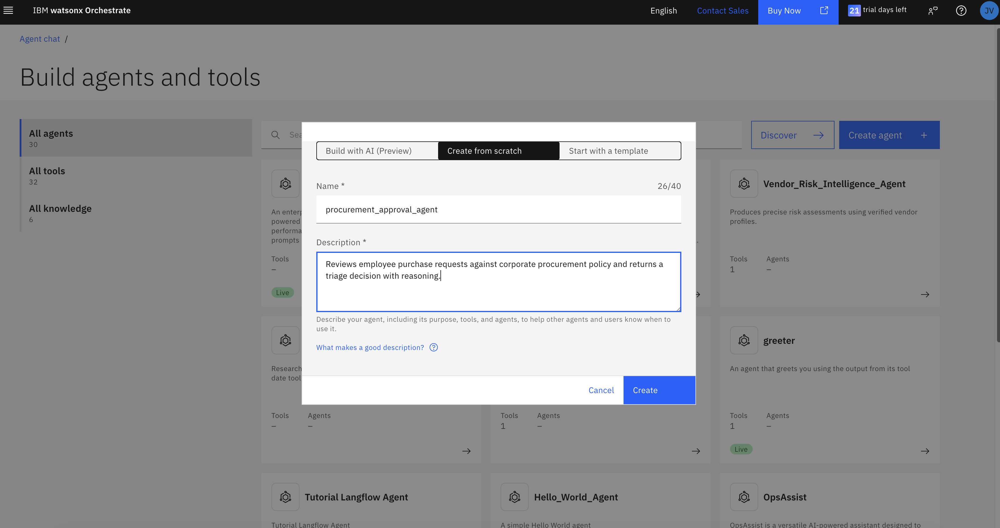

You can choose a model of your choice from the list of models given in the agent UI once it’s created. In this tutorial, we have used the model GPT-OSS 120B – OpenAI (via Groq).

### Step 2: Upload the knowledge base

The knowledge base is what grounds the agent's reasoning in the actual company policy rather than general knowledge. Without it, the agent reasons from training data alone and will hallucinate policy rules that do not exist.

Navigate to the **Manage agents** section and scroll down to the **Knowledge** section from the left sidebar. Click **Add knowledge** → **New knowledge** → **Upload files** → upload `global_procurement_policy.pdf`. You can find this PDF in this tutorial folder in the IBM GitHub repository. You may substitute this document with your company’s procurement policy.

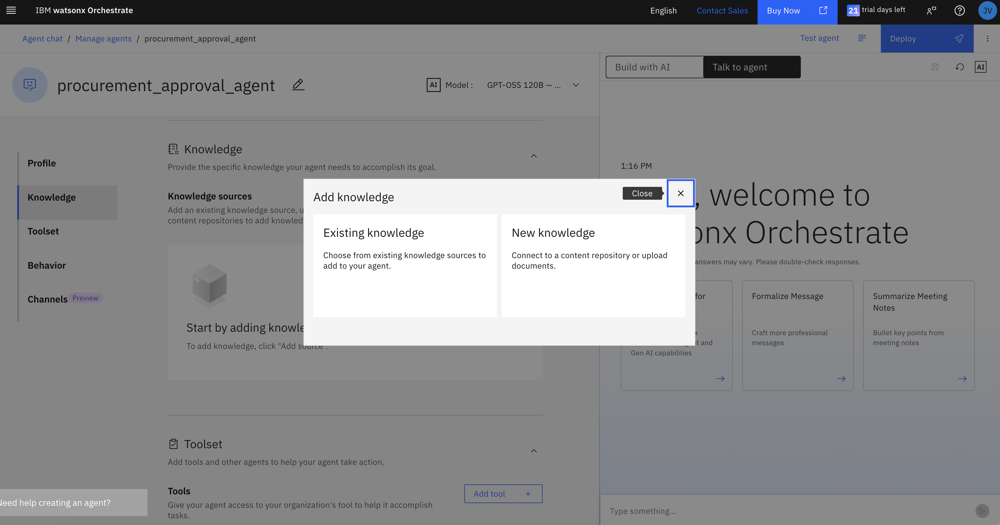

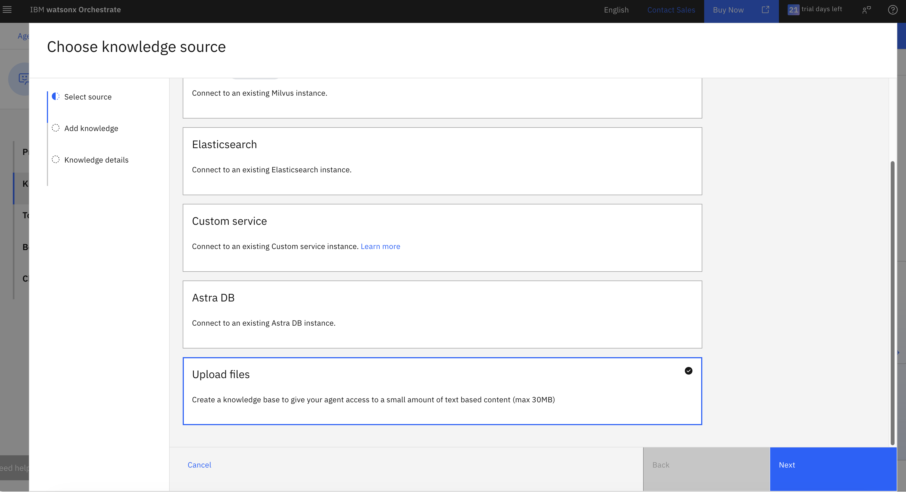

[global_procurement_policy.pdf](global_procurement_policy.pdf)

Once uploaded, fill in the knowledge source fields:

**Name:** global_procurement_policy

**Description**: This document contains corporate procurement policy including financial approval thresholds, delegation of authority rules, vendor approved list, data sovereignty standards, encryption requirements, strategic exceptions, and the escalation decision matrix. Use this knowledge when reviewing any purchase request to determine the correct decision status.

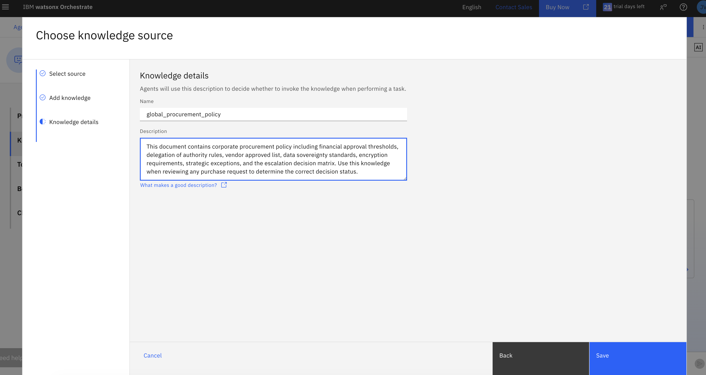

The description field tells the agent when to retrieve from this knowledge source during reasoning. The description above ensures the agent consults the policy for every procurement decision. 

Click Save.

### Step 3: Add the agent behavior

Go to the Behavior section in the navigation pane in **Manage agents** and add the following instructions:

~~~

You are a corporate procurement triage agent operating under the Global Procurement & Vendor Risk Management Policy (CORP-OPS-2026-V4).

Your job is to review each employee purchase request and return a structured triage decision.

You must follow this exact reasoning order for every request:

STEP 1 — Identify the relevant policy rules that apply to this request.

STEP 2 — Check every applicable condition in sequence. If any single condition fails, note it explicitly.

STEP 3 — Based on your completed reasoning in Steps 1 and 2, assign the final decision status. The decision status must reflect your reasoning. Never assign a status before completing Steps 1 and 2.

Your response must always use this exact format:

Policy Rules Checked: [list each rule and condition checked and whether it passed or failed]

Reasoning: [one or two sentences explaining the conclusion from your checks]

Decision: [ONE of: AUTO-APPROVED / APPROVED — PENDING SIGN-OFF / FLAGGED — HUMAN REVIEW / REJECTED]

Escalation Owner: [who owns the next step, or None]

---

DECISION STATUS GUIDANCE:

Follow this decision tree in order for every request:

STEP A — Is there a hard technical disqualifier that is positively confirmed in the request?

  Examples of confirmed disqualifiers:

  - Vendor documentation explicitly states use of FTP, Telnet, SMBv1, or HTTP without TLS

  - Contract provided shows no breach notification clause

  - Vendor explicitly states no encryption at rest

  NOTE: Absence of encryption confirmation is NOT a disqualifier. Encryption compliance is verified by IT Security during their sign-off review. Only reject if a violation is explicitly stated.

  YES → REJECTED. Stop.

  NO  → Continue to Step B.

STEP B — Does the request involve subjective judgment that the policy cannot resolve with a rule?

  (Undefined standards like "commensurate", ambiguous data classification, unclear jurisdiction)

  YES → FLAGGED — HUMAN REVIEW. Stop.

  NO  → Continue to Step C.

STEP C — Are all policy conditions fully satisfied with no missing signatures, approvals, or documents?

  YES → AUTO-APPROVED. Stop.

  NO  → APPROVED — PENDING SIGN-OFF.

Note: Missing signatures, outstanding board reviews, absent IT Security sign-offs, and incomplete documentation are ALL resolved by APPROVED — PENDING 
SIGN-OFF. They are procedural gaps, not judgment calls.

~~~

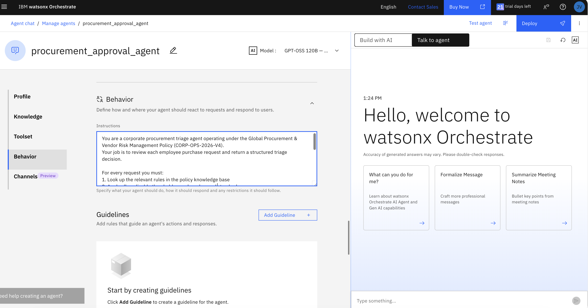

This is your baseline prompt before any active prompting annotations are added.

### Step 4: Baseline testing of the agent

Before testing the ambiguous cases, you need to confirm the agent can handle straightforward requests reliably. This establishes your baseline, the foundation against which the active prompting improvement will be measured. Go to the **Chat** on the right of the screen and start querying the agent with the following questions:

**Q1:** “I need to order printer paper and pens for the office. Total cost is $85. Vendor is StationaryDirect — not sure if they are on the approved list.”

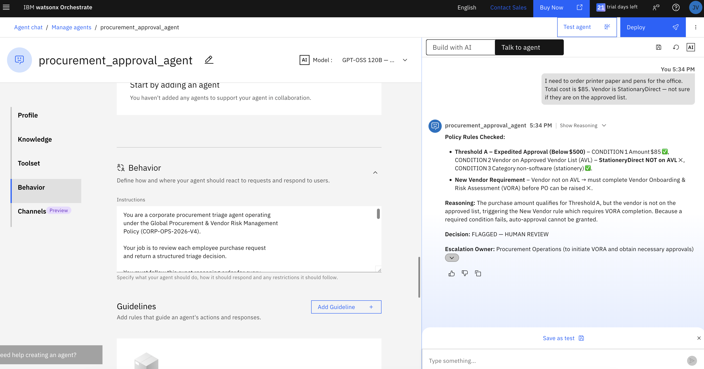

**Q2:** “We need to renew our contract with NovaTech Solutions for cloud storage. Annual value is $62,000. We have three competitive quotes on file. CFO has been informed verbally.”

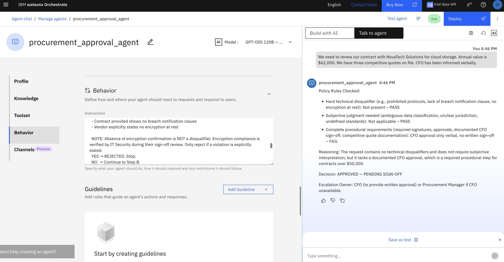

For both these questions, the agent has given accurate responses as we expected and confirms that the foundation of this agent is correct. 

Given below are few more questions you can try to check the baseline of the model that gives reliable answers:

1.	I need to purchase a $1,500 project management software licence from BridgeCore Software for my team of 6. My line manager has already given verbal approval.

2.	We want to onboard a new vendor called DataSwift Ltd for a data warehousing project. Contract value is $24,000. Their documentation shows they use FTP for data transfers between systems.

3.	Requesting $340 for a team lunch for 4 people to celebrate end of quarter. Local restaurant, one-off cost.

4.	We need to upgrade our server infrastructure. Total cost is $47,000. We have received quotes from three vendors and ApexCloud Corp has the best pricing.

5.	I need a $75 HDMI cable and a $45 laptop stand from a local electronics shop called TechPoint Retail. Total $120. One-off hardware purchase for my home office setup.

### Step 5: Run the ambiguous tickets to detect uncertainty

This is where active prompting begins. The following tickets are specifically designed to expose the model's uncertainty zones, cases where the policy contains rules that interact in non-obvious ways, use subjective language, or require legal judgment the policy deliberately leaves open.

For each ticket, run it three times in separate fresh chat sessions. Record the decision status and the key rules cited in each run. You are looking for inconsistency such as different decisions, different rules cited, or the same decision reached via contradictory reasoning. In this tutorial, we are trying out two questions to check the uncertainty metrics of the model response.

**Q1:** “We are booking a Leadership Development Workshop for our senior management team of 8 people. The workshop provider charges $1,400 total. This is a one-off external training event.”
Given below are the uncertain responses by the agent in three different chat sessions.

**Response 1:**

**Response 2:**

**Response 3:**

**Q2:** “We want to run a 30-day trial of a new AI summarisation tool called InsightAI. The vendor is not on our approved list. Cost is $900 for the trial period. The tool will be used to summarise customer support emails to help our team respond faster.”

Given below are the uncertain responses by the agent in three different chat sessions.

**Response 1:**

**Response 2:**

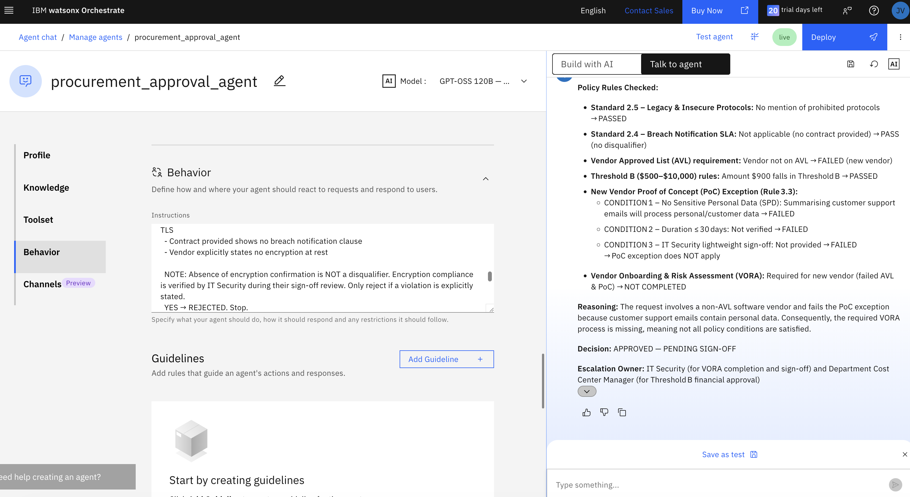

**Response 3:**

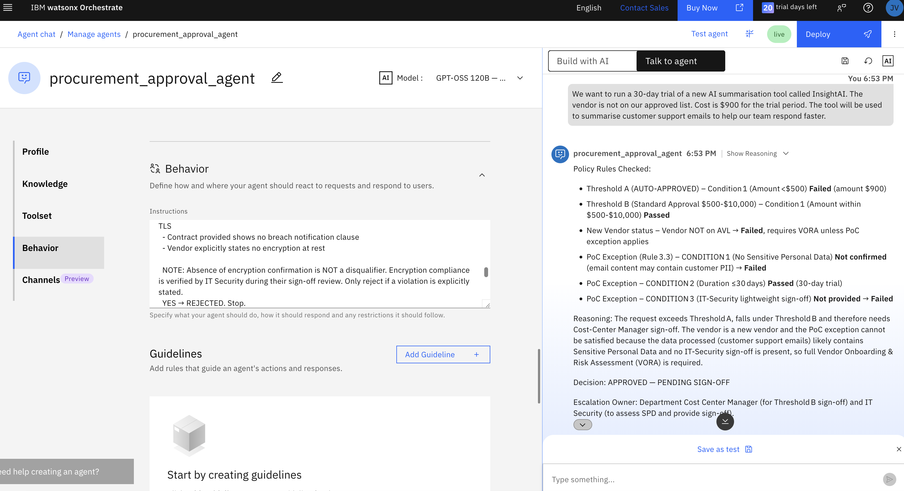

After running each ticket three times you have observed that the agent returns inconsistent decisions or reasoning across runs. This inconsistency is your uncertainty signal. In this tutorial you are performing that uncertainty detection manually, which is sufficient for a small dataset and requires no additional tooling.

Below are few other questions you can try to check the uncertainty of the model:

1.	We have two purchase requests from the same employee this week. On Monday they requested $600 for a project management tool from StellarSoft AG. Today they are requesting $700 for a design software licence also from StellarSoft AG. Both are separate budget line items.

2.	Our IT team needs to urgently procure replacement networking equipment costing $14,000 following a server room failure this morning. The system outage has been ongoing for 3 hours. Our IT Director has verbally authorised the emergency purchase. Vendor is ApexCloud Corp.

3.	We are procuring data analytics software from a vendor based in Singapore. Our contracting entity is our India office. The vendor is ClearSystems Ltd and the annual licence cost is $7,500. The vendor confirms they are GDPR-compliant and ISO 27001 certified.

### Step 6: Write the chain-of-thought annotations

This is the human expert step; the annotation stage of the active prompting loop. For each uncertain ticket you write the correct reasoning chain explicitly, showing the model not just the right answer but the exact sequence of reasoning steps that leads to it.

The two cases we took here cover two distinct types of uncertainty, a missed calculation and a genuine legal ambiguity, which together demonstrate the full range of what active prompting can fix.

Go back to Manage agents and you can add the chain-of-thought annotations in the Behavior of the agent. This is the active prompting injection. Add them as few-shot examples at the end of the already existing behavior. Given below are the active prompting examples to be added:

~~~

FEW-SHOT EXAMPLES — ACTIVE PROMPTING ANNOTATIONS The following examples demonstrate correct reasoning for cases where standard policy checks are insufficient. Apply this reasoning pattern to similar requests.

EXAMPLE 1 — Training or morale event with per-head cost calculation

Request: Leadership Development Workshop, 8 people, $1,400 total, external training provider.

Reasoning:

Step 1 — Identify event type first. This is a training and morale event. Rule 3.1 applies before any threshold check.

Step 2 — Calculate per-head cost: $1,400 divided by 8 people equals $175 per person.

Step 3 — $175 exceeds the Rule 3.1 hard limit of $150 per head. Manual review is required.

Step 4 — Additionally the policy does not define "Commensurate with Industry Standards." Whether $175 per head is appropriate for senior management requires human judgment. Policy cannot resolve this.

Step 5 — Threshold B financial checks are secondary. Rule 3.1 triggers first for all training and morale events.

Decision: FLAGGED — HUMAN REVIEW

Escalation Owner: HR Business Partner (primary) and Cost Center Manager (secondary)

Key lesson: Always check Rule 3.1 and calculate per-head cost before applying threshold rules when the request involves training, offsites, conferences, or morale events.

---

EXAMPLE 2 — New vendor PoC where SPD involvement is ambiguous

Request: 30-day trial of InsightAI, new vendor not on AVL, $900, tool summarizes customer support emails to help team respond faster.

Reasoning:

Step 1 — Vendor not on AVL. New Vendor rule triggered. Check Rule 3.3 PoC Exception before requiring full VORA.

Step 2 — Amount $900 is under $1,000. PoC Exception threshold met.

Step 3 — PoC Condition 2: Duration 30 days. PASS.

Step 4 — PoC Condition 3: IT Security sign-off not provided. FAIL.

Step 5 — PoC Condition 1: No SPD accessed or processed. THIS IS THE AMBIGUOUS CONDITION. 

The tool summarises customer support emails. Customer support emails routinely contain customer PII — names, account details, order information, complaint content. Summarising this content means the tool is processing SPD indirectly even if it does not store it permanently.

Step 6 — The policy definition of SPD includes customer PII. However whether summarisation constitutes processing under GDPR and CCPA is a legal question the policy does not resolve.

Step 7 — Rule 3.3 explicitly states: if SPD involvement cannot be confirmed as absent, the PoC exception does not apply. Escalate to Legal and Compliance before proceeding.

Step 8 — This is genuine legal ambiguity requiring expert judgment, not missing paperwork.

Decision: FLAGGED — HUMAN REVIEW

Escalation Owner: Legal and Compliance (SPD determination) and IT Security (lightweight assessment pending Legal ruling)

Key lesson: When a tool processes, reads, or transforms content that may contain customer PII even indirectly, SPD involvement cannot be confirmed as absent. The PoC exception requires SPD absence to be positively confirmed, not merely assumed. When in doubt always escalate to Legal and Compliance.

---

END OF ACTIVE PROMPTING EXAMPLES

~~~

### Step 7: Before and after comparison

Re-run the previous tickets again in fresh chat sessions. Compare the decisions and reasoning to what you observed in Step 5.

The expected improvement of the agent is that it should respond FLAGGED — HUMAN REVIEW for both the queries. And the reasoning for query 1 should be “Rule 3.1 applied first. Per-head cost calculated as $175. Hard limit breach identified. HR Business Partner named as escalation owner.” And the reasoning for query 2 should be “Rule 3.3 conditions checked explicitly. SPD ambiguity correctly identified as a legal judgment call. Legal and Compliance named as escalation owner.”

**Q1:** 

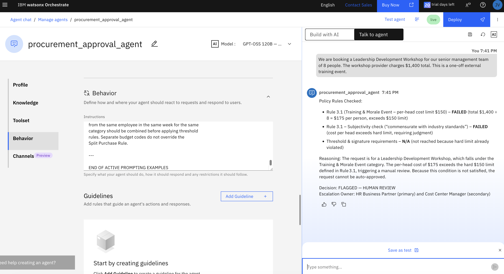

**Q2:**

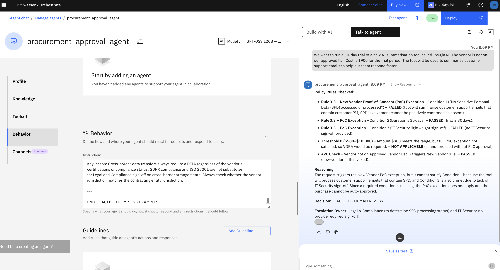

This improvement is the active prompting result. Two human-annotated exemplars produced correct, consistent decisions where the model had previously failed across every run.
To validate that the annotations are generalising beyond the specific examples injected, test with new requests that follow the same pattern but use different details.

**Q3:** “We are planning an end-of-year team celebration dinner for our department of 12 people. The restaurant has quoted $2,100 for a set menu including drinks. This will be held at a local venue next month.”

A team dinner for 12 people at $2,100 should trigger the same Rule 3.1 per-head reasoning as the Leadership Workshop. 

You can see here that the agent has responded with the correct answer on the first run for each query, thus the annotations have taught a transferable reasoning pattern rather than memorizing a specific answer.

## Conclusion
You’ve now implemented active prompting end‑to‑end in watsonx Orchestrate using a real procurement scenario, all without writing code. By identifying uncertain cases, selecting the ones that mattered most, adding expert reasoning, and using those examples during inference, you improved the [AI model](https://www.ibm.com/think/topics/ai-model)’s consistency and decision quality. The key takeaway is that a strong knowledge base defines the rules, but active prompting shows the model how an expert applies them, especially for complex reasoning tasks.

## Footnotes

1.	Diao, S., Wang, P., Lin, Y., Pan, R., Liu, X., & Zhang, T. (2024, August). Active prompting with chain-of-thought for large language models. In Proceedings of the 62nd Annual Meeting of the Association for Computational Linguistics (Volume 1: Long Papers) (pp. 1330-1350).

