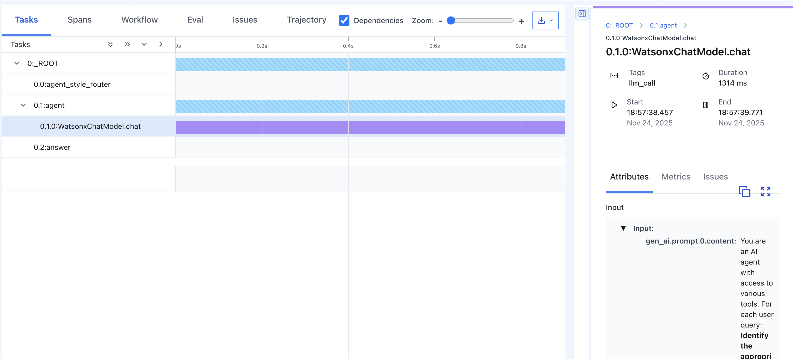
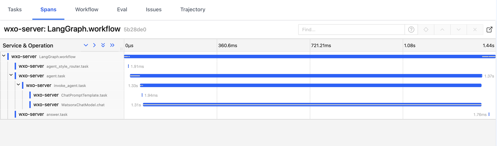
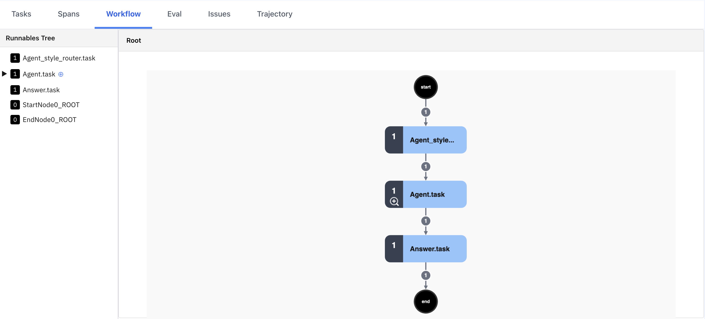
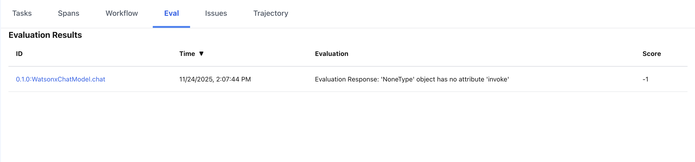
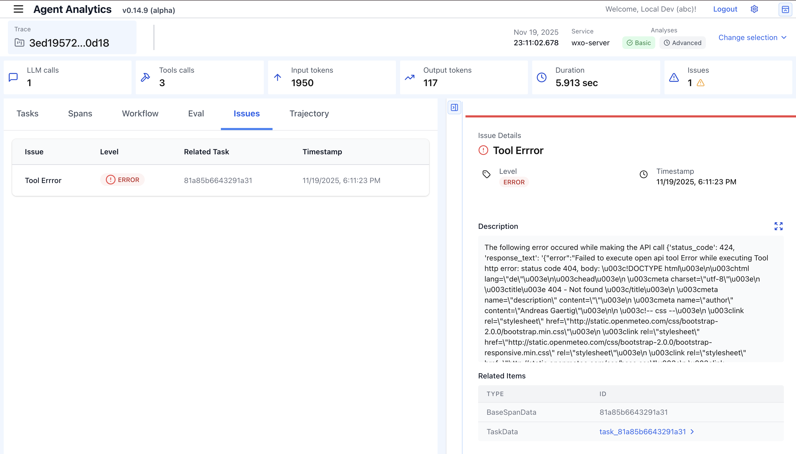

# AgentOps: Monitor and govern AI agents with IBM Telemetry using watsonx Orchestrate

As AI agents become more sophisticated and autonomous, understanding their behavior,
performance, and decision-making processes is critical for ensuring reliability
and governance. [AgentOps](https://www.ibm.com/think/topics/agentops), the
practice of monitoring, observing, and managing AI agents in production, provides
the visibility needed to build trustworthy agentic AI systems.

This tutorial provides a step-by-step guide to setting up and using IBM Telemetry
with watsonx Orchestrate Developer Edition to monitor and govern AI agents.
You'll learn how to enable observability for AI agents and analyze their behavior
in depth, from individual LLM calls to complete multi-step workflows.  

By the end of this tutorial, you'll be able to:  

- Install and configure watsonx Developer Edition locally
- Enable IBM Telemetry for comprehensive agent observability
- Import and test a pre-configured AI agent with external tool integration
- Analyze agent behavior through detailed traces, tasks, spans, and workflows
- Debug issues and optimize agent performance using advanced analytics

## What is IBM Telemetry?

IBM Telemetry is the native observability framework of wawtsonx Orchestrate that
captures detailed information about how your AI agents execute requests. It
records every step of the agent lifecycle, from routing decisions and prompt
construction to LLM invocations and tools calls, providing complete visibility
to agent behavior.

With IBM Telemetry, you can track performance metrics, monitor LLM cost, identify
errors, and ensure your agents are operating as intended. IBM Telemetry provides
enterprise-grade observability designed for production environments and AI systems
at scale.  

## Prerequisites

### System requirements

Before you begin, ensure you have the following prerequisites installed and
configured on your system:  

- Python 3.8+ (Check with `python --version`)
- 16 GB RAM minimum
- The watsonx Orchestrate Developer Edition via watsonx Orchestrate ADK

This guide includes installation steps for the ADK.

### Authorization requirements

- **watsonx Orchestrate Account** [Free 30 day trial available](https://www.ibm.com/products/watsonx-orchestrate) if you don't have an account.
- **watsonx Orchestrate API Key**, generated from your IBM cloud dashboard

Authorization steps are provided later in this guide.

## Steps

## Step 1. Clone the GitHub repository

To get started, clone the GitHub repository by using https://github.com/IBM/ibmdotcom-tutorials.git
as the HTTPS URL. For detailed steps on how to clone a repository, refer to the
[GitHub documentation](https://docs.github.com/en/repositories/creating-and-managing-repositories/cloning-a-repository).

Open the repository in your preferred IDE (e.g., [Visual Studio Code](https://code.visualstudio.com/))
and locate this tutorial's project folder: `wxo-agentops`. This is the directory
you'll be working in as you follow along.

### Step 2. Install the watsonx Orchestrate ADK

The IBM watsonx orchestrate Agent Development Kit (ADK) is a CLI tool
that simplifies the installation, configuration, and management of the watsonx
Orchestrate Developer Edition.  

**To use the ADK, you must connect it to an existing watsonx Orchestrate environment.**
If you don't have a watsonx Orchestrate account yet, you can [sign up for a free
30-day trial](https://www.ibm.com/products/watsonx-orchestrate). If you already
have an account, you can use it to provide the environment credentials needed by
the ADK.  

These steps will guide you through installation using a Python virtual environment,
which is the recommended approach for keeping dependencies isolated. For alternative
installation methods and detailed instructions, see the
[Getting started with the ADK documentation](/getting_started/installing#ibm-cloud).

#### 2a. Create your virtual environment

Create a new Python virtual environment in your project directory:  

```bash
python -m venv .venv
```

This creates a `.venv` folder containing an isolated python environment.

#### 2b. Activate your virtual environment

The activation command differs depending on your operating system.

macOS & Linux

```bash
source ./.venv/bin/activate
```

Windows

```bash
.\.venv\Scripts\activate
```

Once activated, your terminal prompt should change to indicate you're working inside
the virtual environment (typically showing `(.venv)` at the beginning of the
prompt).  

#### 2c. Install the watsonx Orchestrate ADK

With your virtual environment activated, install the ADK using pip:  

```bash
pip install ibm-watsonx-orchestrate
```

This command downloads and installs the ADK along with all its
dependencies. The installation may take a few minutes to complete.

**Note:** If you have earlier an earlier version of the ADK installed (>`2.0`),
run `pip install --upgrade ibm-watsonx-orchestrate`. You may also have to run the
troubleshooting steps in step 4b.  

### Step 3. Configure your environment

The ADK uses a `.env` file to authenticate your user credentials and configure
the watsonx Orchestrate Developer Edition. The environment variables you need
depend on your chosen authentication method. This tutorial uses the watsonx Orchestrate
account method, which is the most straightforward approach for getting started.  

For alternative authentication methods and detailed configuration instructions,
see the [configuring your environment file documentation](https://developer.watson-orchestrate.ibm.com/developer_edition/wxOde_setup#configuring-env-file).

#### Step 3a. Create your `.env` file

Inside the `wxo-agentops` directory, create a `.env` file by copying the provided
template:  

```bash
cp env.template .env
```

#### Step 3b. Configure required fields

Open the `.env` file in your text editor and configure the following two essential
fields:  

- `WO_INSTANCE`: This is the URL of your watsonx Orchestrate instance. You can
find this by logging into your [watsonx Orchestrate account](https://dl.watson-orchestrate.ibm.com/login?redirUrl=/chat)
and navigating to your instance details. Click your profile icon > Settings, then
select the **API details** tab. For detailed instructions on getting started with
the API, check out the [watsonx Orchestrate documentation](https://www.ibm.com/docs/en/watsonx/watson-orchestrate/base?topic=api-getting-endpoint).

The URL follows this format:  

```text
WO_INSTANCE=https://api.us-south.watson-orchestrate.cloud.ibm.com/instances/<your-instance-id>
```

Copy and paste your service instance URL to replace the template value in your
`.env` file. The region (e.g. `us-south` depends on your geographical location).

- `WO_API_KEY`: This is your watsonx Orchestrate API key, which authenticates your
connection to IBM Cloud services. You can generate or retrieve this key from your
IBM cloud account dashboard. Replace `<your-api-key>` with your actual API key.
For step-by-step instructions on generating an API key, see the
[getting started documentation](https://developer.watson-orchestrate.ibm.com/developer_edition/wxOde_setup).

```text
WO_API_KEY=<your-api-key>
```

**Keep your API key secure and never commit it to version control.** The `.env`
file should already be included in your `.gitignore` to prevent accidental exposure.

### Step 4. Install the watsonx Orchestrate server and enable IBM Telemetry

Now you're ready to install the [watsonx Orchestrate Developer Edition](https://developer.watson-orchestrate.ibm.com/developer_edition/wxOde_overview),
which will run a local instance of the watsonx Orchestrate server on your machine.
This step also enables IBM Telemetry, giving you immediate access to observability
features.  

#### Understanding the installation command

The ADK provides a single command that handles the entire installation process:

```bash
orchestrate server start -e <path-.env-file> --with-ibm-telemetry
```

Let's break down what this command does:  

- `orchestrate server start`: Initializes and starts the watsonx Orchestrate
Developer Edition server
- `-e <path-.env-file>`: Points to your configuration file containing credentials
- `--with-ibm-telemetry`: Enables IBM Telemetry's native observability framework

#### 4a. Run the installation

Execute the command from your `wxo-agentops` directory:

The following command starts the watsonx Orchestrate Developer Edition server by
initializing the server environment: `orchestrate server start -e <path-.env-file>`.
Adding the `--with-ibm-telemetry` flag enables IBM Telemetry, its
native observability framework.

Run this command to install watsonx Orchestrate server with IBM Telemetry:  

```bash
orchestrate server start -e .env --with-ibm-telemetry
```

This command creates internal containers managed by the ADK for:

- The watsonx Orchestrate server
- PostgresSQL and Redis databases
- IBM Telemetry services
- Supporting dependencies

The ADK automatically configures a virtual network that allows these containers
to communicate with each other on `http://localhost:3000`.  

#### Step 4b. Verify successful installation

The installation process may take several minutes, especially on the first run as
the necessary images are downloaded. A successful installation produces output
similar to this:  

```bash
[INFO] - Waiting for orchestrate server to be fully initialized and ready...
[INFO] - Orchestrate services initialized successfully
[INFO] - local tenant found
[INFO] - You can run `orchestrate env activate local` to set your environment or
`orchestrate chat start` to start the UI service and begin chatting.
```

If you see this message, congratulations! Your local watsonx Orchestrate environment
with IBM Telemetry is now running.

#### Troubleshooting installation

If the installation fails or hangs, try the following steps:

1. **Reset the server**:

```bash
orchestrate server reset
```

This command stops and removes all containers created for watsonx Orchestrate,
giving you a clean slate.  

2. **Restart the installation**:  

After resetting, run the start command again:

```bash
orchestrate server start -e .env --with-ibm-telemetry
```  

3. **Check the server logs container status**:

You can view service logs for the Orchestrate server to check for warnings or errors:

```bash
orchestrate server logs
```

If the above steps do not work, reset the server and completely removing the
server environment: `orchestrate server purge` and reinstall.  

### Step 5. Activate your local environment and start the service

With the watsonx Orchestrate server successfully installed, you now need to activate
your local environment and launch the chat interface where you'll interact with
your AI agents.  

#### Activate the local watsonx Orchestrate environment

The watsonx Orchestrate ADK supports multiple environments (local, development,
production, etc.). You need to explicitly activate the local environment you
just created:  

```bash
orchestrate env activate local
```

You should receive confirmation that that the environment is active:  

```bash
[INFO] - local tenant found
[INFO] - Environment 'local' is now active
```

This sets the local environment as your default context for all subsequent
ADK commands. Any agents, tools, or configurations you work with will now target
this local instance.  

#### Launch the watsonx Orchestrate chat interface

Start the watsonx Orchestrate chat UI service with the following command:

```bash
orchestrate chat start
```

This command initializes the web-based chat interface and automatically opens
it in your default browser. You should see output similar to:  

```bash
[INFO] - Chat UI Service started successfully.
[INFO] - Waiting for UI component to be initialized...
[INFO] - Opening chat interface at http://localhost:3000/chat-lite
```

The chat interface provides a user-friendly way to interact with your AI agents.
If the browser doesn't open automatically, you can manually navigate to
`http://localhost:3000/chat-lite`.  

#### Verify the interface is running

Once the chat interface loads, you should see a clean chat window ready for
interaction. At this stage, you haven't imported any agents yet, so the interface
will be mostly empty. That's expected, you'll add your first agent in the next
step.  

### Step 6. Import a weather agent and tool to test IBM Telemetry

Now that your environment is set up, it's time to import a pre-configured AI agent
that demonstrates IBM Telemetry's monitoring capabilities. This weather agent uses
an external API tool to fetch real-time weather data, giving you a practical example
to observe and analyze.

#### Why start with a weather agent?

The weather agent is an ideal starting point because it:  

- **Demonstrates tool usage**: Shows how agents call external APIs
- **Provides clear, observable behavior:** Each request follows a predictable pattern
- **Generates meaningful telemetry data:** Produces rich traces you can analyze
in IBM Telemetry
- **Includes error scenarios:** Helps you understand how telemetry handles failures
- **Illustrates automation:** Removes manual data lookup through agent actions

#### Step 6a. Navigate to the weather agent directory

From your project root (`wxo-agentops`), navigate to the Weather Agent folder:  

```bash
cd weather_agent
```

This directory contains two YAML configuration files:

- `get_weather.yaml`: Defines the weather API tool
- `weather_agent.yaml`: Defines the agent that uses this tool

#### Step 6b. Import the weather tool

Tools are reusable capabilities that agents can invoke to perform specific actions.
Import the `get_weather` tools first:

```bash
orchestrate tools import -f get_weather.yaml --kind openapi
```

The `--kind openapi` flag indicates that this tools uses an OpenAPI specification
to define its interface. You should see confirmation that the tool was successfully
imported.

#### Step 6c. Import the weather agent

Now import the agent that will use this tool:

```bash
orchestrate agents import -f weather_agent.yaml   
```

This command registers the Weather Agent in your local watonsx Orchestrate
environment. The agent is pre-configured with:

- Instructions on how to interpret weather data
- Permission to call the `get_weather` tool
- Fallback behavior for invalid locations

#### Step 6d. Activate the agent in the chat interface

Return to your browser where the chat interface is running. You may need to refresh
the page to see the newly imported agent.

Click the agent dropdown menu (typically located at the top of the chat interface)
and select **Weather_Agent** from the list


#### Test the agent  

With the Weather Agent selected, try asking some questions to generate telemetry
data:

**Example queries*:*

- "What's the weather like in New York City?"
- "Can you tell me the current temperature in London?"
- "What is the weather in Tokyo?"
- "Is it raining in Seattle right now?"

The agent will process each request by:

1. Understanding your query
2. Extracting the location
3. Calling the `get_weather` tool with appropriate coordinates
4. Interpreting the weather data
5. Responding in natural language


#### What's happening behind the scenes?

Every interaction you have with the Weather Agent is being captured by IBM Telemetry.
The system is recording:

- The full conversation context
- Every LLM invocation and the tokens used
- Tool calls with their inputs and outputs
- Routing decisions and workflow steps
- Execution times and performance metrics
- Any errors or exceptions that occur
- Interactions with external providers and their response times

In the next step, you'll explore this telemetry data in detail to understand exactly
how your agent behaves.

### Step 7. Analyze the agent's behavior in IBM Telemetry

Now comes the most powerful part of this tutorial: using IBM Telemetry to gain deep
visibility into your agent's behavior. IBM Telemetry provides multiple views and
analytics tools that let you understand every aspect of how your agent processes
requests.

#### Step 7a. Access the IBM Telemetry interface

Open your browser and navigate to [https://localhost:8765/?serviceName=wxo-server](https://localhost:8765/?serviceName=wxo-server).
The interface provides session replays that let you revisit past agent interactions
for analysis.  

**Note:** The URL uses `https`, but since this is a local development environment,
your browser may show a security warning about a self-signed certificate. This is
expected and safe to proceed past in your local environment.

#### Step 7b. Log in to IBM Telemetry

When the login screen appears, enter any name (this is just for identifying your
local session) and click **Login**.


You'll be taken to the main IBM Telemetry dashboard.

#### Step 7c. Navigate to the Trace and Group Selection view

The dashboard shows a list of recent traces, each representing a single user
interaction with an agent. Click on the first trace in the
**Trace and Group Selection** panel to view detailed analytics about your most
recent chat with the Weather Agent.  


This takes you to the **Agent Analytics** screen, which serves as the central
hub for understanding agent behavior.

#### Understanding the Agent Analytics screen

The Agent Analytics screen provides an overview of the selected trace, including:

- **Summary statistics:** Total execution time, token usage, cost estimates,
and benchmarking data
- **Agent information:** Which agent handled the request
- **User query:** The original question asked
- **Response preview:** The agent's final answer
- **Status indicators:** Success, warnings, or errors


This high-level view gives you immediate insight into whether the agent performed
as expected and how efficiently it operated.

#### In-depth review: Observe agent tasks

The **Tasks** section is where you'll spend most of your time analyzing agent
behavior. It provides a visual, step-by-step timeline of everything the agent did
during a request (every LLM call, tool invocation, routing decision, and output
generation).  

Tasks are organized hierarchically to reflect how the agent actually executed the
workflow, making it easy to understand the sequence of operations and their
relationships.  



##### Breaking down the Weather Agent task workflow

Let's examine the standard execution path for a watsonx Orchestrate agent request.
Your Weather Agent trace should show a structure similar to this:  

```text
0:_ROOT                        
    0.0:agent_style_router     # Routes the request
    0.1:agent                  # Prepares prompt + logic
        0.1.0:WatsonxChatModel.chat # LLM processes the request
    0.2:answer                 # Sends final answer to user
```

This workflow shows the entire lifecycle of a single user query. Here's what each
task represents:

- `0:_ROOT`: The top-level span that contains all child tasks. Think of this as
the folder that holds the entire agent execution. It defines the start and end
time of the complete trace, from the moment the request enters the system until
the final response is delivered.  

This matters because the root task's duration tells you the total latency
the user experienced. If the number is too high, you can analyze its child tasks
to identify bottlenecks.

- `0.0:agent_style_router`: The routing task determines which agent should
handle the message and classifies the request into a handling style. The router
analyzes the incoming request and decides whether it requires conversational handling,
tool-driven execution, retrieval-augmented generation (RAG), or multi-agent
orchestration.

The router ensures that the correct downstream logic is invoked. If requests are
being misrouted, this is where you'd identify the problem.

- `0.1:agent`: The main agent execution context that orchestrates the entire request
This task assembles the prompt from system interactions, conversation history,
and tool responses. It applies orchestration rules and policies and prepares inputs
for the LLM. This task determines what type of LLM call to make.

This is where the "intelligence" of orchestration happens. The agent task ensures
the LLM receives all the context it needs to make informed decisions.

- `0.1.0:WatsonxChatModel.chat`: The actual call to the LLM where it
receives the full prompt and decides whether to call a tool, ask for clarification,
or produce a direct answer. It generates the response, in either text or
structured tool calls.  

This is the "thinking" step where the model processes information and makes decisions.
Token usage, latency, and quality issues all stem from this task. If your agent is
slow or expensive, this is usually the primary contributor.

- `0.2:answer`: The final step in the chain that takes the LLM's output and
formats it for delivery. This task converts the LLM's raw output into the final
answer format and applies any post-processing or formatting rules. Finally, it
delivers the response back to the chat interface.  

This task ensures the user receives a properly formatted response. If answers are
being truncated or improperly formatted, this is where you'd investigate.

**Task workflow summary**

To summarize the complete workflow:

1. Router decides how to handle the request
2. Agent prepares the context and orchestration logic
3. LLM generates the response or tool calls
4. Answer formats and returns the final output

All of this is wrapped under the `ROOT` request container, giving you a complete
picture of the agent's execution from start to finish. This level of observability
is essential for MLOps and DevOps teams managing agent operations and complex
pipelines at scale.  

##### Understanding task attributes

Each task in the hierarchy contains three categories of attributes that
provide detailed metadata about what the task consumed and produced:  

1. **Input attributes**: Show everything the task received before execution: messages,
tool responses, system instructions, the internal state.

**Example:** For the `WatsonxChatModel.chat` task, input attributes would include
the fully assembled prompt with system instructions, conversation history, and
any tool results that need to be interpreted.

2. **Output attributes**: Show what the task produced, including: LLM completions,
tool calls, and decisions.

**Example:** The same `WatsonxChatModel.chat` task might output either a natural
language response or a structured tool call like `get_weather(latitude=40, longitude=-74`).

3. **General attributes**: Provide telemetry metadata: token usage, timing information,
identifiers like unique IDs, and model information.

**Example:** You might see that a task used 450 input tokens and 120 output tokens,
took 1.2 seconds to execute, and used the `ibm/granite-3.1-8b-instruct` model.

**How to use task attributes**

Together, these attributes let you fully understand what the model saw, what it
decided, and how it responded.

This level of detail is invaluable for debugging, optimization, and validation.

##### Understanding task metrics

Every task includes performance and cost-related metrics that summarize how the
task executed. These metrics provide quantitative data about agent performance.

Key metrics include:

- **Total execution time:** How long the task took from start to finish
- **LLM call count:** How many times the language model was invoked
- **Tool call count:** How many times external tools were called
- **Token usage:** Input tokens, output tokens, and total tokens consumed
- **Cost estimates:** Approximate costs based on token usage (when pricing data
is available)
- **Subtask distribution:** How work was distributed across child tasks


These metrics help you optimize performance and debug agent behavior. They can
also aid in identifying slow tasks that could be parallelized or
cached. This is integral for capacity planning because it allows you to understand
resource requirements for scaling and track token usage to control expenses.

For example, if you notice a trace took 8 seconds but only 0.5 seconds were spent
on LLM calls, you know the bottleneck is elsewhere (likely in tool execution or
network latency).

#### Understanding agent spans

While tasks show you the logical workflow of your agent, **spans** represent the
underlying system-level operations that occur during execution. Clicking the **Spans**
tab reveals what the platform is doing internally to process each request.



Spans provide visibility into the low-level execution steps recorded by the
orchestration framework (in this case, LangGraph, an open source framework
running inside the wxo-server).
Each span represents a discrete operation such as:

- Routing the request to the correct agent (`agent_style_router`)
- Invoking the agent and initializing its context (`agent.task`)
- Building prompts and context from templates (`ChatPromptTemplate.task`)
- Calling the LLM with the assembled prompt (`WatsonxChatModel.chat`)
- Returning results to the user (`answer.task`)

##### How spans differ from tasks

While tasks show the *logical* steps of agent execution (what the agent is trying
to accomplish), spans show the *technical steps* (how the system accomplishes it).
This dual view gives you both the high-level understanding and low-level debugging
capability.

**Example:** A single task like `0.1:agent` might contain multiple spans representing
database queries, cache lookups, and configuration loading. These operations happen
behind the scenes to support the agent's execution.

##### Understanding span tags

Each span includes **tags** that provide additional metadata and context. These
tags are essential for filtering, debugging, and analyzing agent performance.

Common span tags include:

- Agent identification: `agent_id`, `agent_name`
- Session tracking: `thread_id`, `session_id`, `conversation_id`
- Workflow context: `step_number`, `workflow_path`, `parent_span_id`
- Performance data: `token_count`, `duration_ms`, `model_name`
- Request details: `tool_calls`, `input_preview`, `output_preview`

##### Using spans for debugging

Spans are particularly useful for tracking down latency, understanding failures
by seeing which internal component failed, analyzing patterns by filtering spans
by tag to identify trends, and cross-referencing by linking spans across multiple
traces using session IDs.

For example, if your agent occasionally hangs, you can filter spans by duration to
identify which internal operations are taking unexpectedly long, perhaps a database
query or a network call to an external service.

#### Visualizing execution with the Workflows tab

The **Workflows** tab provides a hierarchical visualization called the
**Runnables Tree**, which shows the complete execution structure of your agent
workflow. This view is especially useful for understanding complex multi-agent
systems and nested execution patterns.



##### What is a runnable?

In the watsonx Orchestrate framework, a **runnable** is a unit of work or task
that can be executed. Runnables can be:

- **Simple operations:** A single LLM call or tool invocation
- **Composite workflows:** Multiple runnables chained together
- **Conditional branches:** Different execution paths based on conditions
- **Parallel executions:** Multiple runnables running simultaneously

##### Understanding the tree structure

The Runnable Tree displays parent-child relationships, making it easy to see:  

- Which tasks trigger others: Following the execution chain
- Parallel vs. sequential execution: Understanding workflow concurrency
- Branching logic: How decisions lead to different execution paths
- Workflow depth: How deeply nested your agent logic is

##### When workflows become critical

For simple agents like the Weather Agent, the workflow view mirrors the task view
closely. However, workflows become invaluable when you're working with:

- **Multi-agent systems:** Multiple specialized agents collaborating on a task.
- **Complex orchestration:** Agents that dynamically choose between different
tools or sub-agents
- **Iterative refinement:** Agents that loop through steps until a condition is met
- **Conditional routing:** Workflows that branch based on intermediate results
- **Scalable architectures:** Designing workflows that handle real-world load
efficiently

For example, imagine an agent that first checks if a query requires web search, then
decides between using a calculator tool or a database query tool, and finally
validates the result before responding. The Runnables Tree would show this
entire branching structure clearly.

##### Using the workflow view

You can interact with the tree by:

- **Expanding/collapsing nodes:** Focus on specific workflow sections
- **Clicking nodes:** Jump to detailed task information
- **Following execution paths:** Trace how data flows through the window
- **Identifying bottlenecks:** Spot where workflows become inefficient

The visualization makes debugging workflows significantly easier than trying to follow
text logs or trace data alone.  

#### Advanced analytics: The Eval tab

The **Eval** (evaluation) tab provides a quality assurance and monitoring view that
measures the correctness and reliability of your agent's execution. This is where
you move from observing *what happened* to evaluating *how well it happened*.  



The Eval tab shows evaluation results that asses quality through guardrails:

- **Task success:** Which tasks completed vs. failed
- **Output quality:** Whether outputs matched expected results or quality criteria
- **Performance scores:** Quantitative metrics indicating success levels
- **Error analysis:** Categorization and severity of failures
- **Use case validation:** Whether agent behavior matches intended use cases


Evaluations help you monitor reliability by tracking how consistently your agent
produces correct results, identify when changes degrade agent performance, prioritize
improvements, and build confidence by validating that agents work correctly before
production deployment.

You can leverage evaluation measurements to set up alerts, track improvements,
identify patterns, and use feedback to guide development to improve prompts or
tools.  

If you notice that 15% of weather queries fail evaluation, you can
investigate those specific traces to understand whether the issue is bad input
handling, API failures, or incorrect response formatting.

#### Identifying problems with the Issues tab  

The **Issues** tab provides a centralized view of everything that went wrong during
workflow execution. This is your first stop when debugging agent failures or
unexpected behavior.



The Issues tab lists problems such as:

- **Failed API calls:** External services returning errors
- **Tool execution failures:** Tools that crashed or timed out
- **Missing inputs:** Required data not available when needed
- **Model exceptions:** LLM errors like token limits or invalid inputs
- **Validation errors:** Data that doesn't meet expected formats
- **Timeout errors:** Operations that exceeded time limits
- **Unhandled runtime failures:** Unexpected exceptions in agent code

In the screenshot above, you can see a **Tool Error** that occurred
when the weather API returned a 424 (Failed Dependency) or 404 (Not Found) error.
The issues tab displays:

1. **The error type:** "Tool Error"
2. **The specific tool:** `get_weather`
3. **The error response:** Full API response showing the failure
4. **A direct link:** Click to jump to the exact task where it failed

This makes it simple to understand what went wrong without digging through logs
or trace data.

The Issues tab is especially valuable because it aggregates failures instead of
forcing you to hunt through individual tasks. It provides complete context by
including full error details and related data, while severity levels enable
quick triage so you can prioritize which issues to address first. The direct links
to source tasks mean one click takes you to the exact execution point where things
went wrong.

#### Understanding agent behavior with the Trajectory tab

The **Trajectory** tab provides a chronological, conversation-style view of the
agent interaction between the user and any tools the agent invokes. This
view is invaluable for understanding the full context and flow of agent behavior.


The Trajectory view is useful because it allows you to see exactly how the agent
processes requests from start to finish, giving you complete visibility into agent
behavior. You can validate tool integration by ensuring tools are called with
correct parameters and receive appropriate responses. When debugging unexpected
responses, the trajectory helps you trace where logic diverged from your expectations.
You can also analyze how context builds over multiple conversation turns, watching
the workflow evolve naturally. Beyond debugging, the trajectory serves as
documentation, letting you capture examples of correct behavior that can be shared
with team members or used as reference cases for future development. This is
particularly valuable for teams building with generative AI who need to validate
agent adaptability across diverse scenarios.  

##### Anatomy of a Trajectory

Let's walk through the Weather Agent trajectory shown in the screenshot:

1. The user query

```text
User: "What's the weather like in NYC?"
```

The conversation starts with a clear, specific request about weather in New York
City.

2. Agent makes a tool call

The agent recognizes it needs external data and invokes the weather tool:

```json
{
  "current_weather": "true",
  "latitude": "40",
  "longitude": "-74"
}
```

This shows that the agent correctly identified NYC's approximate coordinates, properly
structured the request for the API, and set the appropriate flag for current weather.

IBM Telemetry displays this both as raw JSON and a nicely parsed, expandable
tree view.

3. Tool returns data

The weather API responds with structured weather data:  

```json
{
  "temperature": "7.8",
  "temperature_unit": "celsius",
  "time": "2024-01-15T14:30:00",
  "weather_code": "partly_cloudy",
  "wind_speed": "15",
  "wind_speed_unit": "kmh"
}
```

This shows that the tool successfully retrieved data and the response follows the
expected schema and all required fields are present. Being able to inspect the raw
tool response is crucial for debugging issues where the agent misinterprets tool
outputs.  

4. Agent summarizes the result

Finally, the agent processes the structured data and responds naturally:

```text
Agent: "The weather in NYC is 7.8°C…"
```

The agent correctly extracted the temperature and weather code and converted the
structured data into natural language. The response is concise and answers the
user's question.

##### Testing edge cases with Trajectory

The Trajectory view is particularly valuable for validating how agents handle edge
cases. For example, if you ask:  

```text
"What is the weather like in Atlantis?"
```

A well-designed agent should respond:

```text
Agent: I’m not aware of any location named Atlantis…
```

This shows the agent correctly avoided making an erroneous tool call after
recognizing the invalid location. It handled the edge case gracefully with a
helpful fallback message.

##### Key Trajectory features

The Trajectory tab also supports filtering by role to view only user messages,
agent messages, or tool interactions. You can also expand and collapse parts of
long conversations to focus on details that matter to you. For further analysis
or debugging, you can export the data as JSON to jump to linked tasks from
trajectory steps for corresponding details.

## Conclusion

Congratulations! You've successfully set up IBM Telemetry with watsonx Orchestrate
and learned how to monitor and analyze AI agent behavior in depth. IBM Telemetry
provides multiple layers of visibility to give you complete observability into how
your AI agents think, decide, and act. These capabilities you've explored are crucial
for effective lifecycle management of agent operations in production or integrating
with other agent frameworks in your environment.

If you encounter issues or have questions check the documentation. Most
common issues are covered in the [troubleshooting guide](https://developer.watson-orchestrate.ibm.com/developer_edition/wxOde_setup#troubleshooting).
You can also review GitHub issues to see if others have experienced similar problems.

Agent monitoring through platforms like IBM Telemetry has created a robust
ecosystem for AgentOps, becoming essential as autonomous agents take on more complex
tasks that involve integrating SDKs, tools and external APIs. The visibility
you've gained into agent behavior enables you to create more reliable, efficient,
and trustworthy AI systems.
