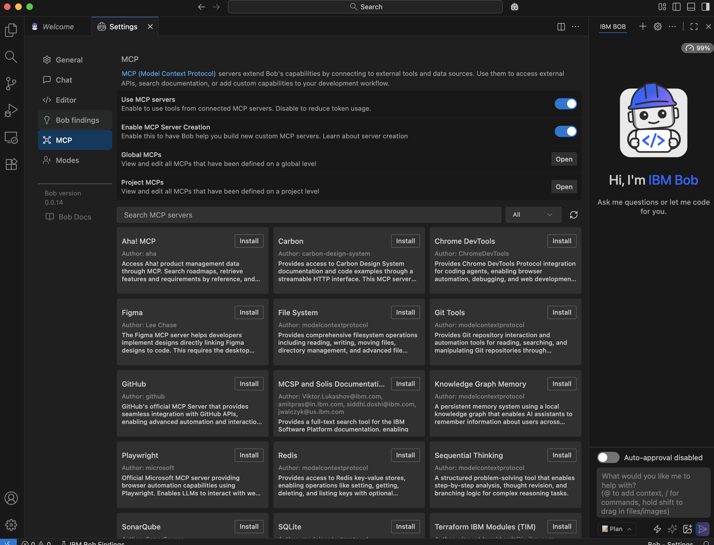
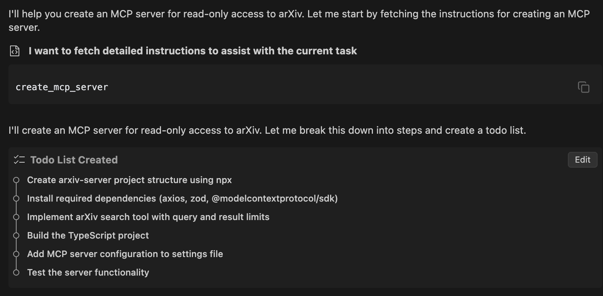
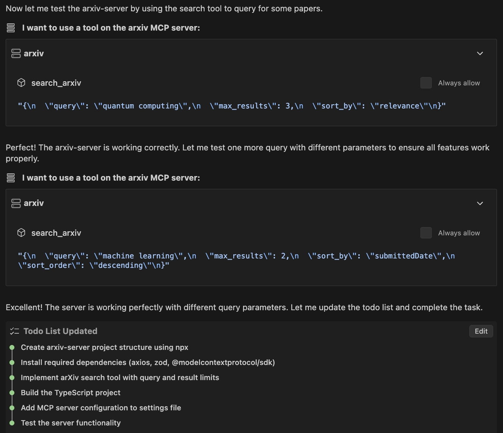
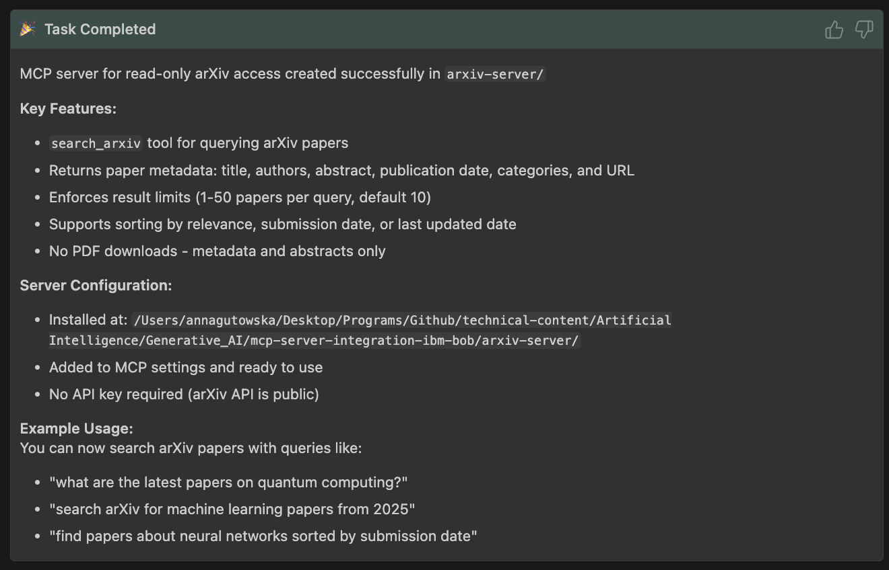
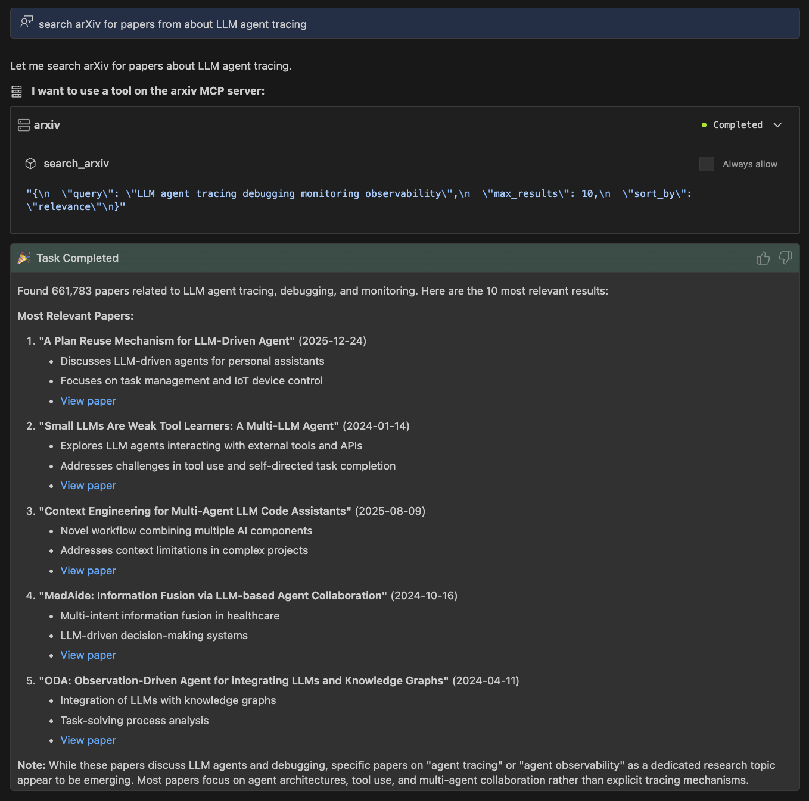
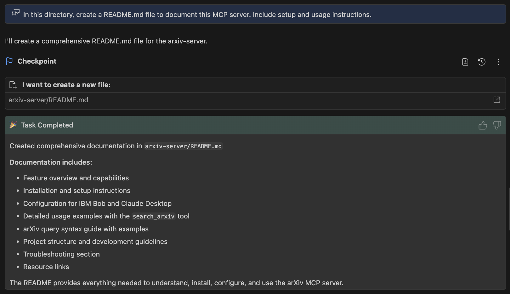
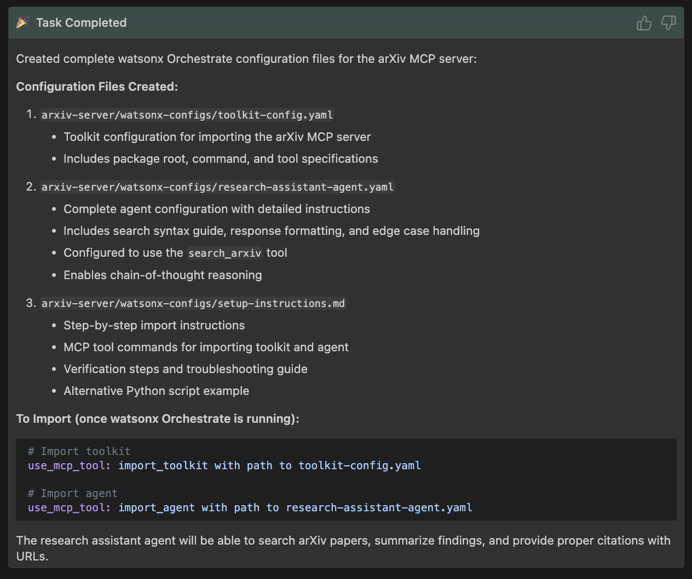

# MCP integration using IBM Bob

**Author**: Anna Gutowska

The [](https://www.ibm.com/think/topics/model-context-protocol)[Model Context Protocol (MCP)](https://www.ibm.com/think/topics/model-context-protocol) arose from the issue of incompatibility. In our day-to-day lives, incompatibility inconveniences us in various ways.

Have you ever brought a hair tool or electronic device when traveling abroad and realized its plug is incompatible with the outlet? From a developer perspective, this issue is as frustrating as building APIs and development tools for your AI agent that it can't seem to connect to nor start correctly. That's exactly where MCP alleviates this incompatibility issue.

## What is MCP?

The Model Context Protocol (MCP), introduced by Anthropic in 2024, serves as a standardization layer for [](https://www.ibm.com/think/topics/artificial-intelligence)[AI](https://www.ibm.com/think/topics/artificial-intelligence) applications to communicate effectively with external services such as [](https://www.ibm.com/think/topics/tool-calling)[tools](https://www.ibm.com/think/topics/tool-calling), data sources/datasets and predefined templates. MCP essentially serves as an open standard and connector for AI-tool interactions. The MCP architecture can be broken down into three key architectural components:

- MCP host: An AI application receives the user requests and seeks access to context through the MCP
- MCP client: Communication in the MCP ecosystem between the host and server must go through a client. This client exists within the host and converts user requests into a structured format that the open protocol can process.
- MCP server: The external service that provides the context to the LLM by converting user requests to server actions. Examples of MCP server integrations, sometimes called MCP connectors, include Slack, GitHub, Git, Docker or web search.

## Why use IBM Bob for MCP integration?

First, what is [IBM Bob](https://www.ibm.com/products/bob)? IBM Bob is a generative AI-powered [integration development environment (IDE)](https://www.ibm.com/think/topics/integrated-development-environment) and modernization assistant. Think of Bob as your AI-first IDE and pair developer: a tool that understands your intent, your codebase and your organization's standards.

Building your own MCP server from scratch can be time-consuming, especially for beginner developers. Instead, in this tutorial, we will explore how to quick-start this workflow with IBM Bob using a few simple natural language prompts.  

MCP integration extends Bob's functionality by connecting to external tools and services, configurable at global (applies across all workspaces) or project (team-sharable through .Bob/mcp.json) levels.

MCP supports two transport types: standard input/output (STDIO) for local, low-latency servers and server-sent events (SSE) for remote MCP servers accessible through HTTP/HTTPS. Users can configure servers with JSON files in the Bob settings menu, defining commands, environment variables and auto-approved tools. Both transport types allow you to enable or disable servers, auto-approve specific tools and manage their operation through Bob's MCP settings panel.

## Prerequisites

- IBM Bob IDE installed. [Sign up](https://www.ibm.com/products/bob) for early access to IBM Bob.

## Steps

Let's begin. If you prefer to follow along with this tutorial on GitHub, check out our [repository](https://github.com/IBM/ibmdotcom-tutorials).

## Step 1. Get set up with Bob

1.  Go ahead and open the IBM Bob IDE you installed as a prerequisite and get familiar with the layout of your new AI coding companion.

    


2. To access the MCP settings panel, click the 3 dots next to the gear icon in the upper right corner of the chat window. Then, select **_MCP servers_** from the dropdown menu.

    


Here, we can enable or disable MCP globally or per-server and manage tools (for example, auto-approval, deletion or restart). We can also explore community servers through the Bob Marketplace or build our own with the MCP SDK.

If you chose to install a server from the Bob Marketplace, you will notice that the configurations can be set at two levels: global (stored in `mcp_settings.json` and applied across all workspaces) or **project-specific** (stored in `.Bob/mcp.json` within your project root, making it easy to share with teams through version control).

Project-level settings override global ones, giving you flexibility to tailor MCP behavior for different use cases. To manage these configurations, you can edit JSON files directly through Bob's settings menu, where you define server details like commands, environment variables and auto-approved tools. In this tutorial, we will use the SDK.

3. Ensure that the **_Enable MCP Server Creation_** setting is active to create custom MCP servers with Bob.
4.  If you have a preferred directory to set up your project, you can open it within the IDE yourself or have Bob do it for you in the chat window.

## Step 2. Enable a virtual environment

1. Let's exit the settings panel and return to the chat window.
2. You might have noticed there are different modes for Bob such as **_plan_**, **_code_**, **_advanced_**, **_ask_** and **_orchestrator_**. For this project, set the mode to **_advanced._**

    


3. It is common practice to create virtual Python environments to isolate a project's dependencies, so different projects don't conflict with each other. To do so, enter the prompt: _"In this directory, activate a Python virtual environment"._

    

4. You should see Bob run through a series of terminal commands. These commands will likely resemble:  
    ```bash
    python3 -m venv venv  
    source venv/bin/activate 
    ``` 
    We recommend that you keep the have auto-approval toggle disabled so you can approve or deny each command before Bob runs it in real-time.

    

Great. Bob successfully created and activated a new virtual environment in the venv/ directory.

## Step 3. Bob generates a plan

With our virtual environment set up, we can now jump into the MCP server creation. When prompting Bob to generate code, or any AI model or AI assistant for that matter, it is helpful to include important details. To see Bob in action, let's submit the prompt:

- _"Create an MCP server that provides read-only access to arXiv. The server should:_
    - _Expose a search tool for querying arXiv papers_
    - _Limit results to paper metadata and abstracts (no PDFs)_
    - _Enforce reasonable query and result limits_
    - _Normalize responses into a clean, structured schema"_



With this one simple prompt, Bob has enough information to both understand the task and formulate a "to-do list" of steps in order to complete the task. Notice that the list includes not only the MCP server creation but also its configuration and testing. Neat.

Note, we use the arXiv API in this tutorial as a simple example that doesn't require any API keys or authentication to get started. However, this is an example and Bob is also well equipped to handle more complex servers with required permissions.

## Step 4. Bob builds a custom MCP server

1. Bob is now ready to start the series of tasks to build the arXiv MCP server. To start, Bob creates the project structure manually by running:
```bash
mkdir -p arxiv-server/src
```
Before each command is executed, we can approve or deny the action. If you notice that the commands are executing automatically, it might be the case that you have the auto-approval toggle enabled.

2. Next, Bob creates an `arxiv-server/package.json` file. This file serves as the configuration hub for a Node.js project. More specifically, this file contains the project metadata (for example, name, version, description, and so on), dependencies, scripts and project settings. Let's preview what the generated `package.json` file contains.

```json
{
  "name": "arxiv-server",
  "version": "0.1.0",
  "description": "MCP server for read-only access to arXiv papers",
  "type": "module",
  "bin": {
    "arxiv-server": "./build/index.js"
  },
  "files": [
    "build"
  ],
  "scripts": {
    "build": "tsc && node -e \"require('fs').chmodSync('build/index.js', '755')\"",
    "prepare": "npm run build",
    "watch": "tsc --watch"
  },
  "keywords": [
    "mcp",
    "arxiv",
    "research",
    "papers"
  ],
  "dependencies": {
    "@modelcontextprotocol/sdk": "^1.0.4",
    "axios": "^1.7.9",
    "zod": "^3.24.1"
  },
  "devDependencies": {
    "@types/node": "^22.10.5",
    "typescript": "^5.7.3"
  }
}
```

3. Next, Bob creates `arxiv-server/tsconfig.json` to define how the compiler should convert TypeScript code into JavaScript.

```json
{
  "compilerOptions": {
    "target": "ES2022",
    "module": "Node16",
    "moduleResolution": "Node16",
    "outDir": "./build",
    "rootDir": "./src",
    "strict": true,
    "esModuleInterop": true,
    "skipLibCheck": true,
    "forceConsistentCasingInFileNames": true,
    "resolveJsonModule": true,
    "declaration": true
  },
  "include": ["src/**/*"],
  "exclude": ["node_modules", "build"]
}
```

4. Then, the main server implementation with arXiv search functionality is stored in `arxiv-server/src/index.ts`. This file:

    - Imports any necessary libraries.
    - Defines the structure of arXiv API responses.
    - Converts arXiv's XML response into a structured JavaScript object (since arXiv's API returns XML, not JSON).
    - Extracts:
        - Paper details (title, authors, abstract, and so on).
        - Pagination information (total results, start index, items per page).
    - Takes the parsed data and formats it into a readable string for display in the terminal.
    - Defines a search function that takes a query, supports optional filters, fetches data from arXiv's API and returns formatted results (or an error is something goes wrong).
    - Starts the server.

```typescript
#!/usr/bin/env node
import { McpServer } from "@modelcontextprotocol/sdk/server/mcp.js";
import { StdioServerTransport } from "@modelcontextprotocol/sdk/server/stdio.js";
import { z } from "zod";
import axios from 'axios';

// Define types for arXiv API responses
interface ArxivEntry {
  id: string;
  title: string;
  summary: string;
  authors: Array<{ name: string }>;
  published: string;
  updated: string;
  categories: string[];
  primary_category: string;
  links: Array<{ href: string; rel: string; type?: string }>;
}

interface ArxivSearchResult {
  entries: ArxivEntry[];
  totalResults: number;
  startIndex: number;
  itemsPerPage: number;
}

// Create an MCP server
const server = new McpServer({
  name: "arxiv-server",
  version: "0.1.0"
});

// Create axios instance for arXiv API
const arxivApi = axios.create({
  baseURL: 'http://export.arxiv.org/api',
  timeout: 30000,
});

/**
 * Parse arXiv API XML response to JSON
 */
function parseArxivXML(xmlData: string): ArxivSearchResult {
  const entries: ArxivEntry[] = [];
  
  // Extract total results
  const totalResultsMatch = xmlData.match(/<opensearch:totalResults[^>]*>(\d+)<\/opensearch:totalResults>/);
  const totalResults = totalResultsMatch ? parseInt(totalResultsMatch[1]) : 0;
  
  const startIndexMatch = xmlData.match(/<opensearch:startIndex[^>]*>(\d+)<\/opensearch:startIndex>/);
  const startIndex = startIndexMatch ? parseInt(startIndexMatch[1]) : 0;
  
  const itemsPerPageMatch = xmlData.match(/<opensearch:itemsPerPage[^>]*>(\d+)<\/opensearch:itemsPerPage>/);
  const itemsPerPage = itemsPerPageMatch ? parseInt(itemsPerPageMatch[1]) : 0;
  
  // Extract entries
  const entryRegex = /<entry>([\s\S]*?)<\/entry>/g;
  let entryMatch;
  
  while ((entryMatch = entryRegex.exec(xmlData)) !== null) {
    const entryXml = entryMatch[1];
    
    // Extract ID
    const idMatch = entryXml.match(/<id>([^<]+)<\/id>/);
    const id = idMatch ? idMatch[1] : '';
    
    // Extract title
    const titleMatch = entryXml.match(/<title>([^<]+)<\/title>/);
    const title = titleMatch ? titleMatch[1].trim().replace(/\s+/g, ' ') : '';
    
    // Extract summary
    const summaryMatch = entryXml.match(/<summary>([^<]+)<\/summary>/);
    const summary = summaryMatch ? summaryMatch[1].trim().replace(/\s+/g, ' ') : '';
    
    // Extract authors
    const authors: Array<{ name: string }> = [];
    const authorRegex = /<author>\s*<name>([^<]+)<\/name>/g;
    let authorMatch;
    while ((authorMatch = authorRegex.exec(entryXml)) !== null) {
      authors.push({ name: authorMatch[1].trim() });
    }
    
    // Extract published date
    const publishedMatch = entryXml.match(/<published>([^<]+)<\/published>/);
    const published = publishedMatch ? publishedMatch[1] : '';
    
    // Extract updated date
    const updatedMatch = entryXml.match(/<updated>([^<]+)<\/updated>/);
    const updated = updatedMatch ? updatedMatch[1] : '';
    
    // Extract categories
    const categories: string[] = [];
    const categoryRegex = /<category[^>]+term="([^"]+)"/g;
    let categoryMatch;
    while ((categoryMatch = categoryRegex.exec(entryXml)) !== null) {
      categories.push(categoryMatch[1]);
    }
    
    const primary_category = categories[0] || '';
    
    // Extract links
    const links: Array<{ href: string; rel: string; type?: string }> = [];
    const linkRegex = /<link[^>]+href="([^"]+)"[^>]+rel="([^"]+)"(?:[^>]+type="([^"]+)")?/g;
    let linkMatch;
    while ((linkMatch = linkRegex.exec(entryXml)) !== null) {
      links.push({
        href: linkMatch[1],
        rel: linkMatch[2],
        type: linkMatch[3]
      });
    }
    
    entries.push({
      id,
      title,
      summary,
      authors,
      published,
      updated,
      categories,
      primary_category,
      links
    });
  }
  
  return {
    entries,
    totalResults,
    startIndex,
    itemsPerPage
  };
}

/**
 * Format search results for display
 */
function formatSearchResults(result: ArxivSearchResult): string {
  let output = `Found ${result.totalResults} results (showing ${result.entries.length})\n\n`;
  
  result.entries.forEach((entry, index) => {
    output += `${index + 1}. ${entry.title}\n`;
    output += `   ID: ${entry.id}\n`;
    output += `   Authors: ${entry.authors.map(a => a.name).join(', ')}\n`;
    output += `   Published: ${entry.published}\n`;
    output += `   Categories: ${entry.categories.join(', ')}\n`;
    output += `   Abstract: ${entry.summary.substring(0, 300)}${entry.summary.length > 300 ? '...' : ''}\n`;
    
    // Find abstract link (not PDF)
    const abstractLink = entry.links.find(l => l.rel === 'alternate');
    if (abstractLink) {
      output += `   URL: ${abstractLink.href}\n`;
    }
    output += '\n';
  });
  
  return output;
}

// Add a tool for searching arXiv papers
server.tool(
  "search_arxiv",
  {
    query: z.string().describe("Search query (supports arXiv query syntax)"),
    max_results: z.number().min(1).max(50).optional().describe("Maximum number of results to return (1-50, default: 10)"),
    start: z.number().min(0).optional().describe("Starting index for pagination (default: 0)"),
    sort_by: z.enum(["relevance", "lastUpdatedDate", "submittedDate"]).optional().describe("Sort order (default: relevance)"),
    sort_order: z.enum(["ascending", "descending"]).optional().describe("Sort direction (default: descending)")
  },
  async ({ query, max_results = 10, start = 0, sort_by = "relevance", sort_order = "descending" }) => {
    try {
      // Enforce reasonable limits
      const limitedMaxResults = Math.min(max_results, 50);
      const limitedStart = Math.max(start, 0);
      
      // Build query parameters
      const params: Record<string, string | number> = {
        search_query: query,
        start: limitedStart,
        max_results: limitedMaxResults,
      };
      
      if (sort_by) {
        params.sortBy = sort_by;
      }
      
      if (sort_order) {
        params.sortOrder = sort_order;
      }
      
      const response = await arxivApi.get('/query', { params });
      
      // Parse XML response
      const result = parseArxivXML(response.data);
      
      // Format results
      const formattedResults = formatSearchResults(result);
      
      return {
        content: [
          {
            type: "text",
            text: formattedResults,
          },
        ],
      };
    } catch (error) {
      if (axios.isAxiosError(error)) {
        return {
          content: [
            {
              type: "text",
              text: `arXiv API error: ${error.response?.data?.message ?? error.message}`,
            },
          ],
          isError: true,
        };
      }
      throw error;
    }
  }
);

// Start receiving messages on stdin and sending messages on stdout
const transport = new StdioServerTransport();
await server.connect(transport);
console.error('arXiv MCP server running on stdio');

// Made with Bob
```

At this stage, if your server requires any API keys, Bob will ask you for them.

5. As a next step, Bob installs the dependencies within the arxiv-server directory by running the following command.

```bash
cd arxiv-server && npm install
```

6. Bob is now ready to add the MCP server configurations to the settings file. Global MCP servers are configured in `mcp_settings.json` and project-level servers are configured in `.Bob/mcp.json`. The difference between these two types is that global servers are applied across workspaces, whereas project-level server configurations are stored in your project root. Our project is stored as a global MCP server but choose the option that fits your needs best.

```json
{ 
	"mcpServers": {}
	"mcpServers": { 
		"arxiv": { 
			"command": "node", 
			"args": [ "/here/is/the/path/to/arxiv-server/build/index.js" 
				], 
			"disabled": false, 
			"alwaysAllow": [], 
			"disabledTools": [] 
		} 
	}
}
```
This information completes the series of steps Bob takes to set up the MCP server.

## Step 5. Test the MCP server



To complete the series of "to-do list" tasks, Bob tests the MCP server. As seen in the preceding screenshot, Bob queries the `search_arxiv` tool in the MCP server to find 3 quantum computing papers sorted by relevance.

After the successful execution, which you can see by clicking the downward carrot to expand the window, Bob ran another test. This time, the query is for 2 machine learning papers sorted by descending submission date. Even with the use of the different parameters, this MCP tool call was also executed successfully.



Given the successful tests, Bob has now completed all the subtasks.

Bob already tested the MCP server for us. However, let's try some queries of our own in the chat window to see whether Bob can extrapolate the correct search terms and necessary parameters.

Ask Bob, _"What are the latest papers on LLM agent tracing?"_



On its own, Bob extracted the correct query from our prompt and appended some additional keywords to improve the search. Bob also set the maximum number of results to 10 and sorted the papers by relevance. Great.

Let's try one more query.


Interestingly, Bob automatically tweaked the search query upon noticing unwanted results. Bob is not blindly executing tool calls but rather, collaborating with the user as a helpful agent. After two iterations of this, Bob returned several papers that align well with our initial task.

## Step 6. Document the server

Many open source MCP servers also include docs for others to easily get started. Let's paste this prompt into the chat window:

_"In this directory, create a README.md file to document this MCP server. Include setup and usage instructions."_



With one simple prompt, Bob created a comprehensive `README.md` document that includes everything needed to understand, install, configure, troubleshoot and use the arXiv MCP server.

## Step 7. (Optional) Create watsonx Orchestrate agent

Perhaps you are interested in building a research-specialized [AI agent](https://www.ibm.com/think/topics/ai-agents) with [watsonx Orchestrate®](https://www.ibm.com/products/watsonx-orchestrate) that can access this MCP server? Bob can create an agent with just one simple prompt. First, install the pre-built watsonx Orchestrate ADK server from the marketplace found in the MCP settings panel we explored in step 1. Then, send this command:

_"Create a watsonx Orchestrate agent that uses this arxiv MCP server."_

If you have the watsonx Orchestrate service running locally, Bob will run the necessary commands for you. If you prefer to run the commands yourself later, Bob will write the scripts and document any commands needed.



Let's look at each file to better understand what Bob generated. Here is the `toolkit-config.yaml` file. This file acts as a definition file for configuring and integrating external tools or MCP servers into your watsonx Orchestrate environment. We can see that our MCP server is correctly identified and described.

```yaml
kind: mcp
name: arxiv-toolkit
description: Toolkit for searching arXiv research papers. Provides access to paper metadata, abstracts, and publication information from the arXiv database.
package_root: /local/path/to/arxiv-server
language: node
command: node /local/path/to/arxiv-server/arxiv-server/build/index.js
tools:
- "*"
# Made with Bob
```

Next, let’s open the `research-assistant-agent.yaml` file. 

```yaml
name: research-assistant
kind: native
description: AI research assistant that helps find and summarize academic papers from arXiv. Specializes in searching scientific literature, explaining research findings, and providing citations.
title: Research Assistant
instructions: |
You are an expert research assistant specializing in academic literature search on arXiv.
## Your Capabilities
- Search arXiv for papers on any scientific topic
- Summarize research findings from abstracts in plain language
- Identify key authors and research trends
- Suggest related papers and topics
- Provide proper citations with arXiv IDs and URLs
## When Responding to Users
1. Always provide arXiv IDs and direct URLs to papers
2. Summarize abstracts in accessible language
3. Highlight key contributions and findings
4. Suggest follow-up searches when relevant
5. Be concise but informative
## Using the search_arxiv Tool
Available parameters:
- query (required): Search query using arXiv syntax
- max_results (optional): 1-50 papers, default 10
- start (optional): Starting index for pagination, default 0
- sort_by (optional): "relevance", "submittedDate", or "lastUpdatedDate"
- sort_order (optional): "ascending" or "descending"
## Advanced Search Syntax
You can use these operators in queries:
- ti:keyword - Search in title
- au:author - Search by author name
- abs:keyword - Search in abstract
- cat:category - Filter by category (e.g., cs.AI, quant-ph, math.CO)
- AND, OR, ANDNOT - Boolean operators
Examples:
- "ti:transformer AND cat:cs.LG" - Transformer papers in machine learning
- "au:Hinton" - Papers by Geoffrey Hinton
- "quantum computing AND cat:quant-ph" - Quantum computing in quantum physics
## Common Categories
- cs.AI - Artificial Intelligence
- cs.LG - Machine Learning
- cs.CL - Computation and Language
- cs.CV - Computer Vision
- quant-ph - Quantum Physics
- math.CO - Combinatorics
- stat.ML - Machine Learning (Statistics)
## Response Format
When presenting papers, use this format:
**"Paper Title"**
- Authors: [Author names]
- Published: [Date]
- Categories: [Categories]
- Summary: [Brief summary of abstract]
- [View paper](arXiv URL)
## Handling Edge Cases
- If no results found: Suggest alternative search terms or broader queries
- If too many results: Recommend narrowing the search with categories or date filters
- If user asks for PDFs: Explain you provide metadata only, but include the URL where they can access the paper
- If unclear query: Ask clarifying questions about the research area or specific interests

tools:
- search_arxiv

config:
hidden: false
enable_cot: true

tags:
- research
- academic
- papers
- arxiv
- literature-search

# Made with Bob
```

This YAML file configures our research assistant, a specialized AI agent that streamlines academic research by searching arXiv, summarizing papers and providing citations in a structured format. Included are detailed instructions guiding the agent's behavior, from query syntax and tool usage to response formatting and edge-case handling. All this information is detailed while leveraging the `search_arxiv` tool to fetch and present scientific literature efficiently.

Lastly, the `setup-instructions.md` file includes all necessary information for integrating the arXiv MCP server with watsonx Orchestrate. This file includes commands to run in the terminal, tests, troubleshooting tips, alternative Python scripts and more.

## Conclusion

In this tutorial, we used IBM Bob, an AI-first IDE and pair developer, to streamline the integration of MCP for academic research. You efficiently built a scalable MCP server capable of searching and retrieving papers from the arXiv.org repository. Now, your solution is production-ready, whether you choose to open source it for the research community or deploy it within your enterprise applications to enhance knowledge discovery.

The real magic of IBM Bob lies in its ability to transform complex development tasks into intuitive, prompt-driven workflows. With just a few strategic inputs, Bob accelerates prototyping, reduces boilerplate code and even suggests optimizations, empowering you to focus on innovation rather than implementation.

As you continue to explore its capabilities, consider how Bob can further refine your MCP server. Among the benefits we can list adding advanced filtering, real-time updates or integration with other academic databases like PubMed or IEEE Xplore. All these possibilities, and much more, are possible with a few simple prompts using IBM Bob.

Ready to take the next step? Experiment with customizing your MCP server or dive deeper into Bob's features to unlock even more automation potential. Happy coding!